# Topic Wordclouds

## Topic 0

```console
sbatchhtml batchbatch sbatch outputsbatch batchsize batchq jobsbatch partitionbatch batchjob waitsbatch batch batchpy sizebatch fnamebatch dockerexec batchsh stepbatch runprocess multiprocessing idsbatch kbatch sbatchsh nodeecho dockerfile jidsbatch getopt commandpython optimbatch trainingbatch framebatch execpy jobsproc getopts nodesecho partitioncpu minibatch excludegpu multigpu scriptmanager execfilepath partitiongpu batchnorm nodelistgpu cputime cmdpython gpufile gpuqueue outputecho bashrcn outputgmx
```
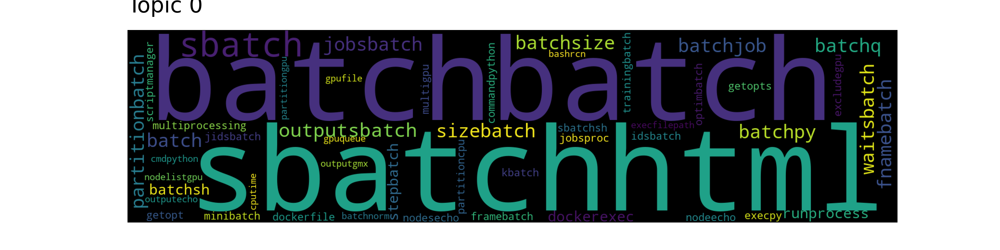

## Topic 1

```console
packagepy spack arpack ifpack lapack pythonpackages specspack gmkpack packerc pack packages unpack package bpacked scalapack dockerexec loadirhomepack loadmodule strumpack modulepy aloadmodule modulefiles sourcehomepack packagevalgrind modulespath packer configpy sbatchhtml packageroot modulefile modulessh packagehypre batchbatch pkgconfig integrated blaslapack moduleslurm configslurm configconfig loadedmodules execpy envmodules packagepetsc qmcpack outputsbatch packed packagerootpara modulepath batchpy zshrc
```
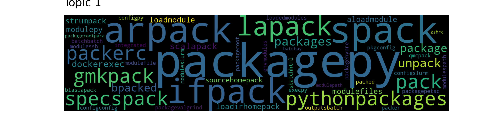

## Topic 2

```console
pythonpython commandpython datasetpy ipython pythonpathhome pythonpathpwd sbatchhtml pathpython pythonuserbase databasepy libpythonpath pythonpathddmd datapy cmdpython pythonpackages pythonpath libtbxpython intelpython numpy tensorflow workerpy python testpy launcherpython outputsbatch simulationpy batchbatch dockerfile batchpy networkpy evalpy performancepy runpy batchsize remotepy datafile sbatch portpython benchmarkpy postgresql modulespath dataset pythonhome datatraindata datasetn postgres runprocess postgresqlconf matplotlib multiprocessing
```


## Topic 3

```console
pythonpython pythonpackages libpythonpath pdebug pythonpathpwd pbs libtbxpython pythonpathhome pythonpathddmd pbsqueue portpython pathpython pbsdsh commandpython cmdpython pb pbsidpbs launcherpython modulepy packagepy python modulefile modulessh pythonpath pythonuserbase partitionepyc nodefilepbs inpfile modulespath runpy fopenmp numpy pdb ipython modulefiles remotepy libvdpau partitiondebug networkpy pkgconfig pyspark pkgconf pythonhome matplotlib databasepy pythonwhich pgsql pdbedit testpy loadmodule
```
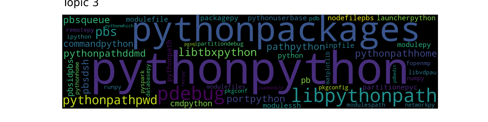

## Topic 4

```console
sbatchhtml tensorflow outputsbatch nodeecho nodesecho nodelistgpu batchsize deeplab dockerfile nodefilepbs nodeslurm nodefile nodemanager multiprocessing runprocess nodesslurm cudapath sbatch nodesn pathcudapath jobsproc pathdata batchbatch pathoutput pythonpathpwd debugtrace pathpython bamspath deeplabv datapy snpeffpath commandtrace datasetpy ftracedir ftrace dockerexec networkpy outputsrun datasetmnist nodejs tmpdirlocal jobsbatch getopt partitionepyc pythonpathddmd cronlogfile clusteroutput backtrace stdout dataproces
```
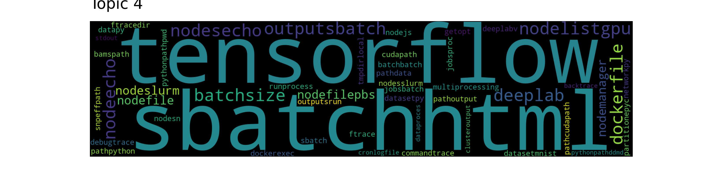

## Topic 5

```console
sbatchhtml outputsbatch partitionbatch fopenmp outputtxt tmpfiles sbatch echoinfo batchbatch ftrace deeplab filetesttxt outputfile execfilepath ftracedir getopt batchq ctxtecho fileoutput commandstxt getopts gnuplot dockerexec batchsize bamfiles outputjtxt dockerfile fnamebatch nodeecho nodefilepbs tmpfile scriptspath sorttxt scriptsdir eachfile scripttest outputrfm outputecho outputgmx filestxt deeplabv bashrcn partitionepyc scriptmanager cmdfile scriptpath tempfile yecho tmpdirlocal simoutput
```
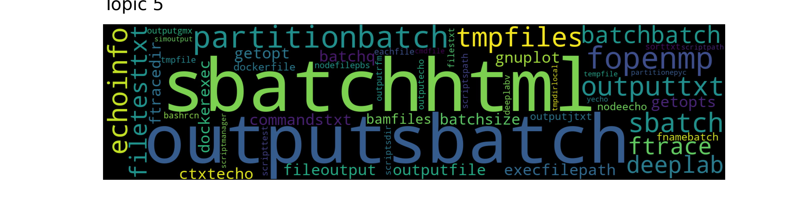

## Topic 6

```console
libpythonpath sbatchhtml commandpython pathpython libtbxpython cmdpython pythonpathhome modulespath outputsbatch pythonpackages execfilepath pythonpathpwd cudapath batchbatch pythonpython remotepy pathcudapath sbatch ipython libexec dockerexec libstdc execpy runpy gnuplot dockerfile pythonpathddmd matplotlib launcherpython bamspath batchsize scriptspath partitionbatch runprocess networkpy pythonpath modulefile partitionepyc batchpy packagepy pathconda githubcom getopt pathoutput github cmdfile intelpython batchq modulefiles outputtxt
```
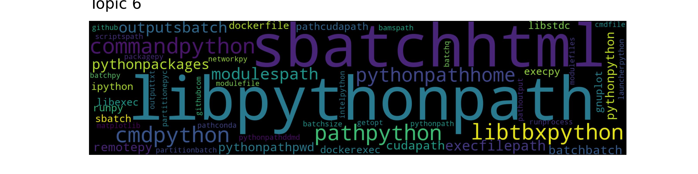

## Topic 7

```console
pythonpackages commandpython libpythonpath pythonpython launcherpython pathpython pythonpathhome cmdpython pythonpathpwd pipelinepy ipython libtbxpython pytorchpy remotepy pythonpathddmd packagepy pythonpath portpython pythonuserbase dockerexec runpy intelpython sbatchhtml pytorchext python modulespath pathconda networkpy pythonhome checkpointpy matplotlib execfilepath batchpy execpy numpy pip testpy pyspark xdpyinfo partitionepyc workerpy pyyaml setuppy snakefile dockerfile snakemake postgresqlconf tensorflow tensoranaconda modulepy
```
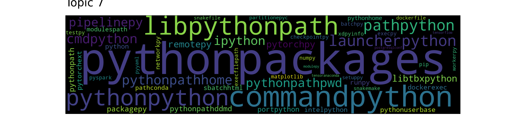

## Topic 8

```console
exports exportall export exportnone exported outputsbatch outputgmx outputecho outputbase dockerexec outputx outputsrun clusteroutput outputerr outputoutputs diroutput outputjobout diroutputs outputfile outputoutput outputslurm fileoutput dockerfile paramsportport outputxjout outputoutj outputdirectory outputr outputout outputmpi stdout outputivecs outputxojn outputjob outputrfm portport outputtxt pathoutput nodeecho outputname outputdir sbatchhtml outputtrain commandtrace execpy xport outputscript outputn libtbxpython execfilepath
```
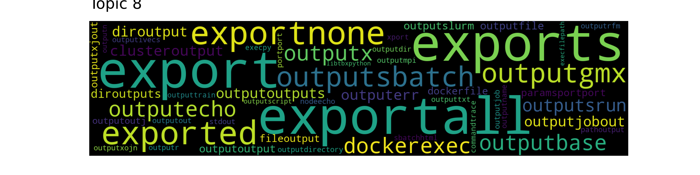

## Topic 9

```console
echoinfo echo sbatchhtml yecho outputecho iecho echoecho outputsbatch echodebug outputtxt nodeecho dockerexec execfilepath outputfile echocat ctxtecho echoerror hsecho hhecho echoerr bashrcn bashrc xecho getopt nodesecho outputrfm fopenmp grep cmdfile getopts outputscript commandstxt outputjtxt execdir asecho outputdirectory stdout mpmdconf shellbash mxecho sbatch mmecho libexec fileoutput stdouttxt outputsrun printfile dockerfile outputbase execpy
```
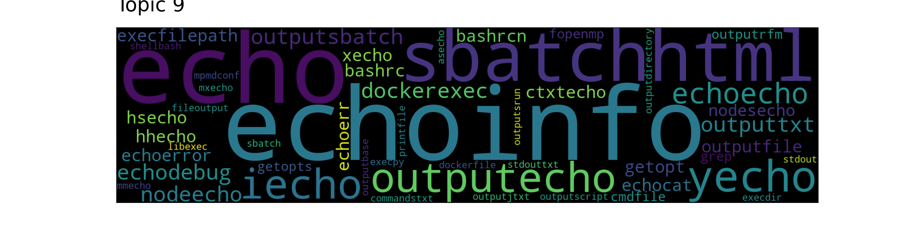

## Topic 10

```console
nodefilepbs jobfile pbsqueue jobtmp jobnamepbs pbsidpbs pgsql fopenmp execfilepath jobsproc bashrcn psdef pythonpathpwd pbsdsh jobscriptsh dockerexec jobpy deeplab nodefile jobidpbs bamfiles postgresql databasespbs jobscript pythonpathddmd inpfile postgresqlconf dirpbs pbs getopt outputfile jobnamejob cronlogfile outputjob nodelisttxt libpythonpath fileprefix workdirpbs logfilename dockerfile dirtmp pythonpathhome cpgdfile bashrc pstmp mpmdconf pgsqlso commandpython filebasename scriptmanager
```
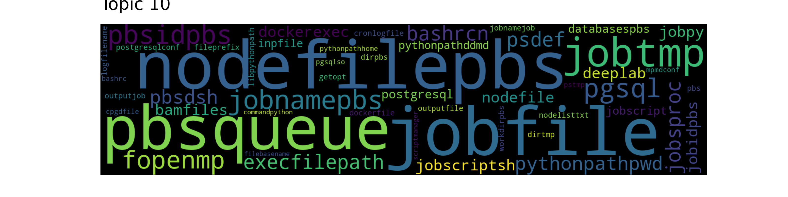

## Topic 11

```console
dockerfile sbatchhtml datasetpy commandpython datapy dockerexec pathpython pythonpathpwd outputsbatch cmdpython echoinfo nodeecho libpythonpath datasettemplama pythonpathhome datafile libtbxpython pythonpathddmd remotepy getopt deeplab outputtxt ipython nodesecho pythonpython outputecho networkpy databasepy gnuplot datalad datadir scriptspath dataset datatarget runprocess datafiles sbatch rdatadir datapath datasetcifar datasetdataset cudapath datasetn execfilepath filedata getopts cmdfile xdpyinfo deeplabv pathdata
```
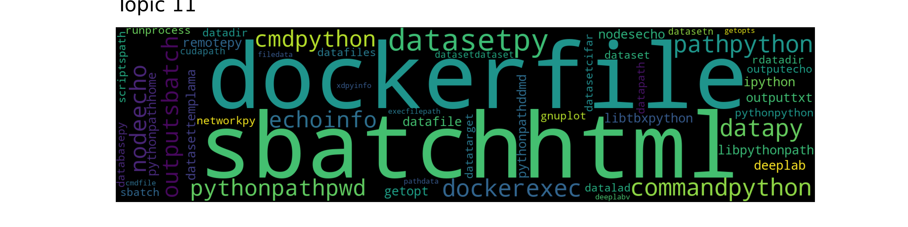

## Topic 12

```console
commandpython pythonpython libpythonpath outputmsub runsub pythonpathhome libtbxpython cmdpython pathpython pythonpathpwd ipython pythonuserbase launcherpython pythonpathddmd bsub oarsub pythonpackages qsub matplotlib intelpython pythonpath portpython subfile deeplab gsub python deeplabv msub submode npython stdouttxt bfile databasepy numpy stdout modulepy pipelinepy pythonwhich subsample runpy losubg subjob pythonhome execpy autolab modulefile makeblastdb distributedpy matlab stdoutpbs
```
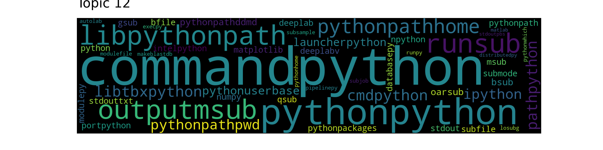

## Topic 13

```console
outputmsub bsub stdout runsub subjob ffmpeg pbsqueue bfile dockerfile stdouttxt postgresql libpythonpath commandpython nprocscat stdoutj qsub deeplab deeplabv subjobs modulefile dockerexec tensorflow pythonpathpwd modulepy gpuqueue pythonpathddmd subfile queueoptarg queuepbs msub modulessh submode subsample makeblastdb pythonpathhome cmdpython gsub pythonpackages jstdout stdoutpbs subdirname oarsub matplotlib launcherpython lmdb modulespath postgres excludegpu subdirectory pipelinepy
```
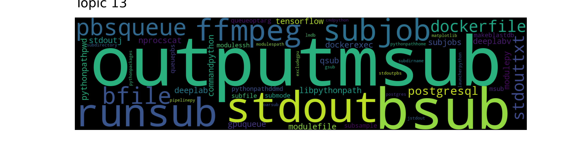

## Topic 14

```console
sbatchhtml batchbatch commandpython pythonpackages pythonpython libpythonpath sbatch batchpy cmdpython launcherpython batchsize ipython libtbxpython batchq pythonpathpwd pathpython pythonpathhome waitsbatch partitionbatch remotepy intelpython pythonpathddmd pytorchpy sizebatch outputsbatch batch multiprocessing pythonuserbase stepbatch python pythonpath packagepy gnuplot modulepy pytorchext runpy numpy dockerexec networkpy pipelinepy workerpy matplotlib batchjob minibatch partitionepyc runprocess execpy jobsbatch dockerfile pyyaml
```
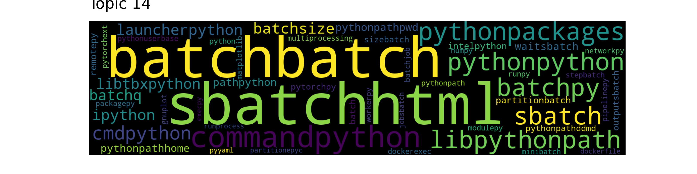

## Topic 15

```console
sbatchhtml dockerexec cmdfile batchbatch cmds sbatch outputsbatch cmdsrun cmd bashrc cmsrun echoinfo execfilepath dockerfile nodeecho bashrcn partitionbatch cmdhostname batchsize printshellcmds ctxtecho cmdlauncher echodebug kbatch dirtmp hsecho batchq hhecho nodesecho slurmscript mxecho getopt scriptmanager scriptspath zshrc yecho iecho fnamebatch idsbatch dirtmpdir jobsbatch runprocess srcpath kernelsasc scriptpath bamspath bamfiles cmdpython powercmddir fopenmp
```
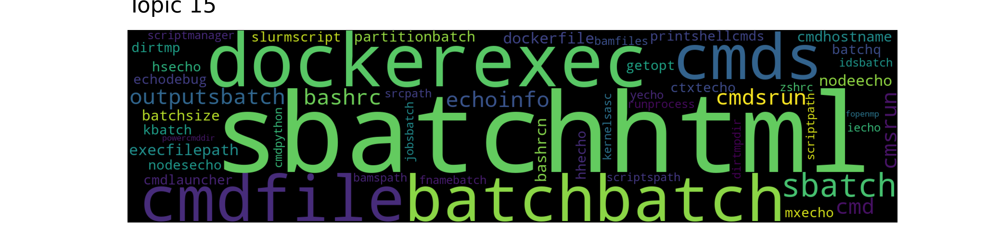

## Topic 16

```console
libstdc libxc cmake makefile libexec compilercc swbuild compilergcc cmakecachetxt compilerintel cmdgmake gmake dcmake compiling bashrc compilervarssh xinitrc zshrc dockerexec gcccore compile libxml pkgconfig archlinux libpythonpath gccsv gcc libncclso compilers libedit fxdtbuild buildbuild bashrcn cmakeliststxt libgl githubcom github libxsmm sysctlconf mpmdconf libc pythonpackages compiler gnuplot libtbxpython cmdpython getopt partitionepyc craylinux qtcreator
```
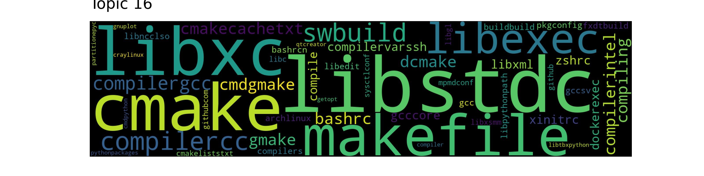

## Topic 17

```console
nodefilepbs dockerfile nodefile nodelisttxt getopt nodeecho ftracedir nodesecho pythonpathpwd libpythonpath fopenmp fileprefix getopts dockerexec intmpdir mpmdconf deeplab bamfiles modulefile pythonpathddmd nprocscat outputfile grep dirtmpdir genomefasta cronlogfile nodelistgpu ftrace eachfile pythonpathhome sbatchhtml bamfile makefile gpufile cudapath filetesttxt bashrcn seqfile tmpfile modulespath outputsbatch indexfile outputtxt fastqfile gnuplot sorttxt inpfile echodebug cmakecachetxt partitionepyc
```
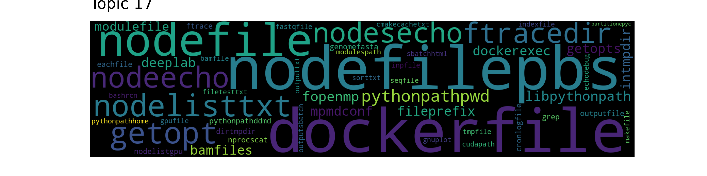

## Topic 18

```console
sbatchhtml outputgmx outputsbatch batchsize batchbatch sbatch gmp nodelistgpu mdrun partitionbatch gmx bashrcn dockerexec sizebatch gmxgmx runprocess nprocs xargs gpufile gmxdir nprocscat nprocswc fopenmp nprocmin outputsrun pkgconfig xinitrc gmrun nodefilepbs nproc batchq cmdsrun gmxrc gromacs nodeecho mpmdconf packagevalgrind fnamebatch gnuplot bashrc execpy excludegpu partitiongpu openmp nodemanager nodesecho getopt scriptmanager nmap xdamp
```
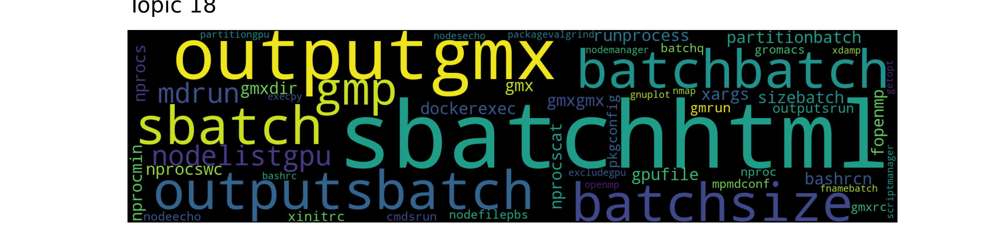

## Topic 19

```console
matlab deeplab matplotlib autolab deeplabv fopenmp mpmdconf srlab libpythonpath libtbxpython pbsqueue pdebug pbsidpbs pythonpathddmd pbsdsh nodefilepbs bamfiles psdef debugtrace makefile dirtmp pythonpackages pbs libexec pythonpython partitionbatch gnuplot outputsbatch pkgconf debugnxf fileprefix partitiondebug execfilepath sbatchhtml packagevalgrind ftracedir bamspath xpbs dirpbs pythonpathhome pb databasespbs pythonpathpwd libstdc modulespath numpy ftrace dirtmpdir gpufile partitiongpu
```
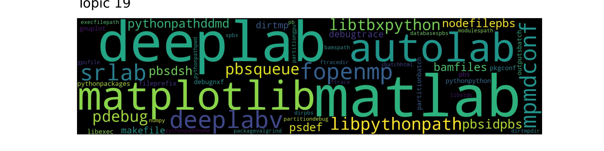

## Topic 20

```console
sbatchhtml outputsbatch batchbatch sbatch batchsize jobsbatch batchjob batchq jobsproc dockerfile partitionbatch fnamebatch multiprocessing dockerexec outputgmx idsbatch waitsbatch sizebatch runprocess outputecho commandpython outputjob nprocs nodeecho outputsrun procname outputbase batch bashrcn simoutput outputfile deeplab mpiprocs outputrfm batchpy batchsh outputname jobfile outputtxt stepbatch nodesecho nprocscat nproc outputjobout gpufile clusteroutput outputjtxt filebasename deeplabv echoinfo
```
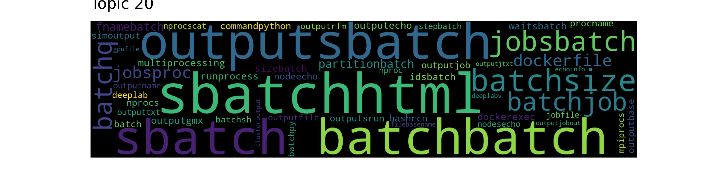

## Topic 21

```console
modulefile modulepy modulessh loadmodule exportall modulefiles export modulespath exports aloadmodule moduleslurm exported exportnone modulepath outputroot outputfile execpy module loadedmodules dockerexec outputgmx remotepy libvdpau xinitrc modules envmodules moduleshome pythonpackages outputxojn commandpython outputbase moduletable fopenmp xdpyinfo packagepy libexec outputrfm outputx fileoutput outputsrun paramsportport libtbxpython execdir jobfile makefile diroutput xport execfilepath outputjobout outputdirectory
```
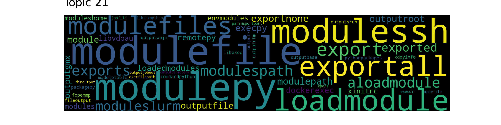

## Topic 22

```console
sbatchhtml echoinfo outputsbatch sbatch batchbatch dockerexec batchq batchjob jobsbatch cronlogfile batchsize partitionbatch waitsbatch scriptmanager echo nodeecho dockerfile getopt echoecho deeplab outputecho timelog crontab mxecho echocat yecho getopts slurmscript scheduler commandpython iecho echodebug cmdpython scriptdir outputscript scriptsdir batchsh outputtxt cputime nodesecho dayecho hhecho mmecho batchpy ctxtecho idsbatch script jobscriptsh fnamebatch printshellcmds
```
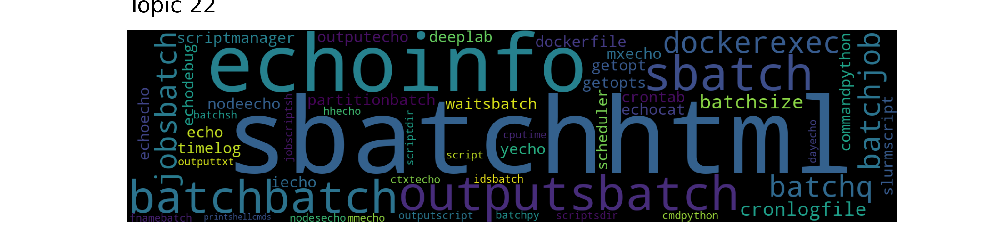

## Topic 23

```console
modulepy loadmodule aloadmodule modulefile modulefiles loadedmodules moduleslurm module modulespath modules modulepath modulessh moduletable envmodules moduleshome modulesnouveau pythonpackages pythonpython libpythonpath commandpython launcherpython cmdpython intelpython profilemodules pathpython libtbxpython pythonpathddmd portpython pythonpathpwd loadmodel pythonpathhome packagepy ipython python numpy pythonuserbase partitionepyc npython networkpy remotepy configpy xinitrc pythonpath runpy modprobeconf matplotlib dependenciespy basepy pdebug pkgconfig
```
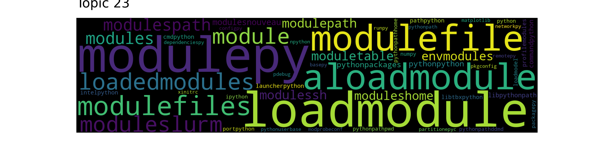

## Topic 24

```console
sbatchhtml batchbatch sbatch outputsbatch batchpy batchsize waitsbatch batchq jobsbatch batch stepbatch sizebatch partitionbatch batchjob cmdpython commandpython trainingbatch fnamebatch kbatch workerpy batchsh pythonpython multiprocessing ipython sbatchsh remotepy framebatch outputgmx batchnorm autolab execpy pythonpathhome minibatch jobpy libpythonpath dockerfile pathpython numpy idsbatch matlab jidsbatch optimbatch runprocess libtbxpython launcherpython partitionepyc pythonpathpwd ffmpeg dockerexec intelpython
```
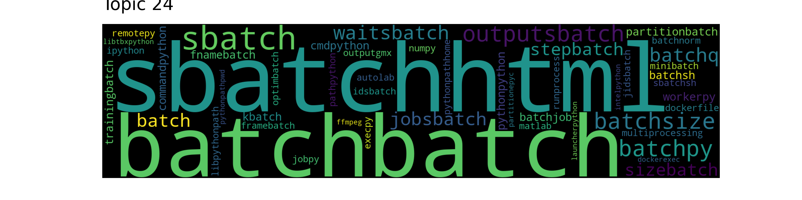

## Topic 25

```console
sbatchhtml batchbatch sbatch batchsize outputsbatch waitsbatch batchq partitionbatch jobsbatch batch sizebatch fnamebatch batchpy batchsh tensorflow stepbatch batchjob optimbatch kbatch batchnorm sbatchsh clusteroutput clustererror jidsbatch multiprocessing genomefasta dockerfile nodeecho idsbatch getopt scancel nodesecho outputgmx getopts gpuqueue bamfiles multirunlog nextflowconfig trainingbatch queueoptarg clusteryaml endcsv gpufile clustergres packagevalgrind nodelistgpu multithreading gnuplot mlflow fastqfile
```
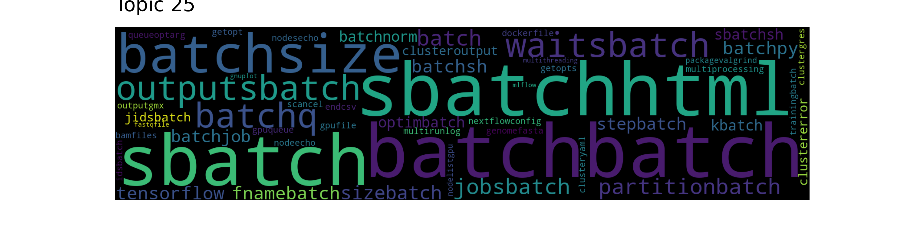

## Topic 26

```console
nodesn nodesecho nodemanager nodesslurm nodeslurm nodeecho nodejs nodesnnodes nodelistnode nodesnodes nodelistgpu node nodefile nodes nodempi nodenames nodesh nodename nodelistslurm nodefilepbs nnode nodescontrol nodelist nodesnum nodea headnode nnodes nodescat nodelisttxt nodesmy nodesscontrol nnodesslurm nodedgxngpu nodeid npernode nnodesnnodes vnode nodesbls arraynodes stringnode datanode nodecat pernode gpuspernode processorsnodes namenode npnumnodesmpi addnode lnodes numnodes
```
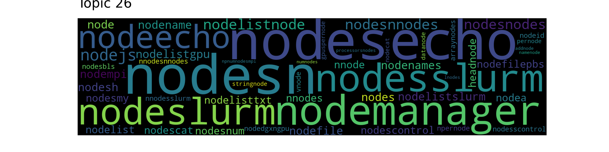

## Topic 27

```console
sbatchhtml batchbatch sbatch outputsbatch batchq batch partitionbatch waitsbatch batchsize batchpy aloadmodule loadmodule fnamebatch sizebatch jobsbatch modulepy batchsh batchjob modulefiles modulefile loadedmodules stepbatch moduleslurm minibatch jidsbatch framebatch trainingbatch multigpu batchnorm kbatch optimbatch sbatchsh modulespath gpuqueue excludegpu idsbatch partitiongpu partitioncpu getopt modules envmodules gpufile pbatch getopts modulepath slurmscript module multiprocessing moduletable batches
```
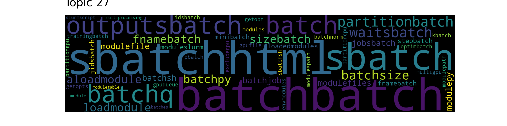

## Topic 28

```console
modulepy modulefiles modulefile moduleslurm modules module modulespath aloadmodule modulessh modulepath loadedmodules loadmodule moduletable envmodules modulesnouveau moduleshome profilemodules modprobeconf modprobe mosaic mod rmmod modset modes lmod applications modprobed userconfigjs configpy remotepy chmod modemmanager application modf configjs slurmfiles dustmod cmdapplication cpuinfo multirunlog usermod mos lmodsh sharedfuncs sysctlconf customcmd mods runmode configconfig usbmodem
```
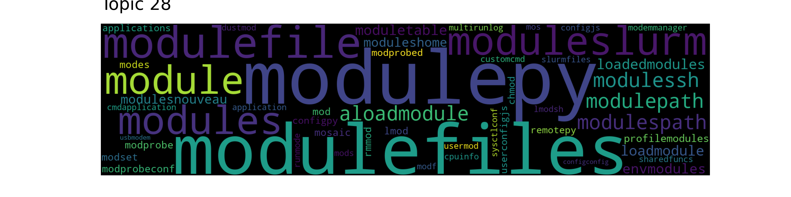

## Topic 29

```console
sbatchhtml exeflexwrf batchbatch sbatch outputsbatch partitionbatch flexpart fnamebatch flexwrf gnuplot flex execfilepath execpy batchq gnu outputgmx batchsize framebatch libexec batchpy batchsh getopt getopts batch matplotlib libxc wrfvarexe exefile waitsbatch xinitrc fopenmp exe dockerexec pkgconfig outputtxt partitiongpu simoutput execdir directivesbatch xlsf partitioncpu centos libtbxpython namintflex debugnxf xfce outputrfm sbatchsh mpmdconf tmux
```
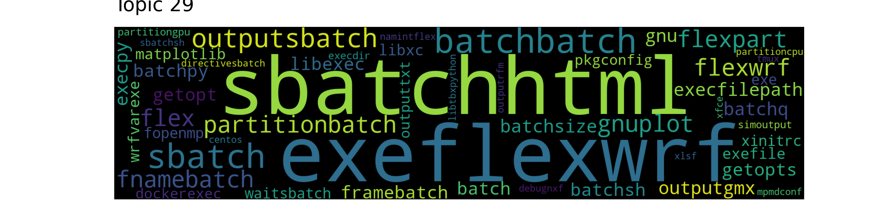

## Topic 30

```console
outputsbatch sbatchhtml partitionbatch deeplab dirtmp fopenmp deeplabv dirtmpdir ftracedir outputecho partitionepyc batchbatch ftrace tmpfiles outputdirectory bamfiles getopt echoinfo batchsize clusteroutput outputmsub outputrfm sbatch diroutput dirproject execpy tmpdirlocal batchq jobsproc outputgmx jobfile autolab matlab jobsbatch jobtmp dockerexec outputfile diroutputs getopts outputjtxt scriptsdir echodebug mpmdconf nodeecho fnamebatch outputsrun outputtxt runprocess xargs makefile
```
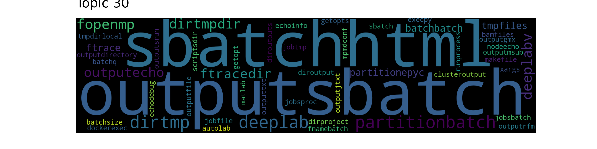

## Topic 31

```console
dockerexec nodeecho echoinfo nodesecho outputsbatch outputecho dirtmp execfilepath getopt sbatchhtml echodebug nodemanager dockerfile bashrcn cmdlauncher cmdsrun dirtmpdir nodefilepbs echo outputgmx cmdhostname libexec getopts runprocess execdir printshellcmds outputrfm execpy yecho mxecho nodelisttxt bashrc shellbash cmdfile echocat jobtmp jobsproc tmpdirlocal outputjob hhecho fopenmp ctxtecho echoecho slurmscript outputsrun deeplab powercmddir iecho nodefile outputdirectory
```
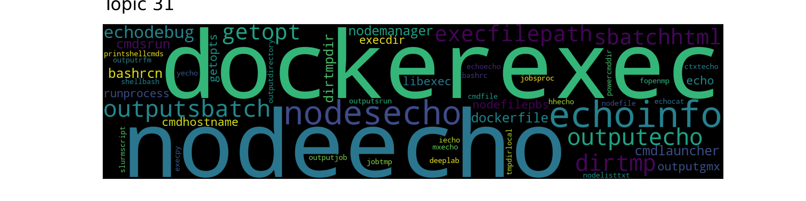

## Topic 32

```console
sbatchhtml batchbatch sbatch outputsbatch loadmodule modulefiles partitionbatch modulespath aloadmodule dockerexec batchsize xinitrc modulefile pkgconfig bashrc batchq swbuild modulepy partitioncpu makefile getopt bashrcn gpufile customcmd partitiongpu cmdgmake getopts loadedmodules gmake zshrc cmake compilercc githubcom envmodules moduleshome moduleslurm modulepath gcccore buildbuild powercmddir nvidiaconf packagevalgrind github libstdc modulessh runprocess fnamebatch libexec compilerintel excludegpu
```
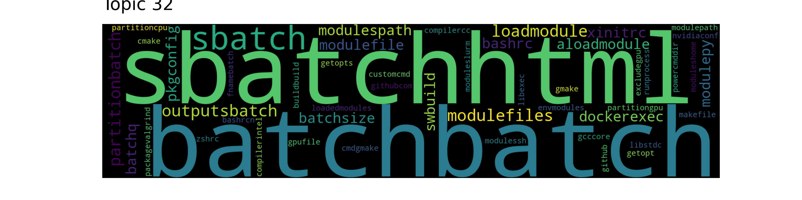

## Topic 33

```console
nodelistgpu nodeecho nodesecho dockerexec nodemanager excludegpu nodejs gpufile nodelistnode nodelisttxt nodelistslurm nodeslurm nodesslurm nodesn dockerfile nodefile modulespath commandpython nodesh gcccore getopt outputsbatch gpuspernode jobpy jobsproc cmdpython envmodules nodelist nvidiaconf gccsv sbatchhtml gpuqueue libpythonpath nodesnodes getopts networkpy gpus echoinfo clusteroutput nodefilepbs kernelexe outputecho tensorflow modulefile gdb nodesnum nodempi github runprocess deeplabv
```
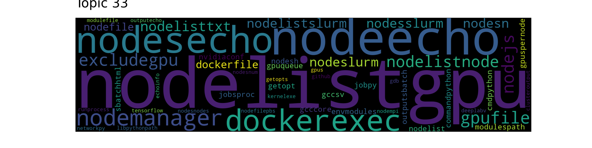

## Topic 34

```console
sbatchhtml dockerexec dockerfile scheduler cmdpython sbatch commandpython batchbatch batchjob remotepy jobsbatch echoinfo outputsbatch runprocess crontab scriptmanager schedulerhead pythonpathhome cmdhostname nodeecho remotehostname cronlogfile networkpy batchpy schedulersslurm xscheduler execpy scriptpy execfilepath launcherpython schedulerjson batchq batchsh waitsbatch partitionbatch echocat cronjobs batchsize pythonpython pythonpathddmd workerpy pythonpathpwd pathpython cron jobpy ipython bashrcn sbatchsh getopt jobsproc
```
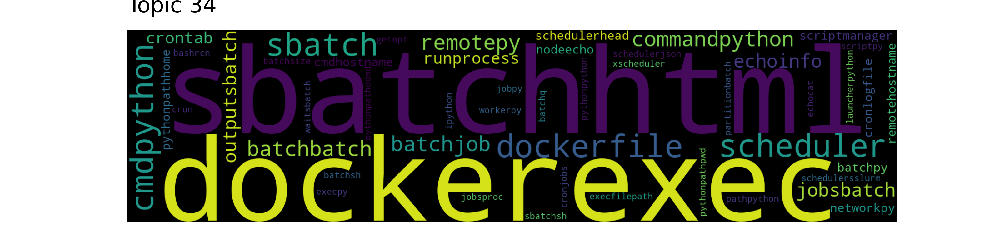

## Topic 35

```console
outputsbatch sbatchhtml commandpython dirtmp outputfile dirtmpdir outputecho outputsrun databasepy dockerfile outputlog datapy cmdpython runprocess tmpdirlocal outputbase clusteroutput remotepy pythonpathpwd outputgmx batchbatch sbatch outputrfm cronlogfile pythonpython outputtxt datasetpy diroutput libpythonpath pythonpathddmd networkpy outputlogs tmpdir performancepy pathpython ipython partitionepyc batchsize fileoutput diroutputs postgres partitionbatch workerpy outputslurm batchpy runpy pythonpathhome logfile intmpdir idlog
```
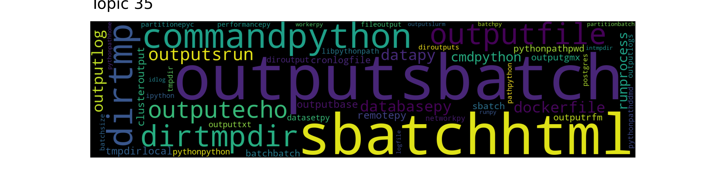

## Topic 36

```console
dockerexec execfilepath scripttest scriptmanager stdout bashrc execdir bashrcn stdouttxt libexec getopt scriptspath ftrace cmdfile outputfile fopenmp outputdirectory scriptsdir stdoutj outputtxt execpy runprocess commandpython ftracedir mpmdconf filetesttxt scriptdir libstdc jobfile getopts echodebug scriptpath nprocscat outputsbatch jobsproc testfile scriptnow sbatchhtml printfile jobscriptsh zshrc scriptsh cmds libpythonpath commandstxt outputscript cmdpython makefile outputecho stdoutpbs
```
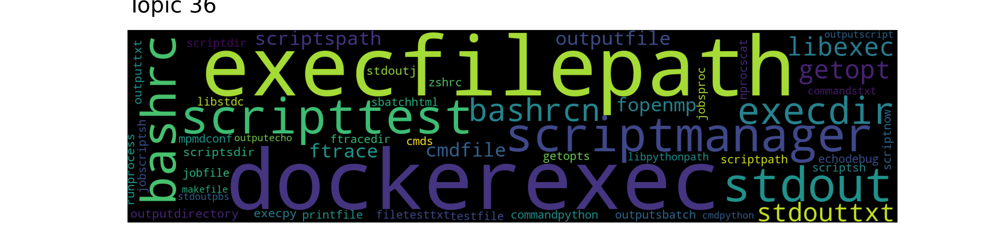

## Topic 37

```console
sbatchhtml batchbatch outputsbatch sbatch batchq batchsize nextflowconfig tensorflow jobsbatch batchjob waitsbatch mlflow partitionbatch workflow stepbatch batch batchsh nextflowtrace workflows fnamebatch batchpy runprocess templateflow multirunlog sizebatch multiprocessing execfilepath sbatchsh outputecho bamspath outputsrun scriptspath fluxos outputgmx batchnorm flow particleflow nextflow outputfile modulespath directivesbatch jidsbatch bamfiles kbatch execpy pipelinepy dockerexec jobsproc deeplab cudapath
```
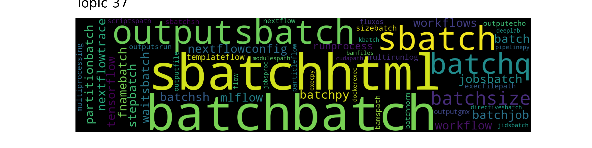

## Topic 38

```console
dockerfile genomefasta libstdc libpythonpath stdoutpbs stdouttxt bashrcn deeplab deeplabv libtbxpython stdout envirovariables githubcom commandpython outputmsub getopt getopts stdoutj pythonpackages benchmarkpy pythonpathpwd postgresql nprocscat fastqfile jobsproc github sorttxt intmpdir gdb mpmdconf jobtmp gcccore bioinformatics nodefilepbs bashrc postgresqlconf zshrc jobfile pythonpathddmd summaryfilejob makefile clusteroutput tmpdirbase batchnorm packagevalgrind eachfile psdef basesprefix databasespbs commandstxt
```
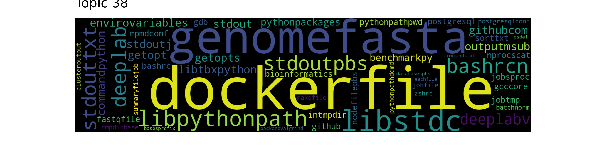

## Topic 39

```console
sbatchhtml batchbatch sbatch outputsbatch batchsize batchq jobsbatch waitsbatch batch batchpy partitionbatch batchjob sizebatch batchsh stepbatch fnamebatch commandpython jidsbatch cmdpython scriptsdir scriptpy sbatchsh dockerfile dockerexec kbatch runprocess scriptdir scriptmanager pythonpackages trainingbatch scripttest framebatch script batchnorm minibatch pythonpython idsbatch scriptspath scripts bashrc scriptsh optimbatch scriptnow multiprocessing getopt libtbxpython scripting scriptpath getopts scriptadd
```
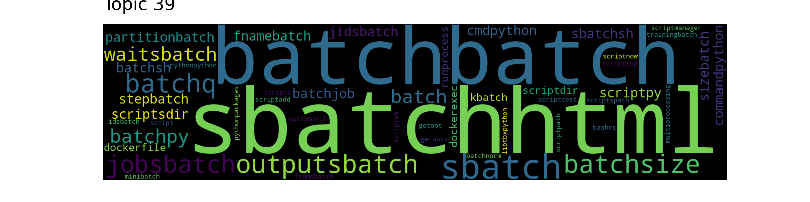

## Topic 40

```console
libpythonpath gmp nodefilepbs gdb outputmsub fopenmp makefile runsub commandpython stdout libtbxpython cmdpython pythonpathhome bashrcn outputfile xinitrc libstdc openmp bfile stdouttxt pythonpathpwd github execpy execfilepath bashrc outputgmx stdoutj outputsrun subfile filerun gmake gnuplot grep pathpython gcccore nodefile launcherpython outputsbatch dockerexec matplotlib runprocess gccsv nprocscat pkgconfig modulefile libxc stdoutpbs dirtmp outputtxt githubcom
```
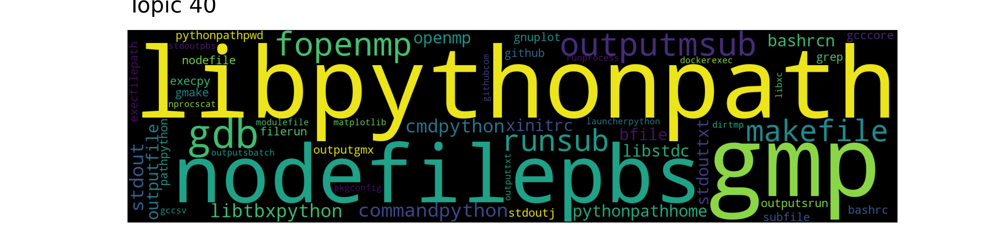

## Topic 41

```console
sbatchhtml batchbatch outputsbatch sbatch batchq batchsize waitsbatch batch sizebatch jobsbatch batchjob batchpy stepbatch partitionbatch fnamebatch batchsh mlflow runprocess kbatch commandpython trainingbatch optimbatch sbatchsh seqproc cmdpython outputscript outputtxt getopt minibatch outputgmx framebatch batchnorm dockerexec scriptsdir scriptdir idsbatch dockerfile outputecho getopts printshellcmds execpy pythonpathpwd nprocscat scriptadd scriptpath scriptmanager script scriptpy libpythonpath pbatch
```
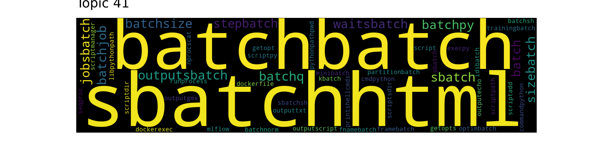

## Topic 42

```console
clusteroutput sbatchhtml clustererror partitionbatch clusteryaml clustergres batchbatch batchq clusterjson clustertime sbatch clustermem batchsize jobsbatch outputsbatch clusterthreads batchjob dockerexec cluster dockerfile clusters clustering partitionepyc waitsbatch clustername batchsh cronlogfile clustered snakemakestats batch partitioncpu sbatchsh batchpy queueoptarg sizebatch kbatch postgresqlconf partitiongpu pbsqueue commandpython runprocess multiprocessing execfilepath jobsproc snakefile fnamebatch crontab pythonpathpwd bwunicluster tensorflow
```
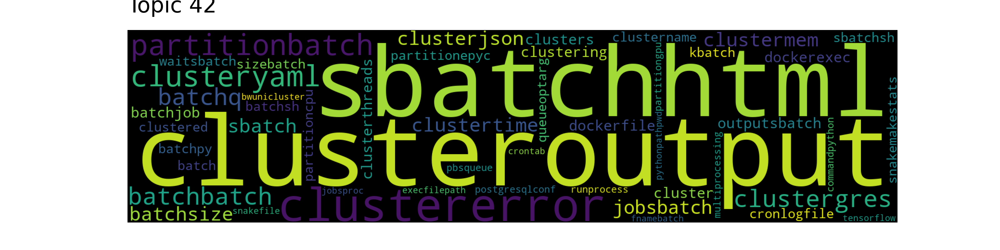

## Topic 43

```console
libpythonpath execfilepath libstdc pathoutput pathpython pythonpathhome libexec pythonpathpwd pathcudapath libtbxpython modulespath nodefilepbs cudapath pathlib runpath bamspath libxc libvdpau libxml dirtmp stdout pythonpackages fopenmp pathpath libtbxfind pathhome scriptspath runlocal dirtmpdir outputfile cmdpython pathmsccl pdebug pathdata nodefile pathpathhome pathdirname libpciaccess pythonpath execpy pythonpathddmd stdoutj pgsql debugtrace filepath zshrc outputdirectory libdmapsharing libmtp bashrc
```
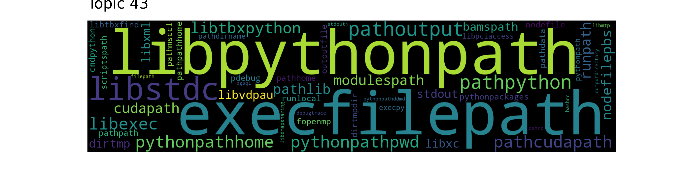

## Topic 44

```console
nodefile gnuplot gridfile datafile nodefilepbs nmap datapy fmap eachfile gridsearchpy cmeshtfrecord matplotlib tmpfile datafiles nodelisttxt tempfile mapfile filenames datasetpy nfile networkpy makefile fopenmp gmapcsv cloudmesh datasetn cinpmatfmap tmpfiles sorttxt filebasename mfileidgrid datanode fileprefix datapath tmux nprocscat endcsv tmpdirlocal dataframe jobsproc deeplabv tensorflow nprocs ftracedir xlsf execfilepath datasettemplama dataset ntimefmt fsldir
```
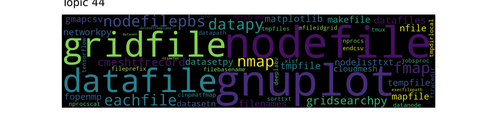

## Topic 45

```console
dockerexec outputsrun outputgmx nodemanager outputsbatch exportall runprocess commandtrace exportnone export outputrfm ftrace outputerr exports outputx outputecho ftracedir debugtrace stdout outputjobout nodeecho outputjob dockerfile outputbase outputlog execpy outputslurm nodefile outputxojn diroutput nodefilepbs execdir exported outputdirectory outputfile outputr execfilepath nodesecho cmdlauncher outputoutput outputlogs outputoutputs outputoutj outputdir diroutputs outputname outputtrain jobsproc outputout outputxjout
```
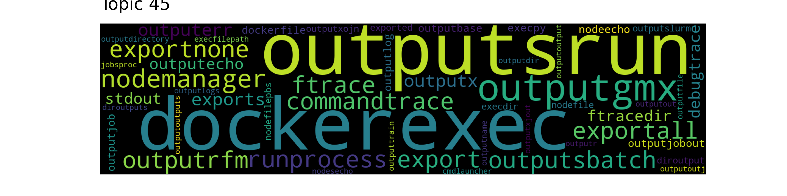

## Topic 46

```console
sbatchhtml outputsbatch batchbatch sbatch partitionbatch batchq dockerexec batchsize runprocess cpuinfo partitioncpu cputime multiprocessing kernelexe waitsbatch dockerfile batchpy batch kbatch openmp partitiongpu nprocs sizebatch clusteroutput jobsbatch cpu outputecho fopenmp partitionepyc nproc framebatch seqproc cpuq outputrfm outputfile batchjob execpy kernelsasc nprocswc gpufile commandpython cmdpython processor multithreading bashrc makefile lscpu excludegpu processors outputgmx
```


## Topic 47

```console
sbatchhtml batchq batchbatch batchsize sbatch outputsbatch batchjob partitionbatch jobsbatch dockerexec multithreading hyperthreading multiprocessing sizebatch partitioncpu waitsbatch lhyperthreading cputime taskthreads seqproc runprocess jobsproc gpuqueue hyperthreads tasksslurm taskslurm queueoptarg multithreaded taskpkl cpuq stepbatch kbatch batch nprocs taskcpus multigpu nodelistgpu partitiongpu batchnorm nprocscat lscpu optimbatch cpu cpuinfo hyperthread nprocswc getopt gpufile outputgmx threadsnprocs
```
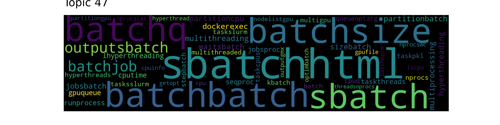

## Topic 48

```console
lognamelog logfilename logbasesprefix nccllog mdlog dockerexec logfile idlog nodemanager nodefile cronlogfile nodefilepbs logdirlogdir logfilelogdir ftracedir fxdlog ftrace loglevelinfo nodesn logbaselogbase runlog multirunlog dirlog nodeecho commandtrace outputlog loggingmllog logdir logfiles jlogfile nodesecho outputlogs dockerfile syslogfacility topoutputlogs indexlog loglog prodlog joblog syslogauth nodeslurm loglammps testlog glog fopenmp debugtrace namelog sysctlconf benchmarkspy filelog
```
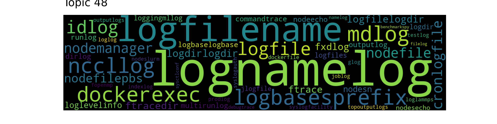

## Topic 49

```console
libpythonpath pythonpython pythonpathhome ipython commandpython pathpython pythonpathpwd libtbxpython datasetpy pythonpackages portpython datapy cmdpython pythonpath launcherpython numpy python pythonpathddmd pythonhome intelpython simulationpy testpy networkpy matplotlib scipy partitionepyc remotepy pythonuserbase xdpyinfo sklearn gridsearchpy pythonwhich databasepy snakefile dockerfile tensorflow runpy npython pyspark workerpy filespy tensoranaconda checkpointpy evalpy datafile modulespath packagepy epyc distributedpy modulefile
```
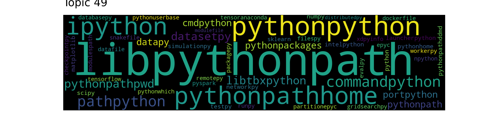

## Topic 50

```console
pythonpython commandpython pythonpathpwd libpythonpath pathpython cmdpython libtbxpython pythonpackages pythonpathhome launcherpython pythonpathddmd pythonuserbase runpy pythonpath portpython ipython runprocess python intelpython execfilepath remotepy execpy pythonhome workerpy jobpy pgsql dockerexec matplotlib fopenmp pythonwhich pyspark dockerfile snakefile pyphrun pdebug npython testpy numpy packagepy xdpyinfo pipelinepy jobfile databasepy outputfile nodefilepbs stdout postgresqlconf performancepy libexec pytorchpy
```


## Topic 51

```console
nodefilepbs pbsqueue nodefile pbsidpbs nodesn pbs pbsdsh pythonpython pdebug libpythonpath pythonpathpwd pythonpathhome nodemanager pb libtbxpython pythonpackages networkpy xpbs pstat jobfile nodesecho nodelistgpu nodesnum modulefile nodesbls fopenmp nnode modulefiles cronlogfile nodeslurm dockerfile dirpbs partitioncpu pythonpathddmd partitionepyc commandpython inpfile nodeecho ppc databasespbs pyspark psdef nbbits getopt cputime fileprefix partitionbatch jobtmp nodesh nodelisttxt
```
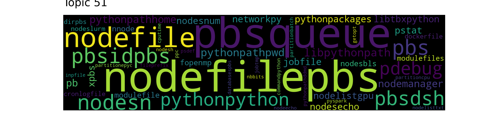

## Topic 52

```console
snakefile snakemake snakemakelog commandpython snakemakestats pythonpython pathpython cmdpython snake libpythonpath sbatchhtml ipython libtbxpython pythonpathpwd pathconda pythonpathhome batchbatch pythonpackages execfilepath pipelinepy pythonuserbase launcherpython runprocess pythonpathddmd pythonpath batchsize dockerexec dockerfile python sbatch makefile batchjob outputsbatch portpython intelpython batchq partitionbatch batchpy bamfiles jobfile jobsbatch execpy scriptpy tensoranaconda runpy pythonhome scriptpath scriptmanager scriptspath networkpy
```
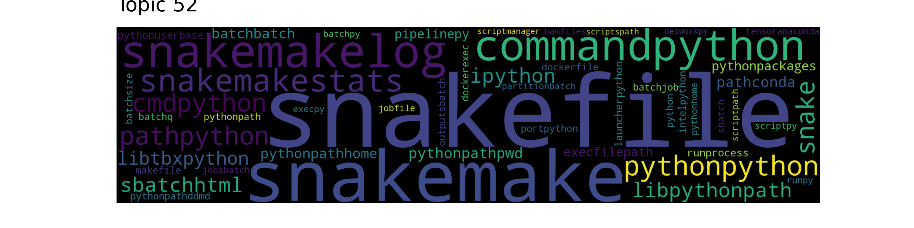

## Topic 53

```console
dockerexec zshrc restartfile cronlogfile bashrcn restartfilefind bashrc stdout grep sbatchhtml nodeecho restartlmp restartfiles stdouttxt gcccore nodefilepbs scriptmanager restartpy nodesecho execfilepath nodefile fopenmp dockerfile multirunlog ftrace nodemanager nccllog cmdsrun outputsbatch getopt logfile xinitrc outputgmx stdoutpbs gnuplot stdoutj gmp sysctl sysctlconf crontab getopts runprocess pkgconfig execdir defaultsh commandstxt cmsrun commandtrace ftracedir nodelisttxt
```
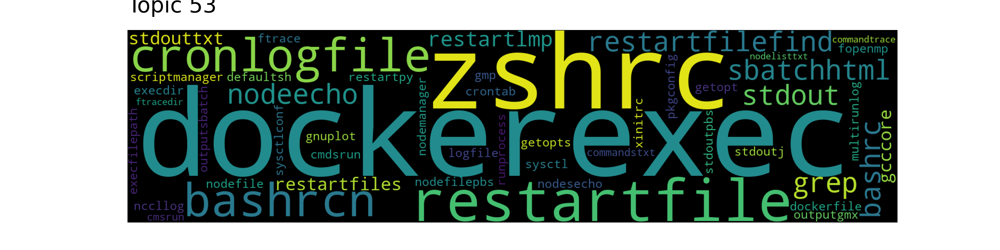

## Topic 54

```console
arraytaskid sbatchhtml arrayjob idparray jobarray arrayidp arrayslurm batchsize outputsbatch deeplabv batchbatch commandstxt sbatch jobsbatch taskslurm tasksslurm deeplab dockerexec datasetpy taskpkl getopt partitionbatch arrayid taskid outputjtxt printshellcmds jobsproc jobpy idcsv commandpython outputtxt sorttxt execpy batchjob taskset configslurm nodelisttxt idsbatch endcsv scriptmanager multiprocessing directivesbatch stepbatch setarrayformats arraybench batchpy array arrayi getopts autolab
```
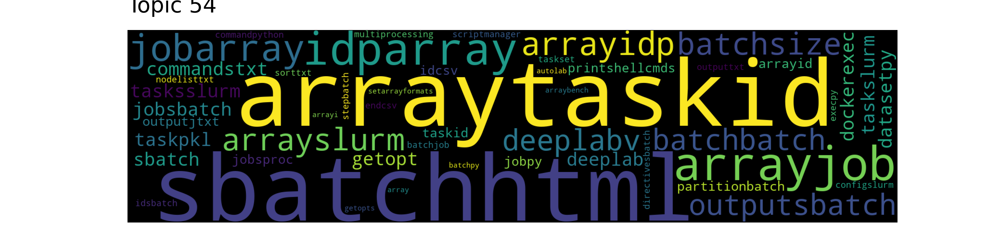

## Topic 55

```console
nodeecho nodesecho nodefile sbatchhtml outputsbatch outputgmx nodeslurm nodelistgpu nodesn nodefilepbs nodesh nodesslurm nodemanager nodejs nodescontrol nodelistslurm nodelisttxt nodesscontrol nodempi nodes node nodelist clusteroutput nodelistnode gcccore outputsrun nodesnum nodesnnodes batchsize dockerexec exportall sbatch nodescat nodesnodes gmp xorgconfd nodesbls batchbatch gpufile outputecho outputx partitionbatch nnode xorgconf jobsbatch outputscript nodea nprocs outputxjout runprocess
```
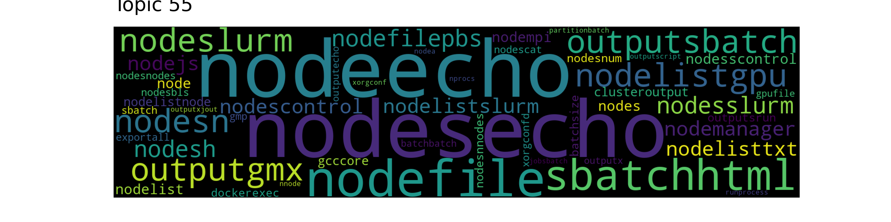

## Topic 56

```console
bashrcn runsub commandpython deeplab deeplabv outputmsub bashrc libpythonpath pythonpathhome pythonpathpwd cmdpython subfile gsub stdout bsub qsub pythonpathddmd subdirectory stdouttxt pathpython oarsub grep sorttxt gdb libtbxpython getopt makefile zshrc launcherpython nodefilepbs pythonuserbase postgresql dockerexec pgsql pythonpython commandstxt outputtxt bfile subfolder nprocscat dockerfile subdirname gnuplot execpy github fopenmp pythonpackages stdoutj ipython sbatchhtml
```
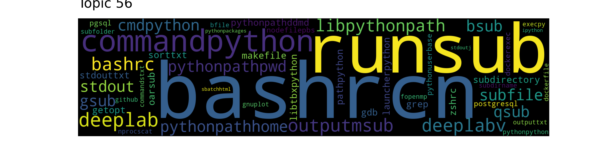

## Topic 57

```console
nfpcli fopenmp nfpcape namfpdyt debugnxf lfpcapextrue namfpdyf fxdlog mpmdconf namfpdyp fdnxf namfpdyi cfpncfechfp xlsf lxplsgtrue echfp lfpmoistrue cfpfmtlalon namfpdyh lfppackingfalse namfpsc nvprof mfp namfpdyv ctxtnxf nprocscat lxplstrue memnxf cinpmatfmap gfp nfpdistrib openmpfalse stopnxf texfiletrue zfp xfce cfp nvtx tmpfiles fsx lfplsgtrue rfp lxrtrue nvmlperf namfpdys nsfxhists fmap nxf lxfutrue xdpyinfo
```
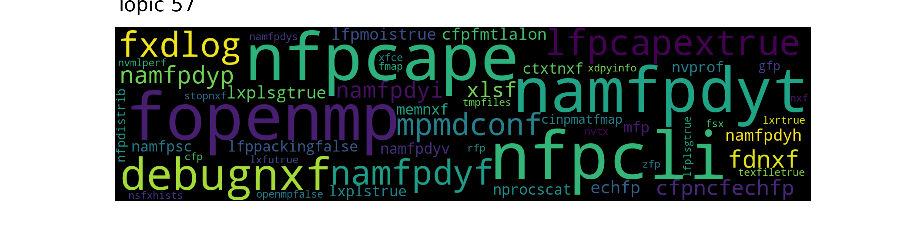

## Topic 58

```console
sbatchhtml batchbatch sbatch batchjob jobsbatch multiprocessing batchsize outputsbatch batchq taskthreads multithreading dockerexec tasksslurm waitsbatch partitionbatch nodelistgpu taskset taskslurm multigpu sizebatch fnamebatch runprocess multithreaded commandpython batch batchpy hyperthreading tasknum dockerfile ntasksslurm excludegpu tasklist stepbatch gpufile idsbatch gnuplot nodelisttxt lhyperthreading tasks gpuqueue taskskip hyperthreads numtasksslurm workerpy jobsproc ntasks nodeecho nodesecho cmdpython minibatch
```
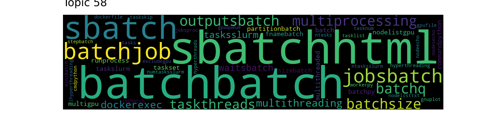

## Topic 59

```console
outputsbatch clusteroutput outputgmx sbatchhtml outputslurm outputecho outputtrain outputfile outputbase outputivecs batchbatch batchsize partitionepyc outputrfm outputx datasetpy outputoutj outputxjout sbatch outputerr partitionbatch outputsrun jobsbatch diroutputs deeplab outputout fileoutput batchq distributedpy fopenmp simoutput batchpy outputoutputs outputjobout outputmsub diroutput openmp dirtmp outputoutput samplingfm datapy outputhrrrconus dockerfile datasetcifar multiprocessing clustererror outputjtxt psdef stdout outputjob
```
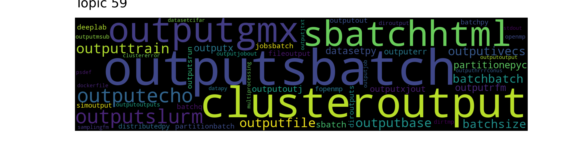

## Topic 60

```console
outputsbatch sbatchhtml outputgmx batchbatch dockerexec batchsize openmp clusteroutput outputecho outputsrun fopenmp outputrfm runprocess execpy outputfile partitionbatch sbatch batchq nprocs bashrcn dockerfile hpctoolkit outputx mpiprocs makefile gmp outputbase outputoutj nprocscat nproc seqproc xinitrc skypeforlinux outputtxt nprocswc outputerr bashrc getopt batchpy nprocnproc gcccore outputjtxt nodenproc mpmdconf restartlmp nodeecho jobsproc cmdpython partitionepyc partitioncpu
```
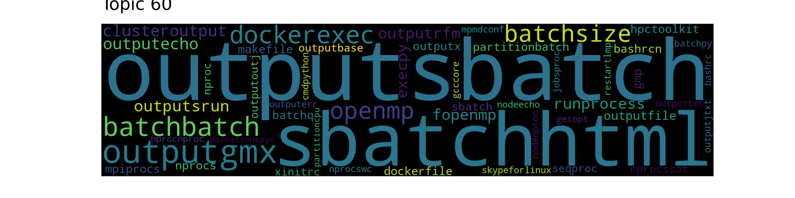

## Topic 61

```console
dockerexec dockerfile commandpython remotepy networkpy modulessh remotehostname cmdpython uselocalhost openssh portport cmdhostname launcherpython sysctlconf bashrcn execpy nginxconf runprocess outputsbatch pythonpathhome pythonpathpwd ipython nginxconfpacnew stdout localhost scriptmanager sbatchhtml pythonpython pathpython runpy networkhost execfilepath portpython commandtrace workerpy portcomm nodemanager hostconfigtxt postgresqlconf bashrc libpythonpath hostnamectl zshrc mpivarssh xdpyinfo compilervarssh pythonuserbase pythonpackages pkgconf stdouttxt
```
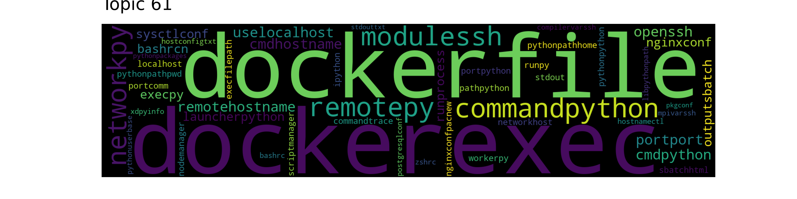

## Topic 62

```console
outputsbatch stdout outputgmx nodeecho tensorflow deeplab deeplabv nodesecho outputsrun outputtxt ftrace nodefile fopenmp outputecho outputerr outputrfm outputx outputfile stdouttxt nodefilepbs ftracedir exportall commandpython execpy pipelinepy libpythonpath stdoutj clusteroutput gnuplot export fileoutput outputxjout pathoutput outputxojn nodesh sbatchhtml tmpdirlocal commandtrace outputbase exports outputscript execfilepath outputslurm nodesn networkpy outputjtxt outputoutputs libtbxpython outputoutj outputr
```
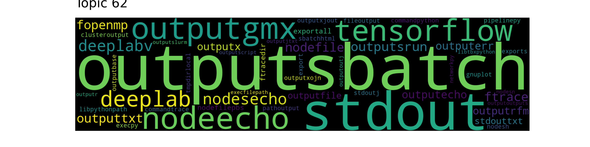

## Topic 63

```console
outputsbatch sbatchhtml batchbatch batchsize sbatch clusteroutput jobsbatch batchjob sizebatch nodeecho dockerfile outputgmx gnuplot outputbase waitsbatch batchq nodefile nodesecho deeplabv batch deeplab partitionbatch multiprocessing dockerexec outputjob outputsrun nodefilepbs nodemanager gpufile kbatch outputfile outputecho github outputtrain batchpy commandpython fileoutput batchsh nodelistgpu outputslurm batchnorm workerpy tensorflow networkpy outputjobout idsbatch nodeslurm nodesh githubcom jobfile
```
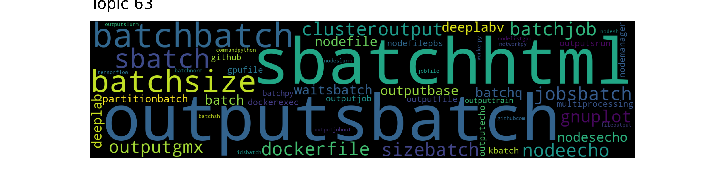

## Topic 64

```console
libpythonpath commandpython pythonpackages pathpython cmdpython libtbxpython pythonpython pythonpathhome modulespath intelpython ipython launcherpython pythonpathpwd remotepy portpython modulepy pythonpath runpy packagepy modulefile modulepath python pythonpathddmd pythonuserbase pythonhome execfilepath xdpyinfo matplotlib modulessh modulefiles pathconda libvdpau cudapath snakemake dependenciespy libexec execpy snakefile pythonwhich libstdc libxml npython gnuplot pluginpy aloadmodule dockerexec pathcudapath testpy loadmodule numpy
```
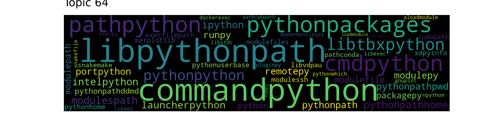

## Topic 65

```console
sbatchhtml batchbatch sbatch jobsbatch batchq outputsbatch waitsbatch batchsize partitionbatch batchjob batch fnamebatch batchpy dockerexec stepbatch idsbatch batchsh sizebatch echoinfo sbatchsh scriptspath dockerfile kbatch execfilepath ctxtecho scriptpath yecho commandpython echodebug nodeecho hhecho echoerror iecho hsecho scriptmanager xecho bashrc scriptpy bashrcn xargs nodesecho printshellcmds scriptsdir cmds runprocess scriptnow commandstxt cmdpython scripthome framebatch
```
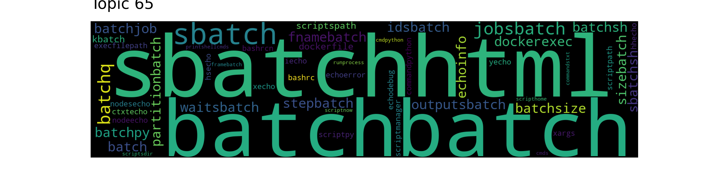

## Topic 66

```console
nodefilepbs nodefile pbsqueue inpfile fopenmp pbsidpbs pbsdsh nodemanager pbs pdebug nodesn modulefile pstmp pb modulessh jlogfile pde outputfile logfile dirpbs pythonpathpwd nprocscat pkgconf nccllog fastqfile nprocswc modulespath stdout pkgconfig jobfile depmap bashrcn stdoutpbs mdlog modulefiles wpb nprocs dirtmp tmpfile nproc makefile nfile nodesh stdoutj pythonpathhome psdef ppc nodelistgpu xpbs nodescat
```
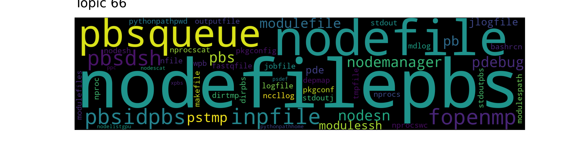

## Topic 67

```console
loadmodule aloadmodule loadedmodules modulefile modulepy modulefiles modulessh moduleshome modulespath moduleslurm modules module modulepath libxc libstdc xinitrc pythonpackages libld libpythonpath libedit moduletable libxml envmodules libexec pdebug sourcehomepack pkgconfig modulesnouveau libmtp zshrc libyaml libvdpau libtbxpython libxsmm loadmodel libc github cmdpython libgl malloc portpython matplotlib libdmapsharing rclone loadd launcherpython multilib libncclso loadirhomepack makefile
```
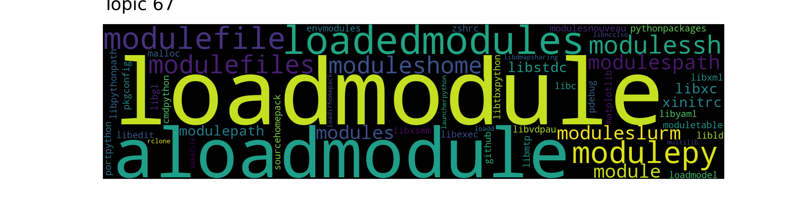

## Topic 68

```console
outputsbatch exports sbatchhtml export exportall batchbatch exported exportnone outputtrain clusteroutput outputgmx sbatch outputbase outputjob pathoutput diroutput outputsrun outputjobout batchsize diroutputs jobsbatch outputivecs outputecho fileoutput batchjob dockerfile outputfile outputoutput dirdataset stepbatch outputoutputs outputslurm outputx datapy outputxjout tensorflow outputname datatraindata batchpy datasetpy datafiles pathdata partitionbatch dataproces outputmpi jobsproc datafile runprocess dataset workerpy
```
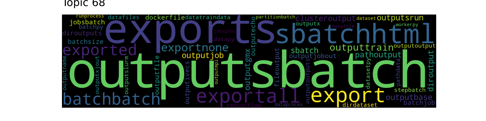

## Topic 69

```console
outputtxt outputjob jobfile jobtmp outputjtxt outputfile cmds cmdfile outputsrun outputjobout outputdirectory cmdsrun jobsproc cmd outputsbatch psdef jobscriptsh fopenmp stdout stdouttxt outputrfm dirtmp nodefilepbs jobidtxt filetesttxt jobksh jobpy stdoutj outputecho nodelisttxt outputlog dockerexec commandstxt joblog outputgmx runjob sorttxt jobscript nodefile jobfs dirtmpdir cmsrun outputmsub nodemanager outputx dmpiexec nodeecho tmpdirlocal mdrun runprocess
```
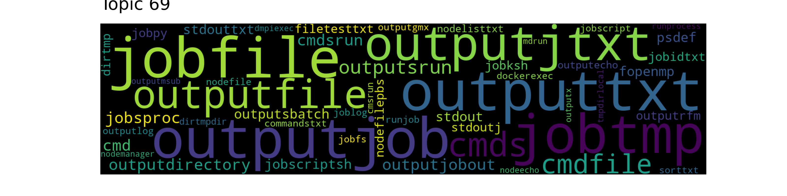

## Topic 70

```console
sbatchhtml batchbatch sbatch outputsbatch waitsbatch batchq batchsize jobsbatch batch partitionbatch batchjob kbatch sizebatch dockerexec framebatch runprocess batchpy fnamebatch multiprocessing batchsh optimbatch stepbatch batchnorm cputime cpuinfo idsbatch trainingbatch minibatch sbatchsh taskthreads jidsbatch partitioncpu nodeecho execfilepath printshellcmds multithreading excludegpu multigpu echoinfo cpu cronlogfile cmdsrun cmds kernelexe getopts crontab yecho processor processors customcmd
```
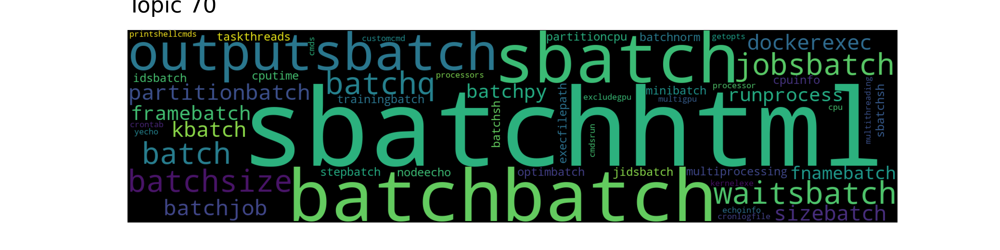

## Topic 71

```console
sbatchhtml batchbatch sbatch outputsbatch batchq batchsize jobsbatch batchjob waitsbatch batchpy partitionbatch nodeecho nodesecho batch jidsbatch excludegpu runprocess batchnorm batchsh bamfiles fnamebatch multigpu multiprocessing simoutput tensorflow kbatch gpufile dockerexec execpy mpiprocs sizebatch loadmodule modulefiles networkpy seqproc jobtmp sbatchsh simulationpy nprocs cpuinfo jobsproc deeplab yecho outputecho nodelistgpu stepbatch performancepy optimbatch aloadmodule packagevalgrind
```
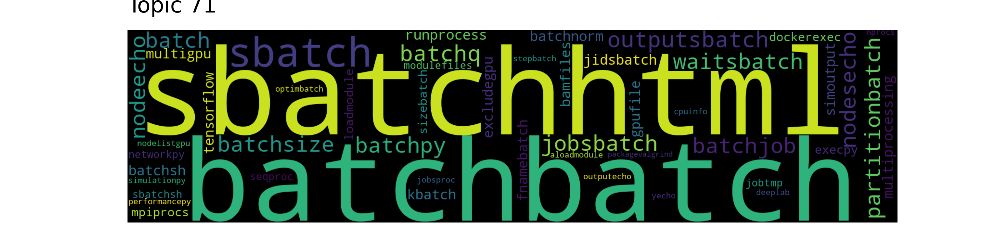

## Topic 72

```console
nodelistgpu gpufile gpuqueue excludegpu multigpu sbatchhtml gpu gpus cpuinfo gpuv gpuname gpuq partitiongpu multithreading batchbatch multiprocessing cpu partitioncpu sbatch nodesecho gpulog taskcpus taskthreads batchjob nodeecho hyperthreading jobsbatch outputsbatch lhyperthreading gpuer nodemanager batchsize partitionbatch nodeslurm lscpu batchq gpgpu gpua nvidiaconf cputime gpuspernode multithreaded gpuvolta gputrue namegpu nodesn nodesslurm nodedgxngpu cpuq nodelistslurm
```
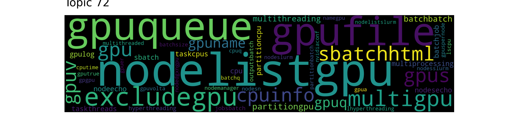

## Topic 73

```console
hadoop nodelisttxt dockerfile nodefile filesystem mapreduce fopenmp nodefilepbs jobfile clusteroutput dockerexec filesystemshome nodemanager summaryfilejob eachfile pyspark sorttxt outputtxt stdouttxt fileoutput restartfilefind cmdlauncher hdfile libpythonpath cronlogfile outputfile commandstxt dirtmpdir dirworkspace outputdirectory powercmddir filespy envfile emacsd filedata fdfd partitionepyc dirtmp gvfs stdout libtbxpython filestxt pythonpathhome maxdepth nodelistnode mywordcountfile nodescat summaryfile libexec lockfile
```
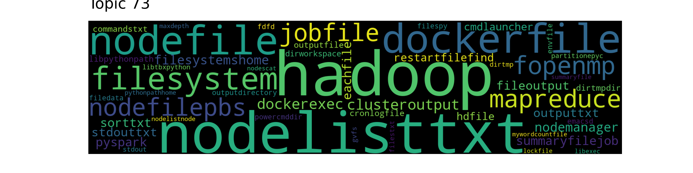

## Topic 74

```console
nodefilepbs nodefile jobsproc modulefiles modulefile nodemanager modulespath libexec jobfile nprocs dockerexec getopt makefile malloc getopts pythonpackages execfilepath nprocswc gdb nproc libpythonpath fopenmp libstdc bashrcn execdir modulessh nodelisttxt modulepy aloadmodule bashrc filehomeobsproc pythonpathhome nprocscat nodesecho loadmodule commandpython moduleshome cmakecachetxt nodeecho nodelistnode execpy bamfiles nprocnproc jobtmp workdirpbs nodesn mpmdconf libtbxpython libxc mpiprocs
```
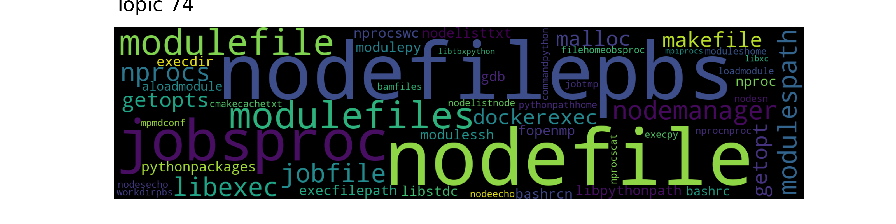

## Topic 75

```console
nodefilepbs nodefile nodesn nodemanager nodesecho nodesnodes nodelistnode nodesnnodes arraynodes nodeecho nodesslurm nodeslurm nodelistgpu nodenames nodesnum nodesh nnode nodescat nodes node nodempi nodelisttxt nodename nnodes nodelistslurm nodejs nodelist nnodesslurm fopenmp nnodesnnodes nodesmy nodescontrol datanode multinode processorsnodes nodea deeplabv stringnode maxdepth nodeid nodesbls nodecat deeplab npernode vnode npnumnodesmpi nodesscontrol nprocs nnodeswc nodedgxngpu
```
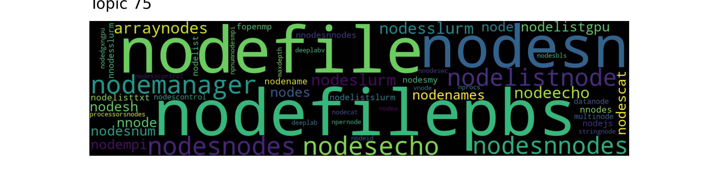

## Topic 76

```console
sbatchhtml gpufile batchbatch gpuqueue excludegpu sbatch outputsbatch multigpu gpulog gpu gpuq batchq gpuv gpuer gputrue cpuinfo batchsize nodelistgpu gpuname gpua nvidiaconf partitiongpu batch cpu partitionbatch waitsbatch amdgpu gpgpu stepbatch lscpu gpuvolta cpuq partitioncpu gpus runprocess sizebatch outputgmx gresgpu cputime jobsbatch processor kbatch batchpy namegpu idsbatch batchsh devicecpu framebatch radeonconf kernelexe
```
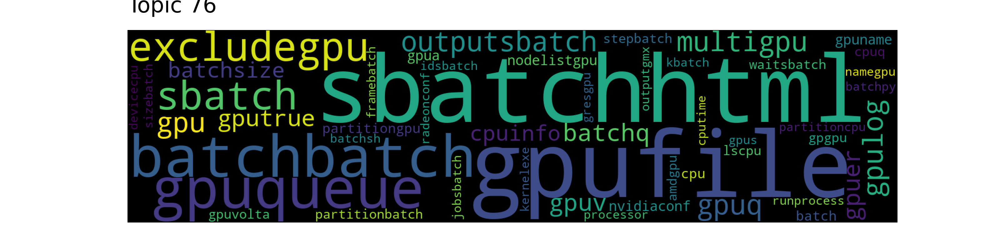

## Topic 77

```console
hxarrayshxarr outputgmx gnuplot nodesecho deeplab nodelisttxt nodeecho xdpyinfo grep nprocscat psdef nprocs datapy nodefile gresgpurtx xmaxarr gridsearchpy nodefilepbs intmpdir datasetpy sorttxt numpy debugnxf bashrcn githubcom partitionepyc idxstats pythonpathddmd xdamp nproc maxdepth xtccibits nmap nprocswc dockerfile indexndx ftracedir nprocmin deeplabv stdouttxt nvtx getopt libpythonpath outputx matplotlib cinpmatfmap github outputxjout fileprefix xlsf
```
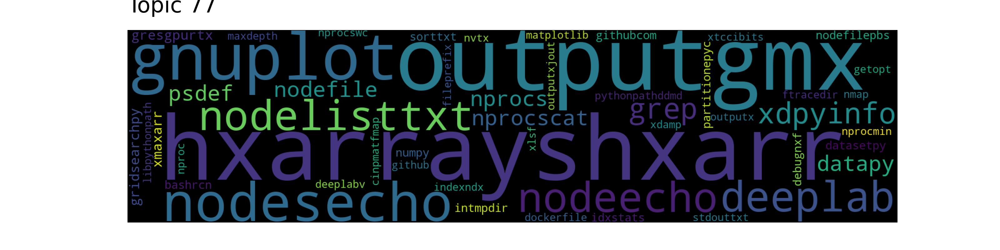

## Topic 78

```console
sbatchhtml batchbatch outputsbatch sbatch logfile lognamelog logfilename idlog loggingmllog jobsbatch cronlogfile logfilelogdir multirunlog syslogfacility batchjob scriptmanager scriptspath dockerexec batchq loglammps mdlog outputlog joblog logmsg logbaselogbase runprocess scriptpath partitionbatch echoinfo waitsbatch logstxt logfiles loglog logdirlogdir execfilepath bamspath logdir log logbasesprefix outputlogs runlog logs syslogauth fxdlog nodeecho dirlog loglevelinfo batchsize logtrue dockerfile
```
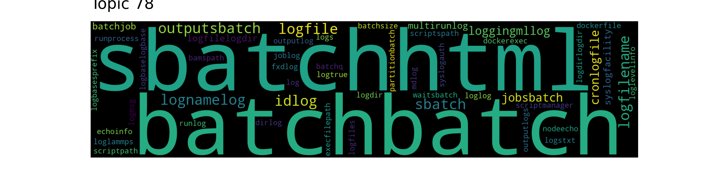

## Topic 79

```console
nodemanager nodesn nodefilepbs nodefile nodelistnode nodesecho nodeecho nodelistgpu nnode nodesnodes nodejs nodeslurm nodempi nnodes node nodesslurm nodesh dockerexec nodesnnodes nodescat nodes nodename nodenames nodelist nnodesslurm nodesnum nodelistslurm nodea vnode nodelisttxt stdout nodescontrol npernode pernode nodedgxngpu headnode nnodesnnodes stringnode nodecat libexec execpy nodesmy addnode nodesscontrol dmpiexec nprocs nnodeswc arraynodes nodeid datanode
```
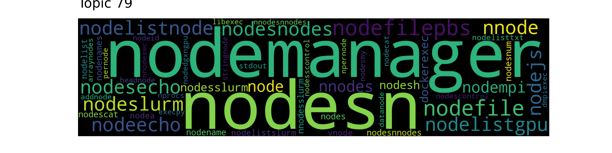

## Topic 80

```console
sbatchhtml batchbatch sbatch outputsbatch batchsize waitsbatch batchq partitionbatch batch kbatch batchpy batchsh framebatch fnamebatch sbatchsh sizebatch ctxtecho idsbatch hhecho cmds trainingbatch pkgconfig jobsbatch nodeecho cmdfile optimbatch mxecho jidsbatch networkpy xecho cmd getopts hsecho getopt yecho kernelsasc configslurm stepbatch bashrc xinitrc mmecho tmpfiles scriptmanager directivesbatch nodesecho iecho configpy scriptscontrol bamfiles printshellcmds
```
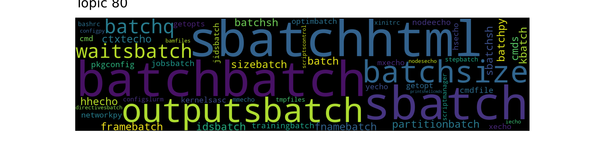

## Topic 81

```console
outputsbatch sbatchhtml batchbatch fopenmp batchsize sbatch lhyperthreading openmp batchjob jobsbatch multithreading jobsproc hyperthreading partitionbatch clusteroutput multiprocessing threadsnprocs ompthreads taskthreads runprocess outputgmx batchq outputecho nprocs jobtmp tmpdirlocal dockerexec nprocscat outputjob hyperthreads multithreaded outputsrun nodenproc outputrfm runthreadn bashrcn outputfile nprocswc mpiprocs nproc fnamebatch execpy sizebatch threadsomp outputivecs nprocnproc gmp mpmdconf seqproc ftrace
```
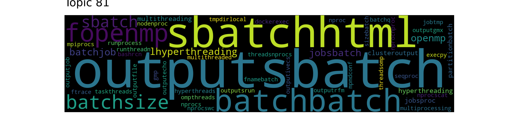

## Topic 82

```console
scheduler dockerexec schedulerjson schedulerhead crontab cronlogfile schedulersslurm dockerfile sbatchhtml xscheduler cronjobs schedulers batchjob cron jobsproc runprocess nodemanager jobsbatch taskthreads workerpy sbatch scriptmanager nprocscat bashrcn batchbatch networkpy schedulestatic partitionbatch nodefile nodefilepbs schedulingtrue execfilepath zshrc scheduling outputsbatch nodelisttxt threadsnprocs nprocswc taskset taskpkl commandpython taskskip nprocs nodescat launcherpython nodeecho nodelistgpu mpiprocs cputime nodesecho
```
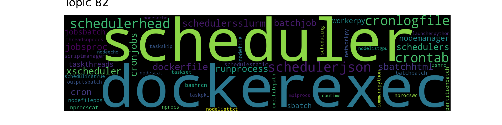

## Topic 83

```console
pythonpython libpythonpath commandpython pythonpackages pathpython libtbxpython pythonpathhome cmdpython ipython launcherpython portpython pythonpathpwd pythonpath python pythonuserbase intelpython pythonhome pythonpathddmd modulespath remotepy npython modulepy pythonwhich runpy packagepy matplotlib xdpyinfo modulefile execfilepath networkpy pathconda modulepath snakefile execpy pytorchpy scipy modulessh tensoranaconda numpy pipelinepy loadmodule snakemake testpy modulefiles pyspark workerpy databasepy checkpointpy aloadmodule xinitrc
```
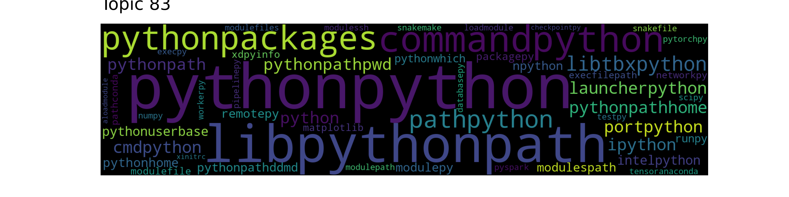

## Topic 84

```console
tensorflow modulepy pythonpython commandpython intelpython cmdpython moduleslurm libtbxpython modulefile pythonpathpwd launcherpython nprocscat envmodules modulespath pythonpathddmd nodelistgpu modulefiles portpython module outputmsub pythonuserbase deeplabv numpy køre pythonpathhome pathpython pythonpackages ipython nprocs modulessh aloadmodule modulepath modules templateflow moduletable xinitrc nprocess tensorboard jobsproc libpythonpath kernelexe nproc jobpy npython nprocswc submode deeplab autolab nprtrwnproc python
```
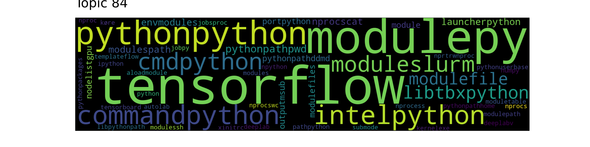

## Topic 85

```console
sbatchhtml batchbatch jobsbatch batchjob outputsbatch sbatch batchsize batchq partitionbatch waitsbatch batch fnamebatch batchsh sizebatch joblog jobsproc dockerexec dockerfile runprocess jobscriptsh outputjob stepbatch kbatch multiprocessing batchpy cronjobs tasksslurm jobscript taskslurm sbatchsh trainingbatch cronlogfile taskthreads jidsbatch taskskip jobfile countjobs jobtmp queueoptarg optimbatch idsbatch scriptmanager multirunlog outputecho framebatch scheduler joberror jobend taskset tasknum
```
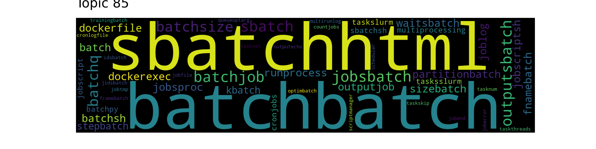

## Topic 86

```console
gmp openmp lmp nodesn itmp partitionepyc nprocs stmp nnode pstmp nodefile nodesh heatmap outputsbatch shares fopenmp multinode nprocmin smp nodesecho nodeecho metadata nodelistgpu ctmp nnodes cerrctmp clusteroutput omp nitmp nodejs nvhpc partitionbatch multiprocessing npl htop nodes outtmp stdout nvidiaconf cnhpc datasettemplama share datanode outputfile hcpmmp ompnth nodefilepbs restartlmp metaq nprocswc
```
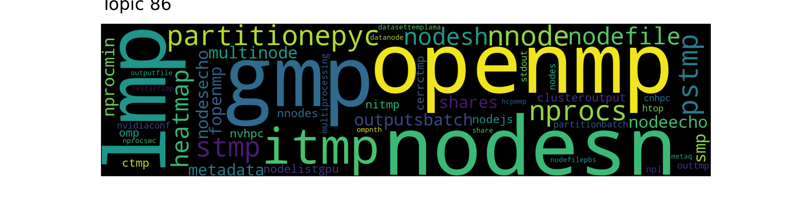

## Topic 87

```console
libpythonpath pathpython pythonpathhome pythonpathpwd commandpython pythonpython libtbxpython pythonpath pythonpackages cmdpython launcherpython portpython execfilepath ipython pythonpathddmd pythonhome pathcudapath python modulespath remotepy pythonuserbase pathconda runpy cudapath intelpython pythonwhich runpath bamspath snakefile npython pathoutput libxml xdpyinfo libstdc scriptspath packagepy libexec execpy matplotlib pipelinepy databasepy pathpath libvdpau filepath pathpathhome pathlib scriptpath checkpointpy networkpy srcpath
```
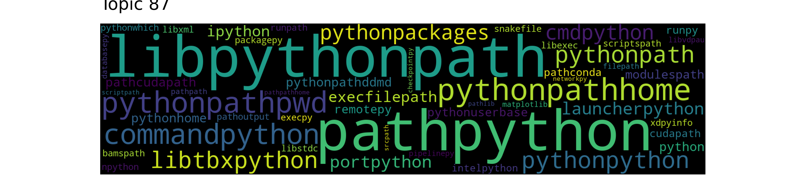

## Topic 88

```console
sbatchhtml batchbatch commandpython sbatch pythonpython ipython batchq batchsize batchpy intelpython tensorflow cmdpython waitsbatch pythonpackages pathpython pythonpathpwd outputsbatch sizebatch stepbatch pythonpathhome pythonpathddmd multiprocessing batch partitionbatch portpython trainingbatch pythonuserbase libtbxpython postgresqlconf gresgpu multigpu launcherpython deeplabv remotepy libpythonpath batchsh gpufile networkpy python pythonpath fnamebatch dockerfile deeplab workerpy postgresql scriptpy runprocess gresgputesla dockerexec optimbatch
```
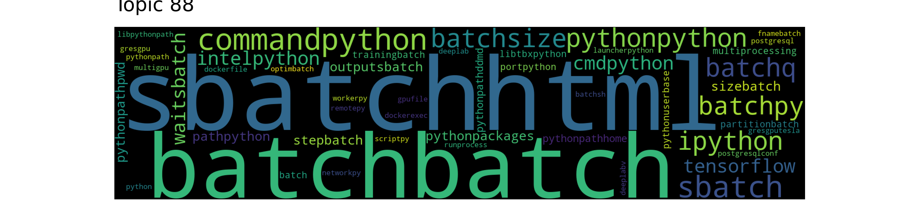

## Topic 89

```console
tensorflow sbatchhtml batchbatch dockerexec batchsize sbatch outputsbatch batchq waitsbatch dockerfile sizebatch batchpy tensoranaconda workerpy cmdpython commandpython pythonpackages batchjob partitionbatch jobsbatch launcherpython clusteroutput gpufile batchsh multiprocessing libpythonpath batch multigpu gpuqueue networkpy runprocess minibatch customcmd kbatch fnamebatch libtbxpython pythonpython modulespath execpy nodelistgpu nvidiaconf pythonpathpwd trainingbatch sbatchsh mlflow clustererror sysctlconf cmdlauncher runpy ipython
```
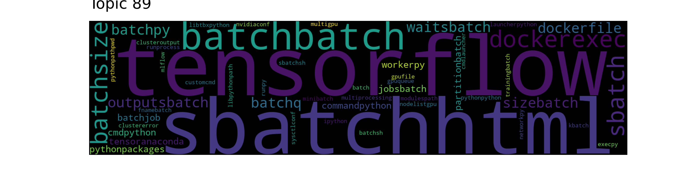

## Topic 90

```console
dockerfile pythonpackages libpythonpath dockerexec github networkpy nodefilepbs pythonpython githubcom pythonpathhome matplotlib pythonpathpwd modulessh pbsidpbs launcherpython pdebug pythonpathddmd remotepy gnuplot libtbxpython pkgconf workerpy nodemanager packagepy pbsdsh pbsqueue commandpython libstdc partitiondebug sysctlconf distributedpy fopenmp pidgin libvdpau cmdpython postgresqlconf hostsmpsize dirtmpdir qbittorrent pkgconfigpkg pathpython lpnetlib mksquashfs nodefile portpython cronlogfile pythonuserbase zshrc dependenciespy jobpy
```
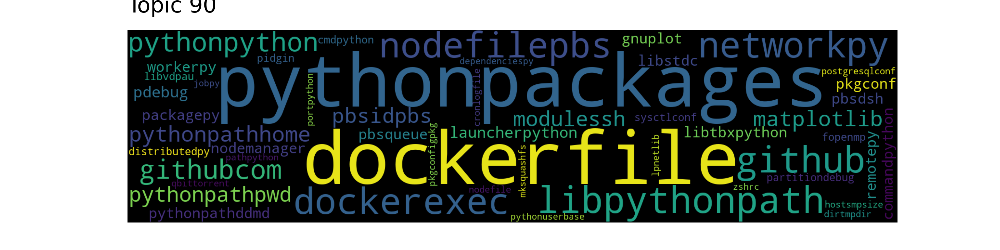

## Topic 91

```console
sbatchhtml outputsbatch batchjob jobsbatch dockerexec batchbatch sbatch cronlogfile batchq batchsize dockerfile waitsbatch queueoptarg crontab execfilepath scriptmanager jobscriptsh cronjobs getopts scriptsdir commandstxt getopt scriptdir synclimit outputtxt cron scriptspath scriptpath echoinfo nodelisttxt outputjob scripttest execdir timelimit printshellcmds scheduler scriptpwd jobscript jstdout directivesbatch tasksslurm multiprocessing partitionbatch outputscript commandpython execpy scriptsh jobsproc optimbatch counttxt
```


## Topic 92

```console
nodesn nodescat nodefile libpythonpath nodesecho pythonpathpwd nodeecho nodefilepbs nodesnnodes nodempi nodecat nodelistnode nodelisttxt nnode nodeslurm nodesnodes nodesslurm nodemanager nodesh pythonpathhome pathpython nprocscat commandpython nodescontrol node libtbxpython nnodes nodelistgpu npernode nodejs stringnode nodes nodea datanode nnodesslurm cmdpython nodesscontrol launcherpython nodesnum pythonpython nnodesnnodes cudapath nodelistslurm cobalt pythonpath ipython jobpy nodesbls nprocswc pythonpathddmd
```
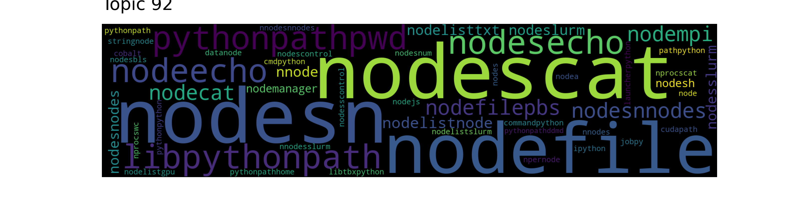

## Topic 93

```console
sbatchhtml batchjob batchbatch jobsbatch dockerexec nodelisttxt outputsbatch batchsize sbatch nodelistslurm batchq nodelistnode queueoptarg nodefile nodelistgpu getopts jobscriptsh nodesecho nodeecho nodelist multinode jobscript nodefilepbs execfilepath cronjobs getopt scriptsdir directivesbatch multiprocessing nnode waitsbatch nnodesslurm cronlogfile tasksslurm nodejs ntasksslurm nodemanager scriptdir nodesnodes commandstxt nodenames execdir nodeslurm crontab synclimit nodesslurm scriptspath scriptmanager numtasksslurm commands
```
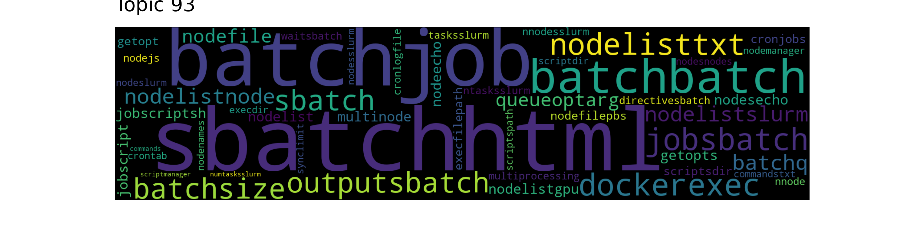

## Topic 94

```console
commandpython clusteroutput libtbxpython exportall launcherpython pythonpython libpythonpath export modulefile ipython fopenmp pythonpathhome exports exportnone tensorflow cmdpython modulessh openmp modulepy outputfile modulefiles pythonpackages remotepy exported stdout outputgmx networkpy outputbase portpython dockerfile execpy makefile pathpython partitionepyc gdb modulespath basepy pythonuserbase runpy intelpython tmpdirlocal distributedpy nginxconfpacnew github pipelinepy fileoutput pythonhome pythonpathpwd gmp xinitrc
```
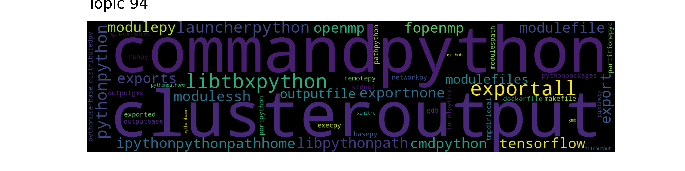

## Topic 95

```console
pythonpackages commandpython pythonpython libpythonpath tensorflow cmdpython launcherpython libtbxpython matplotlib pythonpathpwd pathpython pythonpathhome networkpy ipython pythonpathddmd partitionepyc intelpython remotepy runpy dockerfile portpython dockerexec tensoranaconda workerpy modulespath modulepy numpy packagepy postgresqlconf modulefile xdpyinfo runprocess gnuplot modulefiles scipy sysctlconf datasetpy pythonuserbase modulessh python execpy checkpointpy jobpy sbatchhtml gpufile pythonpath mpmdconf pyspark npython deeplabv
```
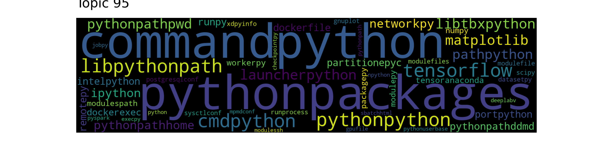

## Topic 96

```console
dirtmpdir dirtmp zshrc centos scriptsdir scriptdir cdatadir tmpdirlocal cmakecachetxt pythonpathhome cdirs libpythonpath rdatadir mkdir dirdir pythonpathpwd localdisk scriptspath execfilepath dirfile psdef restartfilefind makefile rundir datafile tmpdir dirdisk tmpfiles intmpdir srcdir filesystemshome partitionepyc libtbxpython homefolderdata datafiles fileprefix projectdir dockerfile ftracedir filedata fopenmp scriptpath deeplab scriptsh dirproject rawdev outdirdata pythonpathddmd dirdataset filehomeobsproc
```
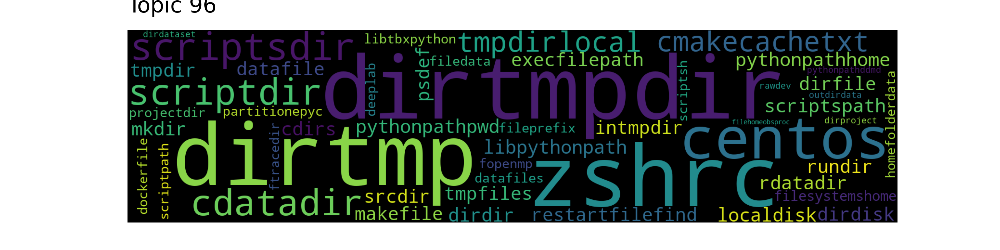

## Topic 97

```console
outputsbatch batchsize sbatchhtml fopenmp outputgmx partitionbatch batchbatch getopts getopt outputfile sizebatch dockerexec outputecho sbatch mpmdconf clusteroutput openmp libexec partitionepyc outputrfm libstdc batchq outputtxt execpy makefile intmpdir outputsrun stdout echoinfo malloc bashrcn nodeecho printshellcmds libxc dockerfile nprocs multiprocessing execfilepath bashrc splitsize endcsv partitioncpu mpdset runprocess cmdpython outputivecs tmpdirlocal ffmpeg cmdfile gmp
```
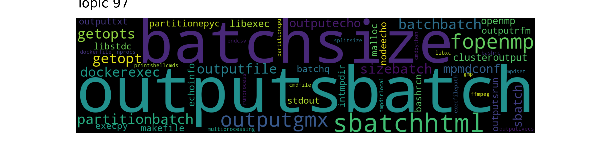

## Topic 98

```console
pathpython libpythonpath pythonpathhome commandpython launcherpython pythonpathpwd pythonpython cmdpython pythonpackages libtbxpython remotepy pythonpathddmd execfilepath modulespath portpython runpy ipython pythonpath pythonuserbase pythonhome runprocess xdpyinfo gnuplot intelpython dirproject matplotlib packagepy networkpy pyspark dockerexec scriptspath python testpy modulefile cmdlauncher filespy checkpointpy execpy modulessh githubcom stdouttxt launchpy stdout pathcudapath makefile epyc partitionepyc modulefiles pathoutput pgsql
```
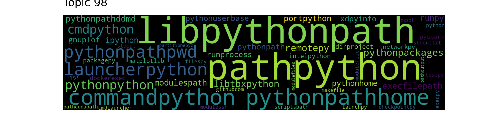

## Topic 99

```console
sbatchhtml outputsbatch batchbatch getopt runprocess getopts commandpython sbatch libpythonpath partitionbatch batchpy execfilepath dockerexec runpy multiprocessing pathpython pythonpathpwd execpy partitionepyc pythonpackages batchq batchsize packagepy cmdpython jobsproc dockerfile bashrc remotepy pythonpython libtbxpython batchjob jobsbatch pythonpathhome nprocscat bashrcn networkpy workerpy fnamebatch pathcudapath processingpy cudapath scriptspath nprocs nodeecho jobpy makefile nprocswc performancepy waitsbatch modulespath
```
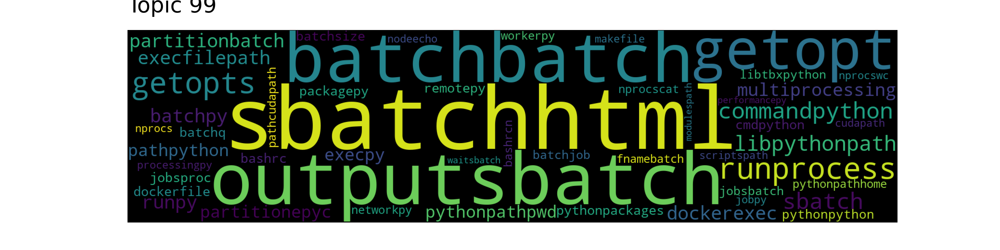

## Topic 100

```console
sbatchhtml sbatch outputsbatch batchbatch fnamebatch partitionbatch batchq batchsize outputgmx outputjtxt outputtxt waitsbatch fopenmp idsbatch commandstxt outputscript xlsf ftrace kbatch batch xargs batchpy outputrfm fxdlog stepbatch batchsh getopt sbatchsh cmdfile cmds tmpfiles runprocess fmap execfilepath sizebatch optimbatch bashrcn ntimefmt ftracedir getopts jobsbatch mktemp cmdsrun outputfile nmap outputsrun bashrc directivesbatch fsldir scriptpy
```
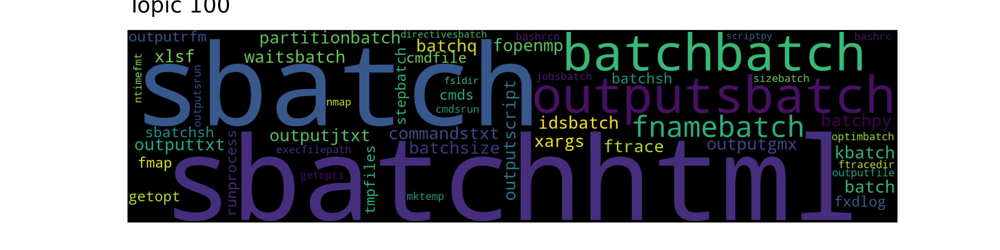

## Topic 101

```console
inputfile pythonpathhome pkgconfig pythonpathddmd modulefile inpfile pathpython pythonpackages inputdir loadmodule inputnml filesystemshome libpythonpath modulespath cpgdfile pkgconfigpkg pythonpython modulefiles networkpy modulepy pythonhome jtyppdyjlogfile aloadmodule portpython pgsql deeplabv pythonpathpwd fileprefix envmodules packagepy vpppg moduleshome bamfiles pbsdsh inputdirmodel pbsqueue inputnmlksh configpy setuppy pkgconf modulessh pmi pmapcsv distributedpy dirinput runpy partitionepyc filehome outputfile filebasename
```
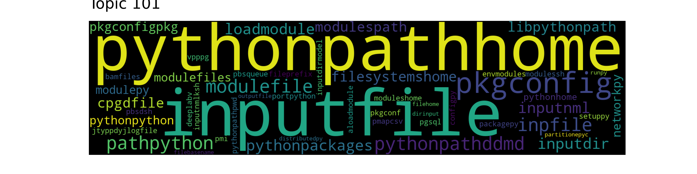

## Topic 102

```console
outputsbatch sbatchhtml dockerexec nodemanager nodeecho batchbatch nodesecho sbatch outputdirectory execdir outputecho batchsize execfilepath nodefile outputsrun partitionbatch outputgmx batchq scriptmanager execpy exawind directivesbatch nodefilepbs outputrfm runprocess outputfile outputerr jobsbatch dockerfile rundirs batchjob exportall idsbatch powercmddir pathoutput mpiexec kernelexe nodelistgpu nodesh dirtmpdir rundir jobfile waitsbatch cmdlauncher outputjob github batchsh outputr clusteroutput getopt
```
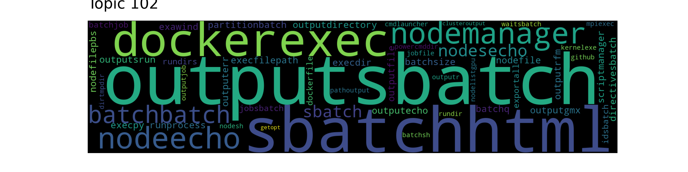

## Topic 103

```console
sbatchhtml batchbatch outputsbatch sbatch waitsbatch jobsbatch partitionbatch batch batchq batchsize batchpy batchjob kbatch stepbatch sizebatch multiprocessing idsbatch batchsh trainingbatch fnamebatch outputecho runprocess sbatchsh clusteroutput clustererror framebatch jidsbatch outputtrain optimbatch batches getopt outputsrun workerpy directivesbatch minibatch erroroutput execpy arraytaskid yecho outputjob dockerexec getopts taskset commandpython processingpy batchnorm tasksslurm outputivecs outputtxt deeplabv
```
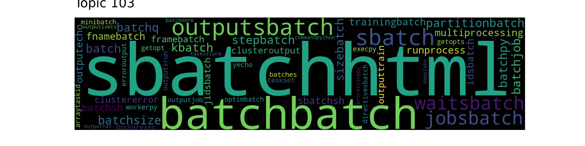

## Topic 104

```console
dockerexec dockerfile libpythonpath bamfiles fileprefix makefile jobfile eachfile pythonpathpwd pythonpathhome matplotlib restartfilefind tmpfiles execfilepath libtbxpython gnuplot scriptmanager tensorflow pathpython zshrc cronlogfile tmux commandpython modulespath pythonpathddmd dotfiles fastqfile nullglob dirtmpdir fopenmp filegene tmpdirlocal filesystem nodefile tmpfile nodemanager bamspath cmdlauncher filenames scriptspath filesystemshome libtbxfind cmdfile logfilename sorttxt cudapath filerun partitionepyc fastqfiles mpmdconf
```
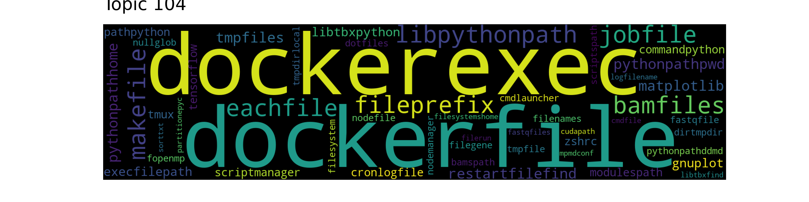

## Topic 105

```console
filebootstrap dockerfile bootstrap launcherpython commandpython libpythonpath pythonpackages nginxconf xdpyinfo databasepy pythonpython pathpython configpy postgresqlconf sysctlconf remotepy tensorflow pythonpathhome cronlogfile datasetpy defaultsconf filesystem distributedpy baselinepy filesystemshome workerpy pythonpathpwd matplotlib libtbxpython dockerexec configfile nginxconfpacnew pythonuserbase modulefile httpdconf packagepy mpmdconf outputfile datapy ipython fileprefix pkgconf restartpy runpy configconfig networkpy clusteroutput filespy jobpy modulepy
```
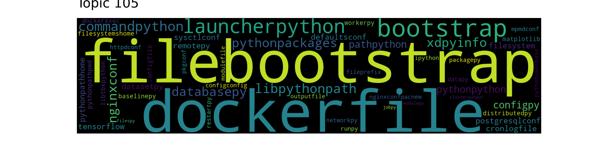

## Topic 106

```console
exports export exportall exportnone exported paramsportport outputgmx outputbase outputoutputs outputoutput outputsrun diroutputs outputfile fileoutput portport outputx diroutput clusteroutput outputerr outputjobout outputivecs import outputecho importing outputoutj outputslurm outputsbatch outputdirectory stdout outputout xport outputr outputrfm outputmpi outputdir tmpdirlocal noutput imported outputjob outputn dockerexec outputxjout outputj outputtrain portshuf pathoutput output simoutput outputroot runlocal
```
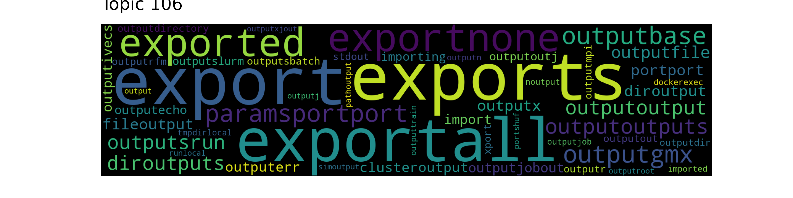

## Topic 107

```console
sbatchhtml batchbatch outputsbatch batchsize sbatch batchq batchpy jobsbatch tensorflow waitsbatch batchjob sizebatch partitionbatch multiprocessing stepbatch commandpython pythonpython batch fnamebatch libpythonpath cmdpython pythonpackages mlflow pythonpathpwd pathpython runprocess workerpy trainingbatch batchsh pythonpathhome performancepy dockerfile ipython libtbxpython execpy multigpu jobpy minibatch launcherpython remotepy pythonpathddmd dockerexec runpy networkpy optimbatch modulespath cputime excludegpu intelpython processingpy
```
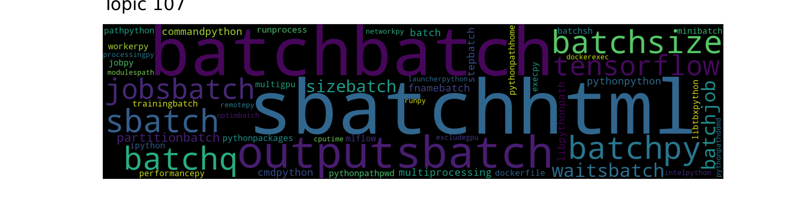

## Topic 108

```console
clustergres getopt clusteryaml getopts postgresql matrixcountf optimtotal nextflowtrace gridsearchpy clustererror clusterjson codellama excludegpu tensorflow geopt algorithm clustermem algorithms classifierpy lcrflimittrue mlflow cluster multiprocessing postgres aggregation matlab arrayslurm clusteroutput algorithmcuda arrayidp sparsesuperlu setcpuaffinity clustering codeclz optimbatch cinpmatfmap clustered multigpu linearsearch constraintgpu nprocscat packagevalgrind arrayslist gresgpu libgl deeplabv simulationpy subsample diroptarg clusters
```
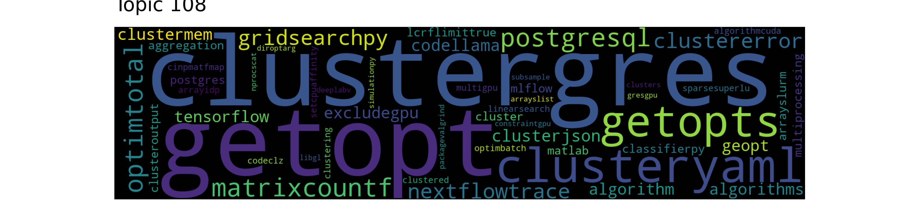

## Topic 109

```console
sbatchhtml batchbatch sbatch outputsbatch batchsize idsbatch waitsbatch batchq batch sizebatch framebatch jobsbatch stepbatch partitionbatch fnamebatch multiprocessing batchjob batchpy tensorflow kbatch idcsv idxstats gmapcsv ipython outputecho commandpython batchsh gpufile multigpu sbatchsh outputgmx gnuplot filenames outputtrain gregtemp graphviz trainingbatch autolab memtotal outputsrun joutput imagenette centos png multithreading tasknum networkpy vmware imagedocker fileoutput
```
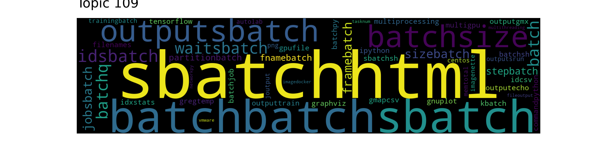

## Topic 110

```console
outputsbatch sbatchhtml batchbatch sbatch jobsbatch batchsize batchjob taskslurm tasksslurm outputsrun taskthreads clusteroutput partitionbatch runprocess multiprocessing batchq taskcpus ntasksslurm taskset outputecho batch stepbatch outputgmx multithreading outputjob outputjobout waitsbatch processors nodeecho excludegpu jobsproc taskskip outputivecs lhyperthreading taskid ntasks nodesecho outputslurm hyperthreading directivesbatch dockerexec ntask kbatch processor outputbase sizebatch opencl outputerr tasklist batchsh
```
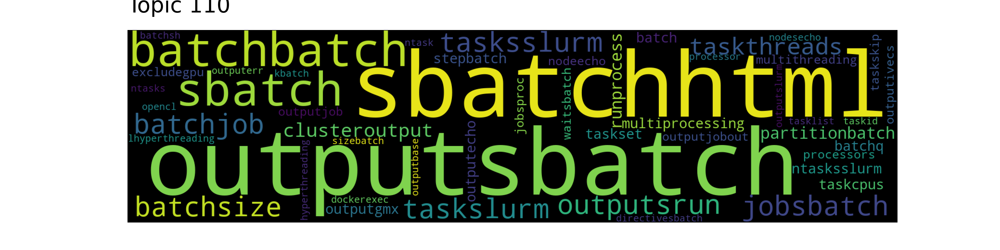

## Topic 111

```console
sbatchhtml batchbatch sbatch batchq batchsize outputsbatch waitsbatch partitionbatch sizebatch batch stepbatch batchjob batchpy kbatch jobsbatch batchsh commandpython framebatch fnamebatch commandstxt minibatch multiprocessing runprocess batchnorm optimbatch outputtxt sbatchsh pythonpathpwd partitiongpu pythonpython gresgpu postgresql counttxt pythonpathddmd postgresqlconf gpuqueue gpufile cmdpython pythonuserbase execfilepath idsbatch deeplab seqproc partitioncpu sorttxt queueoptarg filetesttxt pgsql dockerexec postgres
```
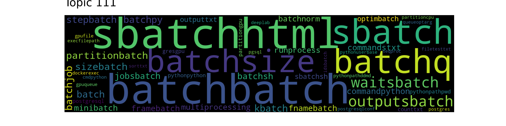

## Topic 112

```console
commandpython pythonpackages pythonpython libpythonpath tensoranaconda tensorflow cmdpython modulefile dockerfile pythonpathpwd modulepy launcherpython intelpython pythonuserbase libtbxpython ipython pythonpathddmd modulespath pathpython pythonpathhome dockerexec modulessh jobpy workerpy numpy snakemakestats sbatchhtml modulefiles python snakefile matplotlib npython nodelisttxt aloadmodule pathconda snakemakelog networkpy envmodules pythonpath loadmodule postgresqlconf portpython moduleslurm postgresql multiprocessing gnuplot batchpy remotepy runpy performancepy
```
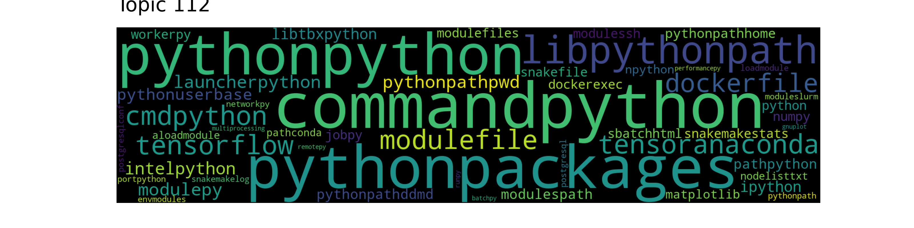

## Topic 113

```console
snakefile commandpython snakemake pythonpython libpythonpath snakemakelog pathpython pythonpackages modulefile cmdpython libtbxpython ipython pythonpathhome snakemakestats launcherpython pythonpathpwd pythonpathddmd pythonuserbase modulespath modulessh modulepy portpython modulefiles intelpython python pythonpath pathconda pipelinepy fastqfile snake matplotlib pythonhome moduleslurm dockerfile modulepath aloadmodule modulesnouveau makefile npython tensoranaconda jobfile loadmodule dockerexec postgresqlconf tensorflow bfile pythonwhich jlogfile logfile pluginpy
```
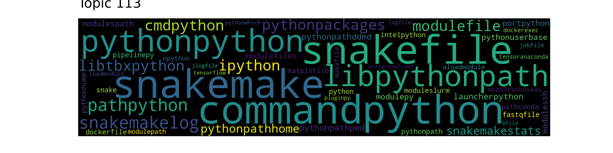

## Topic 114

```console
datapy tensorflow ftracedir ftrace datasetpy datafiles deeplab fopenmp tmpfiles networkpy datalad datafile outputsbatch datatarget dockerfile partitionepyc deeplabv datatraindata clusteroutput benchmarkpy runpy nodefilepbs matplotlib rdatadir performancepy tmpdirlocal psdef filedata datatestdata testpy pythonpathpwd dirdataset datapbs gnuplot dataset sbatchhtml outputfile outputsrun gpufile cdatadir datanode datasetn dirtmp pkgstats matlab partitionbatch datasetcifar libtbxpython libpythonpath debugtrace
```
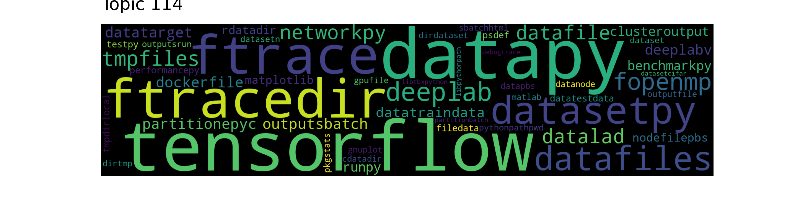

## Topic 115

```console
nodesn nodefile nodefilepbs nodelistnode nodesnodes nprocs nnode nodesnnodes nodeslurm nodemanager nodesslurm nproc nprocnproc nodesnum node nodempi nodelistgpu nprocscat nodename nodes nodesecho nnodes nodesh nprocswc nodejs nodenproc nodenames nnodesslurm processorsnodes nprtrwnproc nodeecho npernode nodescat nodelistslurm nodesmy npnumnodesmpi jobsproc nodelisttxt stringnode arraynodes pernode nodea nodelist nodescontrol nnodesnnodes vnode datanode nprocmin runprocess mpiprocs
```
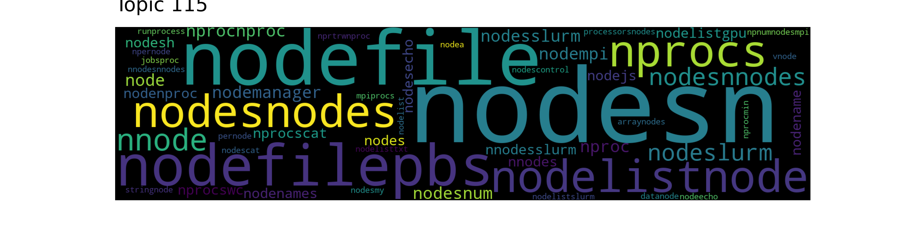

## Topic 116

```console
dockerexec modulespath bashrcn bashrc zshrc modulefile gpufile dockerfile nodeecho getopt github commandpython githubcom kernelexe sbatchhtml sysctl modulessh loadmodule cmdpython libpythonpath modulefiles grep echoinfo sysctlconf nullglob pythonpathhome gdb pkgconfig xinitrc envirovariables nodesecho libtbxpython getopts cudapath simoutput modulepath aloadmodule gccsv nodefilepbs modulepy scriptmanager cmsrun gmp cpuinfo gpulog cmdhostname deeplab outputsbatch nodemanager libstdc
```
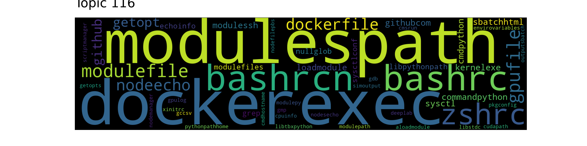

## Topic 117

```console
outputsbatch sbatchhtml batchbatch sbatch jobsbatch batchjob batchq partitionbatch batch waitsbatch outputecho outputlog outputlogs batchsize outputsrun excludegpu outputbase outputjob stepbatch batchpy outputjobout diroutput gpulog partitiongpu multirunlog idlog diroutputs outputoutput sizebatch runprocess outputgmx topoutputlogs outputrfm pathoutput outputmpi outputoutputs idsbatch yecho fnamebatch outputslurm joblog runlog outputoutj batchsh iecho dayecho nodeecho outputout outputfile outputr
```
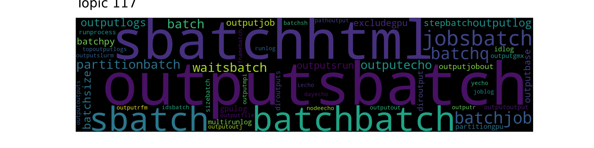

## Topic 118

```console
logfile logfilename logfiles logfilelogdir idlog indexlog mdlog multirunlog pbsqueue lognamelog logdirlogdir fxdlog jlogfile logstxt jtyppdyjlogfile logbasesprefix fopenmp loggingmllog fileprefix logdir nodefilepbs cronlogfile nccllog pathlog outputlog filelog pbsidpbs mpmdconf tmpfiles dirlog logtxt pythonpathddmd rrlog idparray indexfile prdlog bamfiles outputlogs partitionepyc ftracedir fastqfiles dirtmp alignoutputlogs getopt loglammps partitiondebug pdebug intmpdir datapbs dirtmpdir
```
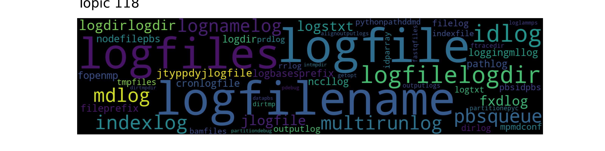

## Topic 119

```console
outputsbatch sbatchhtml batchbatch jobsbatch sbatch clusteroutput dataset batchjob datasetdataset batchq datasetpy batchsize datasetn dataproces seedrandom outputbase simoutput partitionbatch outputjob outputecho datasettemplama datasetmnist datatarget jobsproc dirdataset idsbatch batch hashresult datasets datafile clustergres datasetpolbook outputivecs waitsbatch nodesecho nodeecho outputfile datasettwitch tasksslurm multiprocessing outputjobout taskslurm taskset sizebatch stepbatch fileresults outputslurm deeplab kbatch ifsstat
```
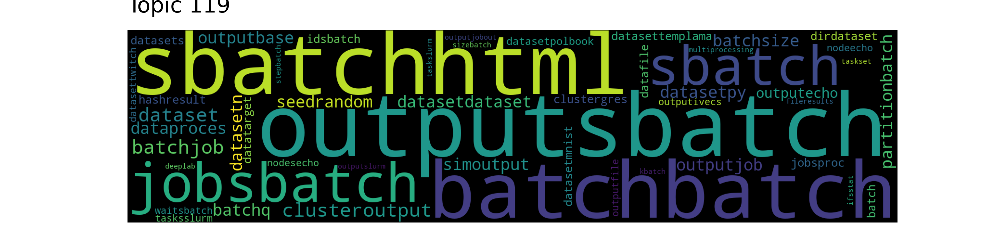

## Topic 120

```console
sbatchhtml outputsbatch batchbatch sbatch partitionbatch jobsbatch batchq batchjob batchsize clusteroutput batch waitsbatch outputecho batchsh kbatch bashrcn bashrc dockerexec getopt runprocess getopts dockerfile idsbatch excludegpu batchpy nodeecho sbatchsh hsecho echoinfo ctxtecho clustererror partitiongpu scripttest hhecho jobsproc outputtxt yecho outputgmx deeplab jidsbatch sizebatch gpufile outputjob outputjtxt centos iecho nodesecho partitioncpu deeplabv stepbatch
```


## Topic 121

```console
nodesecho nodesnodes nodeecho nodefilepbs nodefile nodelistnode nodesn nnode nnodes nodesnnodes nodemanager nodempi nodes npernode pernode nodelistgpu nodejs nodesh nodeslurm node nodesslurm arraynodes processorsnodes lnodes datanode nnodesnnodes addnode nodelist nnodesslurm nodesmy vnode fluxnode nodescat numnodes nodelistslurm multinode pprppnnode rankspernode dockerexec nodea nodescontrol nodelisttxt gpuspernode nnodeswc nodenames kernelexe nwpernode nodename stringnode npnumnodesmpi
```
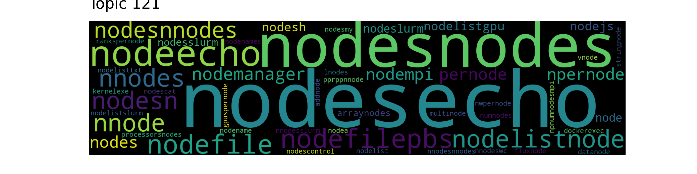

## Topic 122

```console
nodefilepbs fopenmp getopt openmp nodeecho execfilepath libexec bashrcn getopts nodesecho dockerexec outputsbatch bashrc dirtmp outputrfm pathoutput stdout outputecho outputfile makefile execdir runprocess mpmdconf nprocscat nprocs execpy libstdc nproc dirtmpdir nodefile outputgmx intmpdir outputsrun malloc nodemanager echodebug zshrc dirpbs nprocswc gmp echoinfo tmpdirlocal deeplab libpythonpath bamspath runlocal gdb outputmsub sbatchhtml shellbash
```
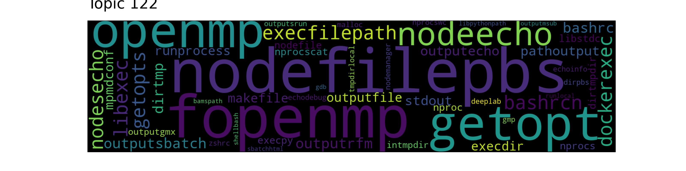

## Topic 123

```console
libpythonpath modulespath libtbxpython cmdpython pathpython pythonpathpwd commandpython pythonpathhome outputgmx cudapath libxml modulessh libxc xdpyinfo execfilepath launcherpython libstdc dockerexec remotepy libvdpau exportall modulepath execpy modulefile dockerfile libexec pathcudapath modulepy runpy libtbxfind portpython export exportnone cmsrun pythonpathddmd pythonpackages githubcom outputxojn outputx nginxconf cmdlauncher pathoutput outputfile modulefiles stdout xinitrc exports outputtxt github outputsrun
```
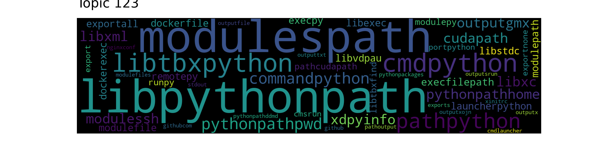

## Topic 124

```console
pbsqueue pbsidpbs pbs pbsdsh pdebug pb pstmp fopenmp nodefilepbs kpsmp clusteryaml databasespbs pbsout pkgstats tmpfiles dirtmp pstat clustererror pbswc partitionepyc clusterjson partitiondebug wpb spbs dirpbs openmp inpfile partitionbatch xpbs pbtype pbatch partitioncpu stmp datapbs dbsnp mapperdebug clusteroutput pdb bamfiles debugnxf clustermem pkgconf epb queuepbs kbs pde ptmp ppc distributedpy pmembb
```
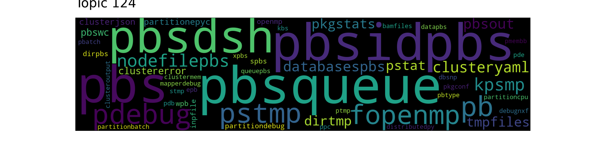

## Topic 125

```console
libpythonpath libtbxpython libdmapsharing libxc libxml libvdpau githubcom github libtbxfind libstdc pythonpathhome remotepy libexec matplotlib pythonpackages xdpyinfo packagepy libmtp pathpython outputgmx xorgconf xdamp libyaml libedit envlocal xport outputxojn gnuplot libld sourcehomepack commandpython xorgconfd launcherpython cmdpython libxsmm gmapcsv cmakecachetxt outputx export lxml lxde dockerexec exportall tmux voxel libncclso nginxconf execpy xtccibits portport
```
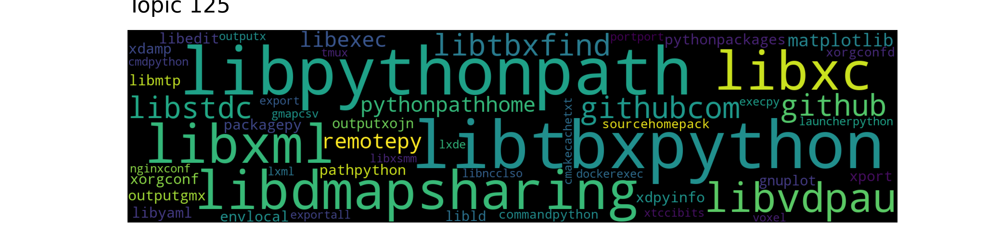

## Topic 126

```console
tensorflow tensoranaconda tensorrt pythonpackages batchbatch sbatchhtml dockerfile dockerexec batchsize tensorboard tensor sbatch nodelistgpu mlflow workerpy batchq pythonpython batchpy multiprocessing commandpython libpythonpath sizebatch waitsbatch templateflow outputsbatch nextflowconfig networkpy clustererror gpuqueue trainingbatch clusteroutput cmdpython githubcom stepbatch launcherpython jobsbatch github matplotlib pathpython gnuplot multigpu pythonpathpwd libtbxpython batchjob partitionbatch nextflowtrace ipython postgresqlconf pythonpathddmd batchsh
```
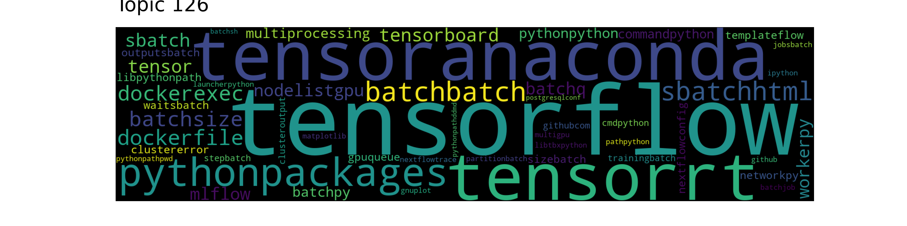

## Topic 127

```console
sbatchhtml outputsbatch dockerfile dockerexec commandpython outputfile fileoutput jobfile batchbatch batchq execfilepath tmpfiles tempfile libpythonpath batchsize modulefile libtbxpython cmdpython sbatch outputgmx bamfiles makefile modulefiles partitionbatch jobsbatch eachfile tmpfile outputtxt pythonpackages filespy fastqfile fileprefix batchjob filetime remotepy pythonpython jobpy outputecho clusteroutput outputjob jobtmp tmpdirlocal workerpy seqfile partitionepyc matplotlib pathpython filesls execpy cmdfile
```
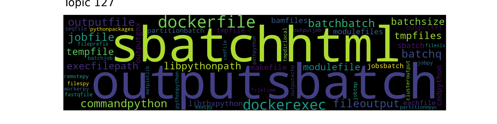

## Topic 128

```console
ftrace ftracedir debugtrace commandtrace qstat echoinfo stdout scriptnow pstat kernelexe backtrace scancel bashrcn nmap outputtxt bashrc scriptsh scripthome sysctl ifsstat stdouttxt scripttest zshrc trackingclean cpuinfo outputsbatch scriptdir tmux debugnxf traceback matplotlib script pidx sysctlconf nfpcli gnuplot runprocess outputx sbatchhtml outputecho scriptsdir strhome outputsrun tmpdirlocal xecho cputime ctxtecho xdef outputrfm scriptpath
```
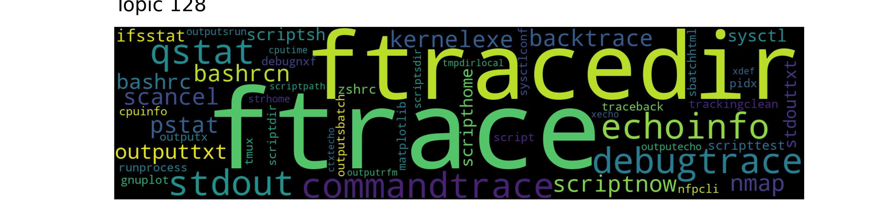

## Topic 129

```console
nodefilepbs nprocs pbsqueue fopenmp postgresql nproc postgres bashrcn mdrun gmp nprocscat nodefile nprocswc nmap mpmdconf inpfile depmap fastqfile nodemanager nprocmin postgresqlconf makefile runprocess seqproc nprocnproc pgsql bashrc intmpdir cpgdfile runpplsh zshrc modulessh modulefile outputsbatch gnuplot pkgconfig xinitrc gpuqueue tmpfile rundirs runpdy nodelistgpu nbitpg nodesn gpufile scriptmanager filerun dockerexec rundir tmux
```
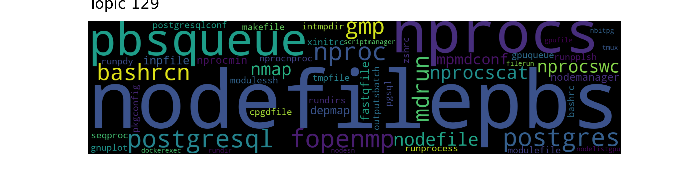

## Topic 130

```console
archlinux craylinux linux xinitrc selectcraylinux kernelsasc libxc pythonpackages cmakecachetxt skypeforlinux kernel libpythonpath github cmakeliststxt libxsmm libedit archslc libxml configtxt libstdc kernelexe xinit ubuntu packagepy configpy zshrc githubcom libexec compiling libpciaccess compilerintel libtbxpython matplotlib playonlinux partitionepyc kernels xorgconfd packagevalgrind xorgconf swbuild openmp gridsearchpy libgl configfile librariesnna rootpolbook smbconf openssl configsh getopt
```
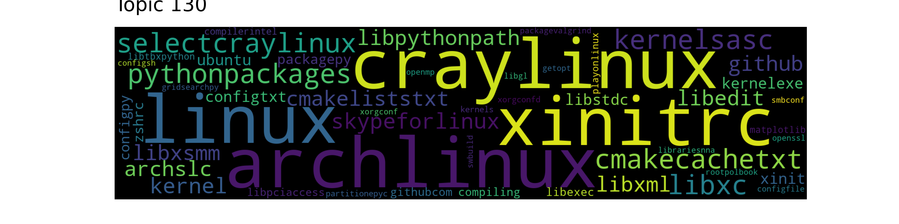

## Topic 131

```console
gpuqueue gpufile pbsqueue outputmsub gcccore loadmodule runsub aloadmodule nodelistgpu packagevalgrind nodefilepbs excludegpu malloc libstdc github nprocswc modulefile pdebug gdb gcc matlab loadedmodules gpulog gsub pkgconfig postgresql gmp nvidiaconf mpmdconf modulepy postgres npm gpuv stdoutj flagsdevicegpu nodejs dockerexec githubcom msub moduleslurm gpuq arraybench dirtmpdir gpgpu qsub stdout gpu subfile gccsv modulefiles
```
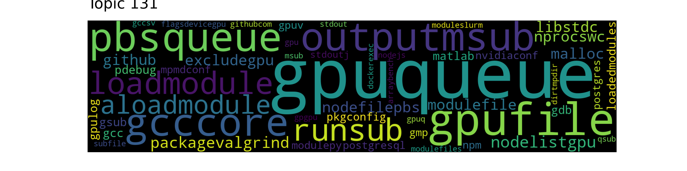

## Topic 132

```console
sbatchhtml batchbatch sbatch outputsbatch batchsize batchq batch waitsbatch sizebatch stepbatch batchsh mlflow jobsbatch partitionbatch fnamebatch batchjob trainingbatch batchpy sbatchsh idsbatch optimbatch kbatch multigpu gpufile batchnorm scriptspath scriptsdir framebatch outputscript jidsbatch minibatch getopt getopts scriptdir script pbatch outputsrun excludegpu gresgpu runprocess outputtxt cmdsrun deeplab execfilepath gpuqueue scriptpath multirunlog multiprocessing scripting pkgconfig
```
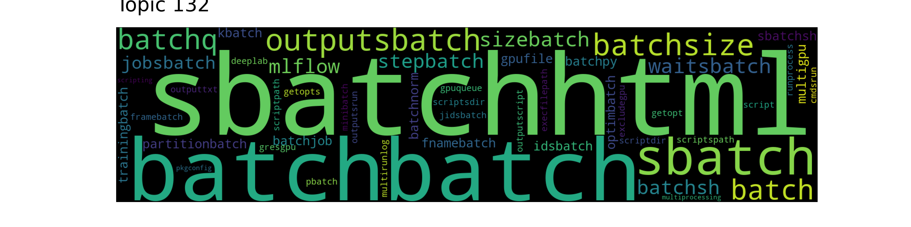

## Topic 133

```console
nodeecho nodesecho sbatchhtml pathcudapath pathexperiment cudapath pathoutput nodefile bamspath pathpath pathdata datapath runpath dstpath nodefilepbs pathdatasets snpeffpath batchbatch pathhome outputsbatch scriptspath pathpathhome filepath pathsout execfilepath nodeslurm sbatch pathpython pythonpathhome capturepath pathname pathdirname path nodesslurm paths nodesn modulespath runprocess srcpath dirpath batchsize scriptpath nodesh pathmsccl networkpy cnppath nodenames dockerfile nodescat pythonpathpwd
```
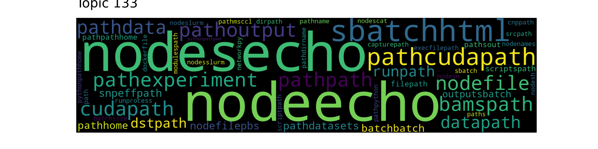

## Topic 134

```console
nodeecho echoinfo nodefilepbs echodebug fopenmp nodesecho grep outputfile deeplab bamfiles bamfile bamspath outputsbatch databasespbs idlog pgsql outputtxt pythonpathpwd outputecho dirtmp nodefile pythonpathddmd yecho dirtmpdir inpfile dockerfile intmpdir logfile ftracedir outputrfm sbatchhtml pythonpathhome echo datapbs pbsqueue iecho indexfile pbsidpbs logfilename outputbase bashrcn databasepy tmpfiles deepmd cpgdfile outputmsub libpythonpath dirpbs idparray pgsqlso
```
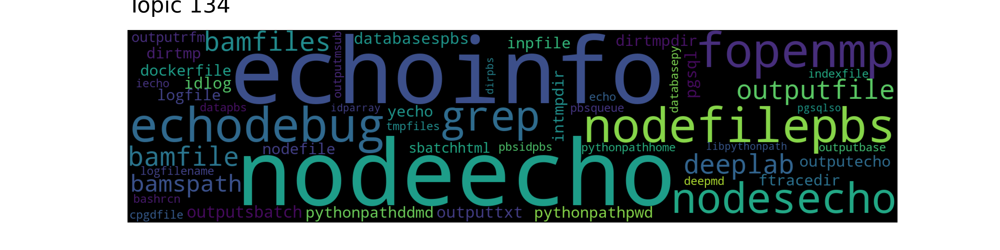

## Topic 135

```console
tensorflow tensoranaconda workerpy libpythonpath nprocscat jobpy tensorrt nprocswc nprocs jobsproc pythonpathpwd libtbxpython nodesn modulespath nodelistgpu nproc nprocnproc nprocmin nprtrwnproc runpy pythonpython testpy numpy cmdpython launcherpython commandpython pythonpathddmd dockerfile tensor pathpython nodescat intelpython partitionepyc workflow cudapath networkpy ipython nprocess nodelisttxt nodefile modulepy pythonpathhome pythonpackages runprocess execpy clusteroutput jobtmp nodeslurm mpiprocs nodesnnodes
```
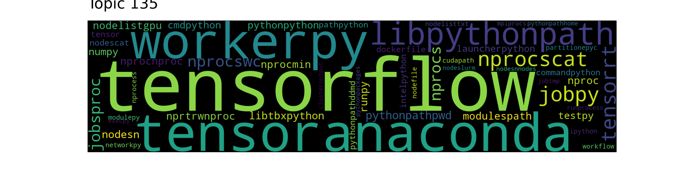

## Topic 136

```console
sbatchhtml outputsbatch batchbatch commandpython sbatch pathpython cmdpython echoinfo pythonpathpwd batchq libpythonpath shellbash bashrc runprocess batchpy dockerexec yecho execfilepath outputecho scriptspath outputtxt pythonpython pythonpathhome bashrcn postgresqlconf echo ipython nodeecho echodebug ctxtecho runpy stdout commandstxt echoecho partitionbatch iecho outputjtxt getopt echocat pythonpathddmd hhecho execpy printshellcmds remotepy stdouttxt batch pathconda modulespath batchjob dockerfile
```
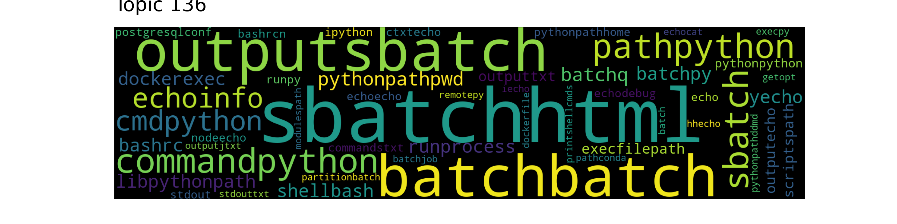

## Topic 137

```console
pgsql pgsqlso nodefilepbs postgresqlconf databasepy postgresql stdout databasespbs ftrace outputbase nodefile ftracedir fopenmp outputfile pythonpathpwd outputsrun tmpdirlocal stdoutj dirtmp stdoutpbs gdb nodeecho outputsbatch debugtrace bashrcn exportall mysqld outputtxt postgres deeplab execfilepath outputdirectory outputgmx outputjobout dirtmpdir deeplabv nodesecho commandtrace datanode outputecho stdouttxt xdpyinfo outputlog nodemanager libtbxfind logfile tmpfiles outputx cpgdfile mysql
```
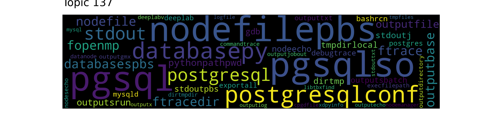

## Topic 138

```console
sbatchhtml batchbatch sbatch batchjob outputsbatch waitsbatch jobsbatch dockerfile dockerexec batchq batchsize networkpy runprocess matlab deeplab partitionbatch jobsproc batch cputime idsbatch sizebatch multiprocessing gpufile batchpy batchsh cpuinfo taskid mpiprocs performancepy fnamebatch processingpy nodeecho taskset autolab taskthreads nodelistgpu stepbatch taskslurm processors tasksslurm multigpu sbatchsh nodesecho workerpy nprocs processor kernelexe cpu commandpython gpuqueue
```
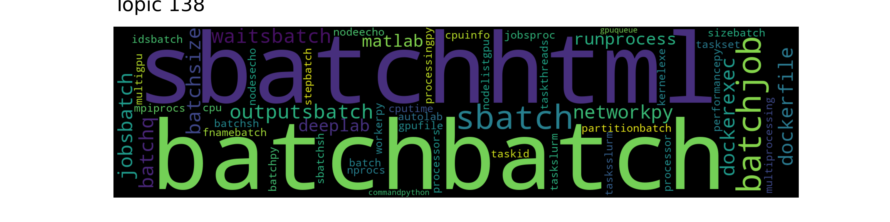

## Topic 139

```console
outputsbatch sbatchhtml batchbatch libpythonpath cmdpython batchsize pythonpathpwd deeplab dockerfile sbatch nodelistgpu pythonpathddmd batchq postgresqlconf gpufile github pathpython postgresql dockerexec pythonpathhome jobsproc deeplabv pythonpackages libtbxpython clusteroutput matplotlib githubcom commandpython outputfile jobtmp pgsql outputrfm execfilepath tensorflow outputecho pathoutput runprocess jobsbatch outputsrun cmdfile nodeecho scriptspath matlab dirtmp datasetpy outputbase bamspath outputtxt outputjtxt cudapath
```
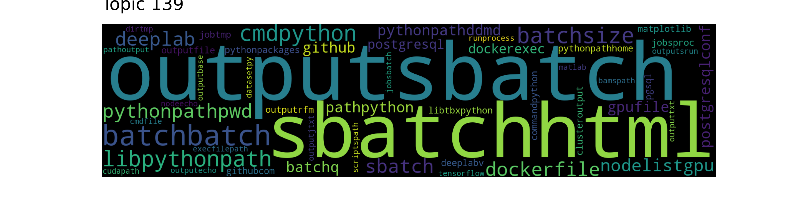

## Topic 140

```console
sbatchhtml batchbatch sbatch deeplab partitionbatch batchsize batchsh batch outputsbatch batchq deeplabv sbatchsh sizebatch batchpy stepbatch kbatch waitsbatch deeplearn trainingbatch scriptsdir multiprocessing scriptsh scriptnow scriptdir fnamebatch deepmd jidsbatch minibatch deepin partitionepyc cputime matlab slurmscript script scripts optimbatch scripting tbatchsh scriptpy idsbatch jobsbatch hhecho scriptspath multirunlog bamfiles partitioncpu printshellcmds scriptpath deeplearning hsecho
```
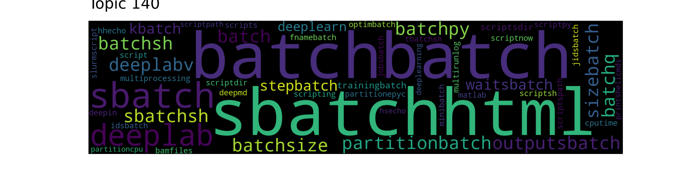

## Topic 141

```console
circuitmtxgz matrixmatrix tmux mtxgz outputgmx mtx gromacs gmp rmtxgz mcomix matrixcountf gmxrc xinitrc mfileid tmpfile xdrmtk powermtxgz intmpdir lxdm packagevalgrind xdamp githubcom matlab lxde fileprefix matricesamd gresgpurtx gmxdir gvim prefixstep mdrun mmap zshrc gmxgmx roadmtxgz mbx hxarrayshxarr xargs gputxt gcmdir hashpath cinpmatfmap matrixout concat gencode matrixcount outputmsub mxecho bindmap xdm
```
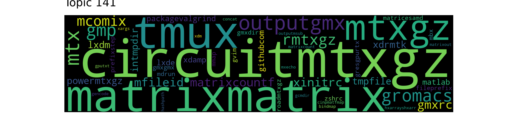

## Topic 142

```console
nodefilepbs nodeecho gpufile ftrace nodelistgpu fopenmp dockerexec nodesecho stdout debugtrace ftracedir gdb nodefile gmp gpgpu getopt excludegpu gdbint libstdc nodemanager outputsbatch commandtrace outputgmx bg gnuplot getopts gpuqueue stdoutj gpulog stdouttxt stdoutpbs sbatchhtml openmp tbg flagsdevicegpu mpmdconf gcccore partitiongpu nbitpg dockerfile nvidiaconf deeplab libexec ivbg pgsql gpg dbg nodescontrol grep nodesn
```
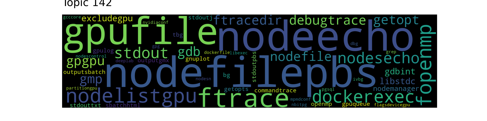

## Topic 143

```console
outputfile outputsbatch outputgmx fileoutput outputsrun outputrfm ftracedir export exportall outputecho exports ftrace diroutputs gnuplot outputslurm fopenmp simoutput outputdirectory outputivecs makefile clusteroutput outputx outputbase execpy outputerr diroutput tmpdirlocal outputoutj sbatchhtml stdout gmp outputtxt exportnone execfilepath printfile outputoutputs libstdc matplotlib mpmdconf outputscript exported outputoutput outputdir pathoutput outputmpi dirtmpdir outputjtxt dockerexec dockerfile execdir
```
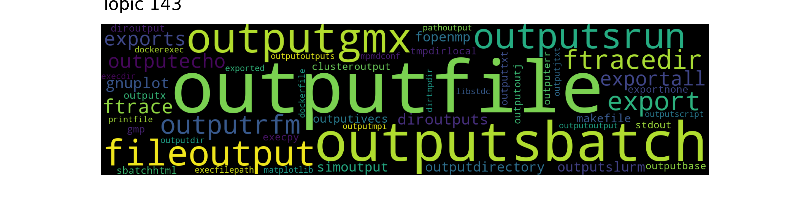

## Topic 144

```console
sbatchhtml batchbatch outputsbatch sbatch batchq partitionbatch batch jobsbatch waitsbatch batchsize batchjob multithreading processors batchpy cputime multiprocessing runprocess julia kbatch openmp fnamebatch processor partitioncpu multithreaded outputecho cpuinfo outputsrun lhyperthreading trainingbatch taskthreads mpiprocs framebatch multigpu compilerintel processingpy outputfile sizebatch concat bashrc fopenmp bindcpu getopts jobsproc cpu getopt seqproc outputjtxt cpuq ncarcompilers joutput
```
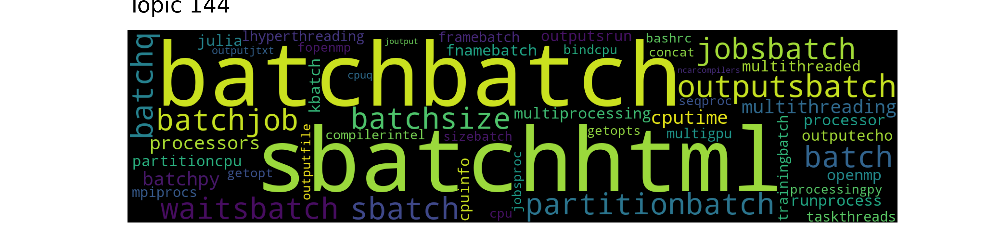

## Topic 145

```console
sbatchhtml outputsbatch batchbatch sbatch partitionbatch jobsbatch batchsize outputecho batchq outputsrun outputgmx batchjob outputfile outputbase waitsbatch dockerfile dockerexec runprocess simoutput outputlog outputscript outputjob execfilepath fnamebatch batch outputlogs commandpython sizebatch diroutput outputrfm outputjobout outputtxt echoinfo logfile outputx diroutputs logfilename outputslurm outputname batchsh echodebug stepbatch outputoutput fileoutput nodeecho hsecho jlogfile outputtrain outputerr scripthome
```
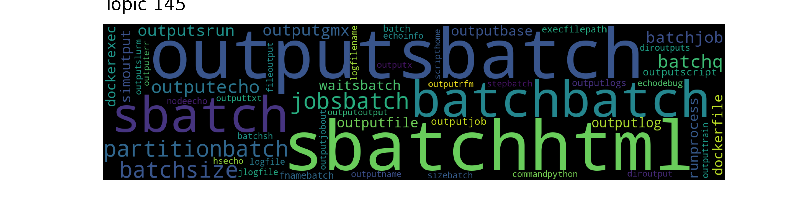

## Topic 146

```console
nodefilepbs outputjob jobfile nodemanager jobsproc nodelistgpu dockerexec stdout nodelisttxt nodefile jobtmp jobnamepbs jobnamejob batchjob pbsqueue jobnameojob runjob jobpy nodesn nodelistslurm outputjobout execfilepath jobend jobrnderr nodeslurm jobscriptsh stdoutj runprocess jobstart jobscript nodesslurm nodename execpy nprocscat nodesecho jobsbatch stdouttxt jstdout cronjobs nodelistnode execdir nodenames nodeecho jobidpbs fopenmp subjob outputsbatch pythonpathpwd nodescat nodesnum
```
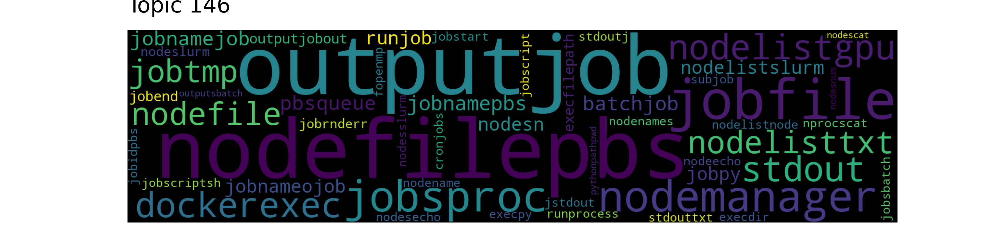

## Topic 147

```console
modulessh dockerexec modulefile modulepy modulefiles outputrfm libexec loadmodule modulespath execpy outputroot zshrc seqproc aloadmodule sysctlconf stdout pkgconfig postgresqlconf mpmdconf execdir libstdc outputecho xinitrc outputsrun pkgconf outputfile outputgmx packagepy moduleslurm dirtmp tmpdirlocal echodebug fopenmp postgresql restartlmp runprocess pulseaudio outputerr bashrcn pythonpackages scriptmanager cmakecachetxt postgres outputmsub bashrc outputsbatch remotepy runpdy pdebug debugnxf
```
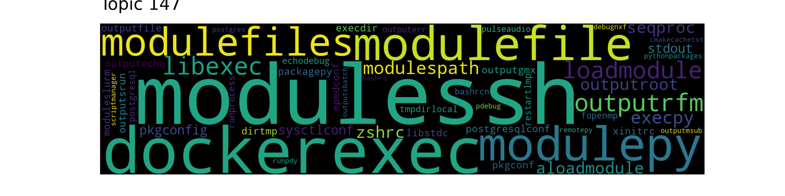

## Topic 148

```console
sbatchhtml commandpython batchq gpufile dockerexec nodelistgpu modulepy cmdpython batchbatch envmodules modulespath excludegpu jobsbatch gpuqueue outputsbatch batchsize sbatch getopt gpuv intelpython modulessh batchjob modulefile getopts dockerfile pythonpython echoinfo gpuq ipython cpuinfo nodeecho jobscriptsh waitsbatch jobsproc gresgpu cputime gpulog modulefiles tensorflow libpythonpath nodelisttxt multigpu github moduleslurm nodesecho gpuname sizebatch multiprocessing pythonpackages snakemakestats
```


## Topic 149

```console
libpythonpath pythonpathhome pathpython gpufile pythonpathpwd pythonpackages githubcom github pythonpathddmd scriptspath gpuqueue pythonpath cudapath commandpython pythonpython networkpy cmdpython sbatchhtml modulespath gpulog ipython matplotlib batchsize dockerfile execfilepath nodelistgpu tensorflow gresgpu postgresqlconf sizebatch launcherpython runprocess scriptpath multigpu bamspath portpython postgres runpy xinitrc libtbxpython pathcudapath batchbatch multiprocessing excludegpu gpgpu hashpath partitiongpu dockerexec workerpy snpeffpath
```
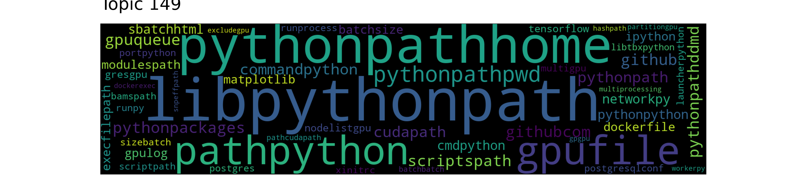

## Topic 150

```console
sbatchhtml batchbatch sbatch batchsize outputsbatch jobsbatch batchq partitionbatch batchjob waitsbatch batchpy runprocess sizebatch commandpython batch batchsh dockerexec cmdpython dockerfile multiprocessing pythonpathhome sbatchsh minibatch batchnorm pythonpython networkpy ipython jobsproc libpythonpath tensorflow pathpython mlflow scriptmanager multirunlog stepbatch githubcom jobpy performancepy getopts getopt execpy pythonpathpwd kbatch remotepy scheduler pythonpathddmd configyml pythonpackages github optimbatch
```
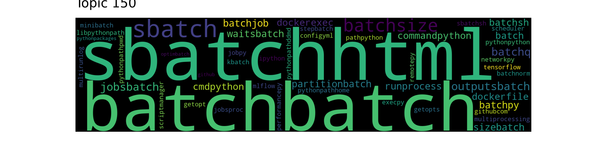

## Topic 151

```console
sbatchhtml outputsbatch batchbatch execpy batchsize dockerexec sbatch outputsrun execdir partitionbatch nodeecho nodesecho runprocess outputgmx batchjob bashrcn fnamebatch batchq waitsbatch execfilepath outputecho jobsbatch nodelistgpu batchpy outputrfm stdout jobsproc procname nodefile nprocs sizebatch packagevalgrind openmp outputfile bashrc nodefilepbs cmdsrun jobtmp clusteroutput dockerfile intmpdir exec mpiprocs cmdlauncher nodelisttxt batch excludegpu outputoutj nproc jstdout
```
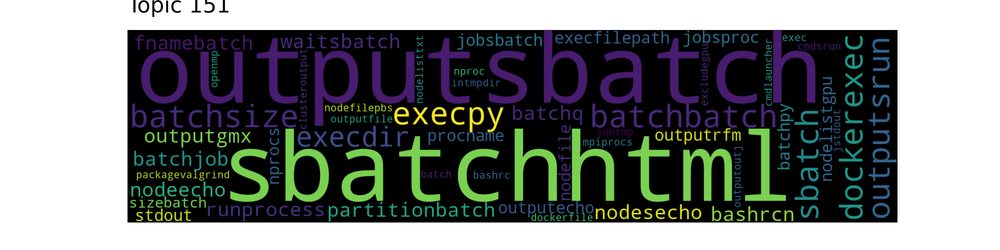

## Topic 152

```console
subjob jobfile subjobs jobpy outputmsub jobksh jobindex pythonpathhome jobsproc subdirectory deeplab runsub libpythonpath bamspath bashrcn dockerexec pythonpathpwd outputtxt jobtmp commandpython outputjob batchjob jobidtxt gdb execpy jobrnderr deeplabv bashrc jobsbatch sorttxt cmdpython execfilepath commandstxt pathpython bjobsh stdouttxt grep arrayjob jobscriptsh execdir pythonpathddmd scriptmanager pgsql runjob getopt jobnamejob bsub nodelisttxt jobidpbs outputdirectory
```
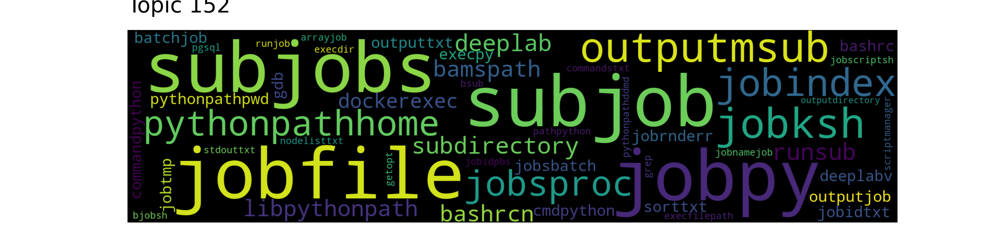

## Topic 153

```console
sbatchhtml batchbatch sbatch outputsbatch batchq batchsize batch waitsbatch partitionbatch sizebatch batchsh batchjob jobsbatch batchpy fnamebatch kbatch stepbatch sbatchsh optimbatch runprocess getopts minibatch getopt scriptsdir outputscript trainingbatch script pbatch idsbatch scriptspath pkgconfig scriptdir scriptscontrol scripting directivesbatch scripts cmds framebatch cputime outputgmx scriptadd scriptsh seqproc scriptpath scriptmanager bashrc cmdsrun printshellcmds outputjtxt scheduler
```
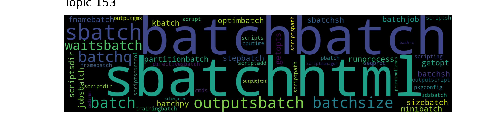

## Topic 154

```console
idsample sampleid sampling dirsample sample samplestsv samples fastsample sampler nsamples sampleline subsample samplingfm samplename downsample idsbatch samplenameerr sampfile sbatchhtml sampletype modelsamples samplesheet outputsbatch batchbatch idxstats idcsv yecho datasetpy iecho experimentpy nodeecho hsecho idparray batchsize nodesecho sbatch multiprocessing deeplab experimentspy numgpus idslurm mpdset experimenting datasetn populate apmrandom experiments batchsh simulationpy experiment
```
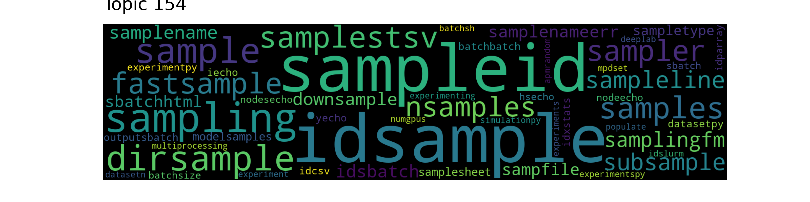

## Topic 155

```console
cmsrun cmdfile cmd cmsset dockerexec cmssw execfilepath cmds bashrc cmdsrun rootpwd xinitrc cmdlauncher zshrc powercmddir outputroot cmscernch execpy cmdpython execdir cmdgmake cms chroot cmsstage srcpath bashrcn archlinux gcmdir inputroot agcmrc outputtxt cmdhostname rootdir libexec pathcudapath outputdirectory printshellcmds jobfile mitgcm outputjtxt outputsbatch outputfile cmdssh dockerfile gcm kernelsasc cmplxsh srcdir roottwitch kernelexe
```
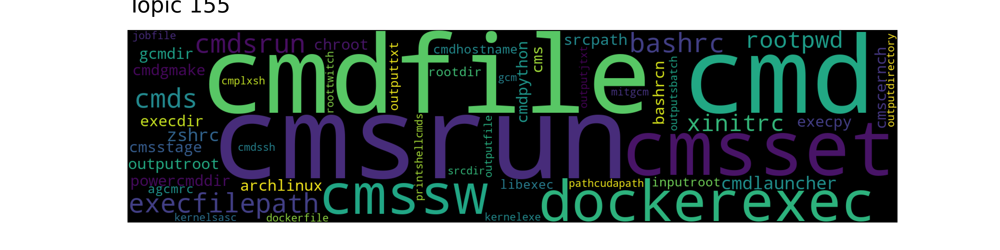

## Topic 156

```console
datasetpy datapy dataset datasetmnist datatrainann namesdataset datasetn tensorflow datasetdataset dirdataset datatraindata namedataset datasetcifar datasettemplama cmeshtfrecord dataprecaggr datasets dockerfile benchmarkpy databasepy deeplabv datatestdata datalad datasetairport idparray outputsbatch deeplab fnamebatch datasettwitch tmpdirlocal datafile idxstats datapath outputgmx clustergres ftracedir datasetpolbook outputtrain metadata datafiles workerpy evalpy tmploctmpdir samplestsv gresgpurtx postgresql idsample tmpfiles pathdatasets expmap
```
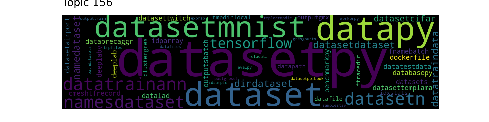

## Topic 157

```console
bashrc zshrc xinitrc bashrcn fopenmp cmakecachetxt psdef makefile aparc gcc pythonpackages inpfile srcpath nodefilepbs packerc compilervarssh dirpbs srcdir gchprc srand nprocscat filehomeobsproc pbsidpbs portrandom xpbs gnuplot pbsdsh networkpy nprocs gdb packagepy src shellbash nproc curlrc grep trandom pdebug libxc rcsn portpython ftrace stdoutpbs depmap pbsqueue gmp jobfile pathpython cmdpython kernelsasc
```
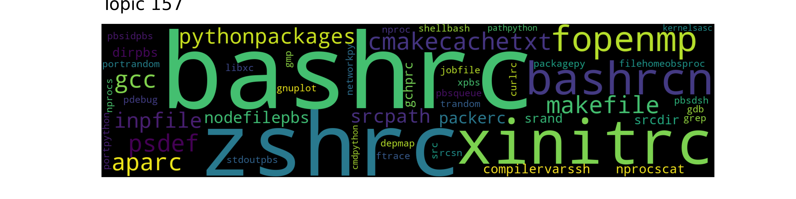

## Topic 158

```console
sbatchhtml scriptmanager outputsbatch scriptspath dockerexec batchbatch scriptsdir bashrc scriptpath scriptdir sbatch outputscript execfilepath batchq scriptsh scripttest script zshrc scriptscontrol printshellcmds bashrcn scripts commandtrace scripthome scriptnow scripting cmdlauncher slurmscript execdir outputdirectory libexec runprocess scriptpy getopt outputecho cmdfile echodebug modulespath cmdsrun scriptpwd scriptadd getopts commandsh commandpython outputsrun commandstxt cmds cmsrun execpy outputrfm
```
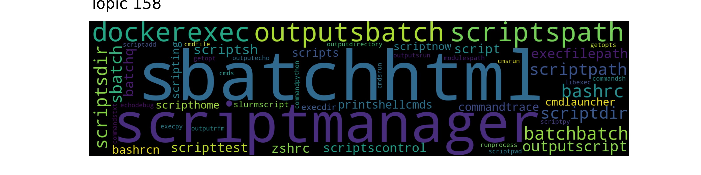

## Topic 159

```console
outputsbatch sbatchhtml outputecho partitionbatch outputgmx batchbatch outputrfm partitionepyc sbatch dockerexec clusteroutput outputx batchq outputsrun echoinfo getopt outputfile execpy outputoutj outputerr outputslurm outputoutput outputoutputs getopts outputdirectory outputscript performancepy outputr batchsize ftrace outputtxt partitioncpu outputout outputbase outputj exportall outputxjout nodeecho execfilepath outputjtxt fileoutput outputmpi bashrcn batchpy bashrc outputlap outputivecs runprocess xecho echodebug
```
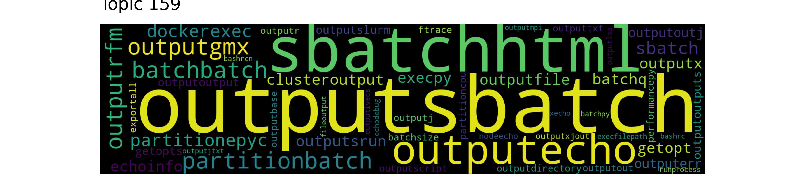

## Topic 160

```console
xorgconf packagepy ubuntu pkgconf sysctlconf echoinfo pkgconfig xinitrc pkgconfigpkg dockerexec zshrc skypeforlinux xorgconfd libxc bashrc pythonpackages gconftool getopts archlinux xconfig getopt libexec bashrcn xorg openssh mpmdconf xterm nginxconf modulessh libstdc pidgin libxml pluginpy linux nvidiaconf commandsh vim libedit radeonconf xinit nconf stdout commandpython packages libvdpau gedit cmsset sysctl libpythonpath defaultsconf
```
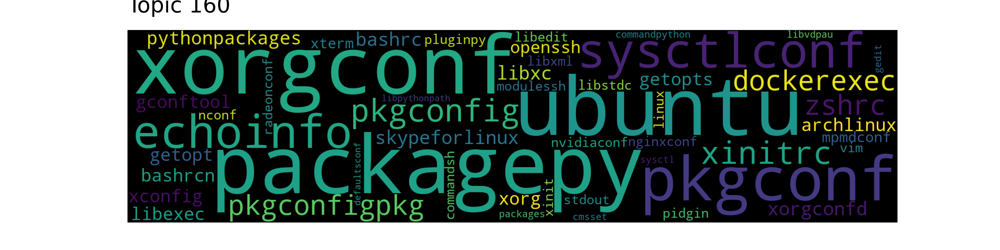

## Topic 161

```console
optimbatch outputsbatch getopts sbatchhtml getopt benchmarkpy optimtotal performancepy optimizeradam multiprocessing jobsbatch optimizer deeplab sbatch jobsproc datasetpy deeplabv optimize optimizers datasetmnist optimbase dataproces optimizations tensorflow batchbatch runprocess optimization stepbatch dirdataset dataset batchsize nprocscat processingpy datapy optimized gresgpu nodelistgpu nprocs nextflowtrace datatrainann dockerfile datasetdataset debugtrace datasetcifar workerpy maxdepth endcsv optim batchpy batchjob
```
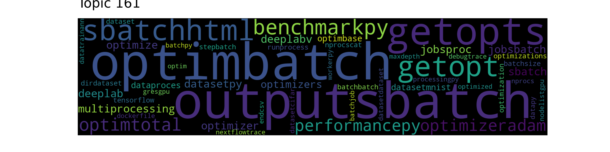

## Topic 162

```console
libpythonpath pythonpathhome pathpython pythonpathpwd pythonpath pythonpathddmd commandpython pythonpython cmdpython datasetpy libtbxpython pythonpackages modulespath ipython cudapath databasepy intelpython datapy pythonuserbase bamspath launcherpython deeplab portpython pipelinepy runpy python tensorflow dockerfile runprocess pathcudapath testpy matplotlib gpufile datapath execfilepath snpeffpath deeplabv workerpy nprocscat pythonhome scriptspath snakefile performancepy pythonwhich filetesttxt xdpyinfo getopt modulepath jobpy pathconda
```
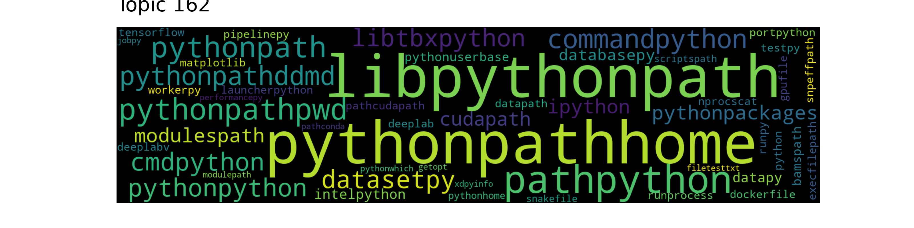

## Topic 163

```console
sbatchhtml outputsbatch outputgmx github execfilepath githubcom pathoutput dockerexec cudapath pathcudapath libstdc libexec batchbatch execpy libxc gnuplot libpythonpath runprocess sbatch modulespath gcccore execdir getopt xinitrc cmdpython outputsrun srcpath gcc batchsize gccsv cmdlauncher pathlib exportall bashrc pathpython outputx getopts dockerfile runpath compilercc exports archlinux zshrc export makefile powercmddir xargs outputecho sourcetarget directivesbatch
```
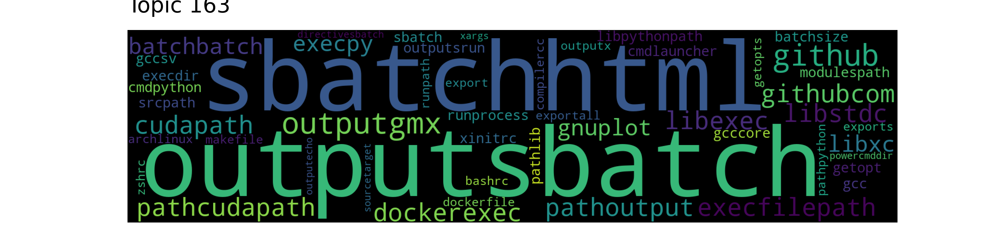

## Topic 164

```console
memtest testfile testdir filetests testpy testset scripttest mdtest testsh pytest test testlog tests testsmpi testing filetesttxt testsskip regtests testtxt testout testes ctestctest fopenmp regtest benchmarkpy testreport nodefilepbs ftrace speedtest testtrue ctest benchmarkspy tested ktest deeplab testcase ftracedir testpig nfile matlab nprocs testbench libstdc bashrcn psdef testyaml dirtmp nodefile makefile ntest
```
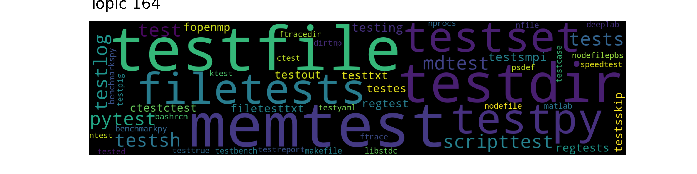

## Topic 165

```console
dynamicomp eachfile dynamicfalse hydrostaticf dynamicmkl schedulestatic tempfile humidity ntimefmt mpmdconf mfileid tensorflow fdfd hydrostatic dynamically mdrun multirunlog runidrunid dynamic ghz fm nvme aqmctl hyperthreadtrue tmpfiles nprocs fastqfiles nprocmin vtdm filerun hydrostatict bamfiles nproc webmin filetrue dotfiles runfile templatefile fms dynamics esmf tmux envirovariables namfpdyv cmeshtfrecord echfp nprocswc namfpdyt runid gvf
```
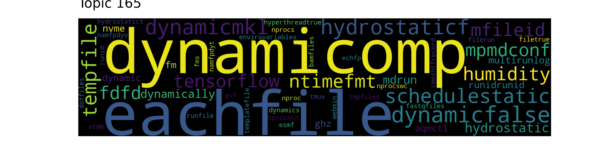

## Topic 166

```console
fastqfile fastqdir fastqfiles fastqs batchq seqfile fastq fastqc sbatchhtml seqproc multiqc postgresql grep qstat arrayidp outputsbatch fastqgz fopenmp getopt echoinfo fastqr queueoptarg cronlogfile concat sorttxt getopts outputjtxt bashrcn arrayprogram echocat mpmdconf outputtxt pbsqueue maxq echo nprocscat postgresqlconf zshrc qtcreator arrayslurm deeplab nliqopt queuepbs dockerexec outputfile seqd seqs postgres crontab multirunlog
```
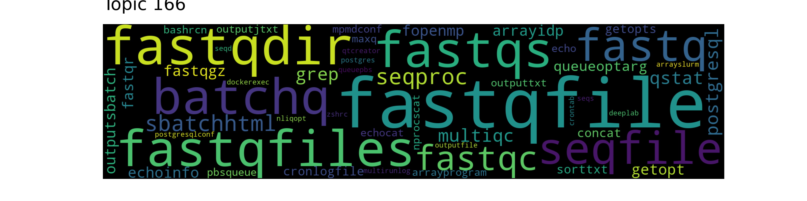

## Topic 167

```console
modulespath execfilepath scriptspath pathoutput pathcudapath bashrc pathpython scriptpath cmdfile bamspath sbatchhtml cmsrun runpath modulepath pathdirname srcpath cudapath dockerexec execdir cmdsrun outputdirectory outputsbatch libpythonpath pathmsccl libexec pathpath zshrc dirpath pathhome bashrcn pathname printshellcmds modulefile echoinfo cmdpython makefile dirtmpdir outputecho cmdlauncher dstpath getopt cmd pythonpathpwd cmds echodebug pathlib cmdgmake outputscript nodeecho outputsrun
```
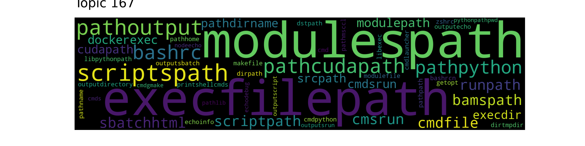

## Topic 168

```console
dockerfile fisher gpufile pythonpathhome pythonpathpwd libpythonpath modulefile nodefilepbs pipelinepy modulespath woodfisher prms sailfish speciesfile networkpy sizegpus github nodefile tensorflow deeplab launcherpython merfish cudapath pathpython bamspath gmp deepseek githubcom zebrafish subfile deeplabv nullglob gnuplot commandpython fileoptarg subsample cmdpython rawnetworkfs eachfile jobfile pythonpython openmp libtbxpython ipython workerpy sampfile bamfile pythonuserbase pythonpath dirsample
```
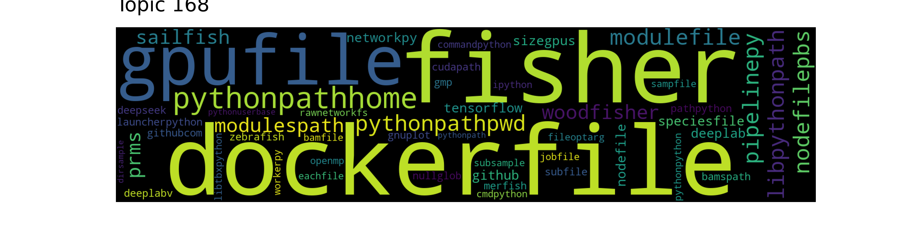

## Topic 169

```console
networkpy libpythonpath pythonpathhome gridsearchpy commandpython libtbxpython ipython pathpython pythonpython resnetpy nodesecho nodeecho snpeffpath netlib githubcom checkpointpy nodefile pythonpath distributedpy gcnnpy numpy datapy nodefilepbs lpnetlib cudapath github nodelistgpu nodeslurm pythonpathpwd pythonpathddmd nodesn testpy nodescat nodesh databasepy bamspath nodemanager runpy intelpython nodesslurm workerpy networkmanagers modulespath subsample datasetpy dockerfile cloudmesh randompy clusteroutput pythonuserbase
```


## Topic 170

```console
dockerexec sbatchhtml outputsbatch nodemanager batchbatch runprocess nodeecho dirtmpdir outputsrun execfilepath dirtmp jobsproc mdrun batchsize cmdlauncher execpy outputgmx sbatch modulespath slurmscript execdir commandtrace nodesecho cmdsrun cmdhostname dockerfile makefile bashrcn bashrc batchq outputdirectory jobsbatch getopt nodefilepbs rundirs powercmddir scriptmanager dmpiexec partitionbatch outputecho nodefile commandsh libexec loadmodule jobtmp exportall partitionepyc mpiexec modulefiles jobfile
```


## Topic 171

```console
pythonpackages libpythonpath pdebug pythonpathhome modulespath loadmodule pbs pbsqueue pathpython pythonpython pythonpathpwd modulefile modulefiles libtbxpython aloadmodule modulepy pb launcherpython pgsql pythonpathddmd packagepy pbsidpbs mpmdconf commandpython execpy postgresqlconf pbsdsh libexec nodefilepbs execfilepath cmdpython portpython runprocess runpy filehomeobsproc getopt mapperdebug inpfile jobsproc modulepath pkgconf workdirpbs pdb postgresql pkgconfig jobtmp bfile jobfile libvdpau psdef
```
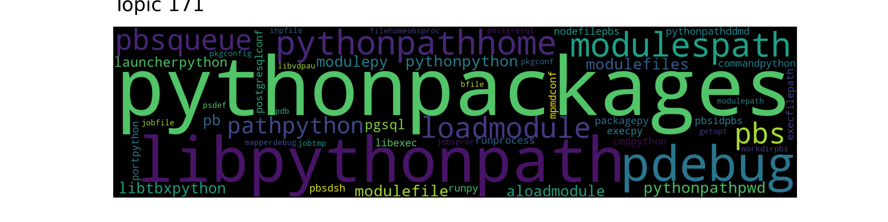

## Topic 172

```console
sbatchhtml batchbatch outputsbatch sbatch batchsize batchq partitionbatch jobsbatch batch waitsbatch batchpy batchjob sizebatch stepbatch dockerfile commandpython batchsh fnamebatch dockerexec cmdpython pythonpathpwd execfilepath kbatch pythonpathhome libtbxpython sbatchsh idsbatch pythonpathddmd pathpython pythonpython libpythonpath deeplabv outputtxt tensorflow outputfile outputecho runprocess pythonpackages execpy cmdfile ipython outputjtxt deeplab clusteroutput framebatch trainingbatch multiprocessing commandstxt cmds scriptspath
```
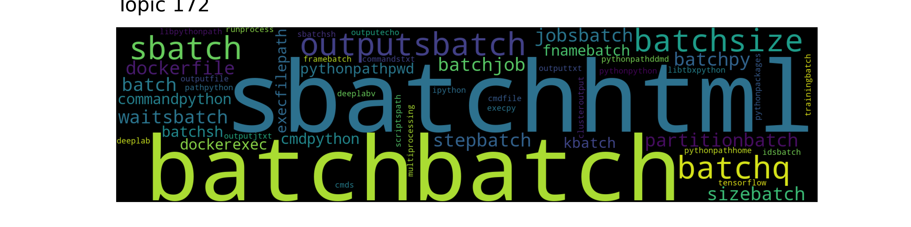

## Topic 173

```console
licenses sbatchhtml license partitionbatch licensed batchbatch sbatch batchsize dockerfile outputsbatch tensorflow libtbxpython libpythonpath dockerexec partitionepyc pythonpathpwd centos batchq powercmddir nodefile licensetxt modulespath nodeecho nodelisttxt github nodefilepbs cudapath commandpython benchmarkpy batchnorm getopt getopts psdef idsbatch eachfile tmpdirbase execfilepath nodesecho githubcom scriptspath executables performancepy libstdc makefile partitioncpu permissions jobsbatch lcrflimittrue libexec scriptpath
```
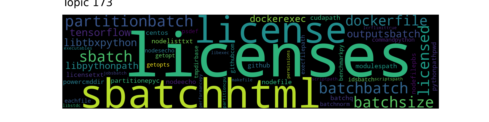

## Topic 174

```console
pdebug pbs pb pbsdsh pbsidpbs pdb pbsout partitiondebug pbsqueue pkgconf pde jtyppdyjlogfile bfile jlogfile dirtmp inpfile julia pdbedit libvdpau pkgconfig pstmp debug outputfile debuginfo debugnxf nodefilepbs qosdebug lpnetlib debugtrace libpythonpath libexec fopenmp libyaml libtbxpython mapperdebug gdb pyspark libxc ppc debugtrue mpmdconf pythonpackages debugdir filehomeobsproc pythonpathhome htslib pgsql pythonpython pyyaml outputtxt
```
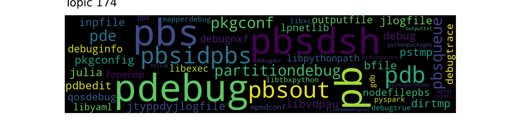

## Topic 175

```console
execfilepath nodefilepbs bashrcn bashrc runpath scriptspath bamspath dockerexec execdir scriptpath cmdhostname nodeecho pathoutput pythonpathpwd pathcudapath outputdirectory pythonpathhome pathdirname pathname pathpython nodesecho jobfile nodefile echoinfo execpy cmdfile echodebug dstpath jobnamepbs libexec pathpath echo pathhome fopenmp filepath libpythonpath pathpathhome runprocess cudapath getopt stringnode jobtmp remotehostname pgsql nodelisttxt shellbash cmds logfilename outputtxt jobsproc
```
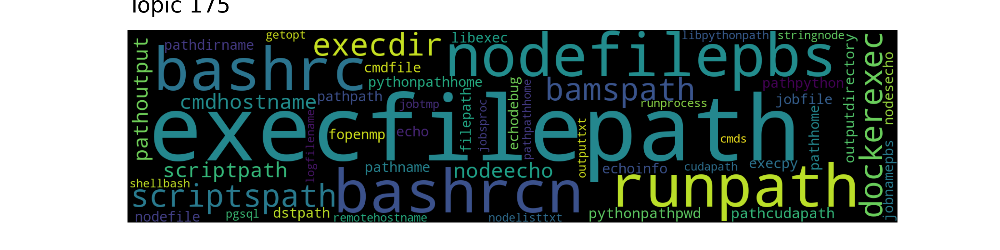

## Topic 176

```console
libpythonpath pythonpathhome pythonpython libtbxpython commandpython pathpython pythonpathpwd pythonpath cmdpython ipython pythonpackages launcherpython python pythonhome pythonuserbase portpython pythonpathddmd fopenmp databasepy pythonwhich intelpython matplotlib remotepy numpy runpy snakefile pyspark partitionepyc npython openmp datapy pgsql cudapath gnuplot nodefilepbs github packagepy networkpy runprocess execfilepath githubcom testpy outputfile dockerfile stdout filespy ffmpeg pyyaml xdpyinfo datasetpy
```
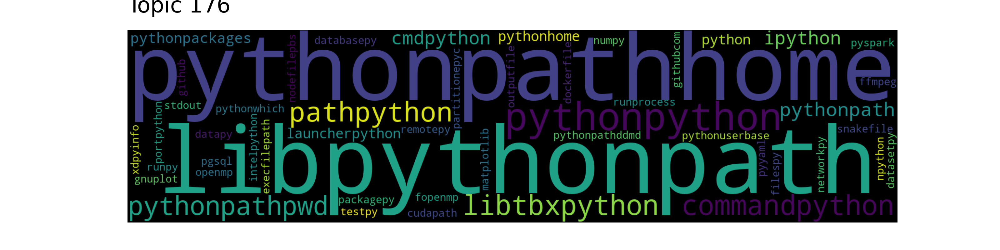

## Topic 177

```console
sbatchhtml batchbatch batchjob jobsbatch outputsbatch batchsize sbatch batchq waitsbatch partitionbatch batchpy dockerexec batch gpuqueue optimbatch sizebatch runprocess dockerfile multiprocessing tensorflow fnamebatch queueoptarg getopts commandpython getopt trainingbatch nodelistgpu jobsproc batchsh excludegpu batchnorm taskthreads execpy nodeecho performancepy stepbatch multigpu jobpy gpufile envirovariables partitiongpu tasksslurm outputjob nodesecho framebatch execfilepath prioritygpu postprocess taskslurm processingpy
```
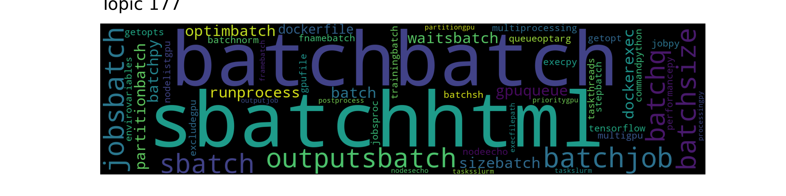

## Topic 178

```console
sbatchhtml batchbatch batchsize sbatch getopts getopt outputsbatch dockerexec batchq echoinfo sizebatch multiprocessing waitsbatch dockerfile batchpy partitionbatch framebatch stepbatch mpmdconf cpuinfo bashrcn deeplab printshellcmds kbatch nprocs batchsh cmdpython cputime runprocess jidsbatch batch pythonpackages modulespath cmsrun kernelexe multigpu sbatchsh idsbatch benchmarkpy commandpython jobsbatch networkpy echocat modulefile nproc execpy modulepy optimbatch partitioncpu nprocscat
```
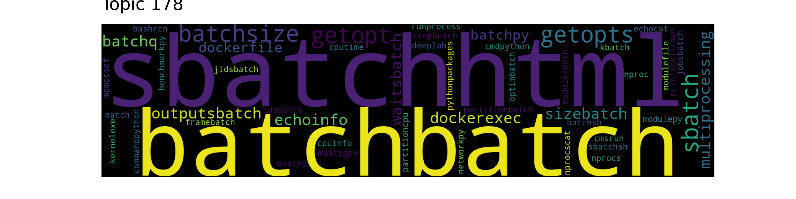

## Topic 179

```console
modulespath compilercc compilerintel modulefiles modulefile compilervarssh compiling aloadmodule makefile compilergcc modulessh modulepath loadmodule pkgconfig compile libstdc modulepy xinitrc pythonpackages libexec configconfig zshrc swbuild githubcom cmake github gcccore loadedmodules mpmdconf libxc cmdgmake compilers dockerexec compiled compiler moduleslurm cmakecachetxt cmdpython configpy cmsrun packagepy libpythonpath archlinux configfile bashrc getopt sysctlconf envmodules kernelexe libedit
```
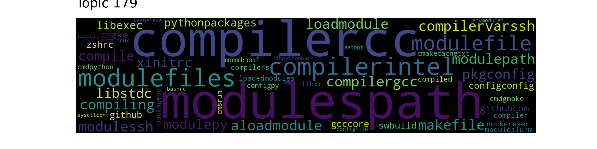

## Topic 180

```console
batchbatch sbatchhtml batchsize batchpy sbatch jobsbatch outputsbatch waitsbatch batchq batch batchjob dockerfile fnamebatch sizebatch batchsh multiprocessing commandpython partitionbatch scriptpy stepbatch dockerexec fileoptarg bamfiles trainingbatch idsbatch sbatchsh cmdpython pythonpathddmd pythonpython kbatch scriptmanager getopt scriptsdir optimbatch jidsbatch clustererror runprocess batchnorm multirunlog pythonpathpwd directivesbatch intelpython processingpy getopts modulefiles scriptdir pythonuserbase libtbxpython framebatch workerpy
```
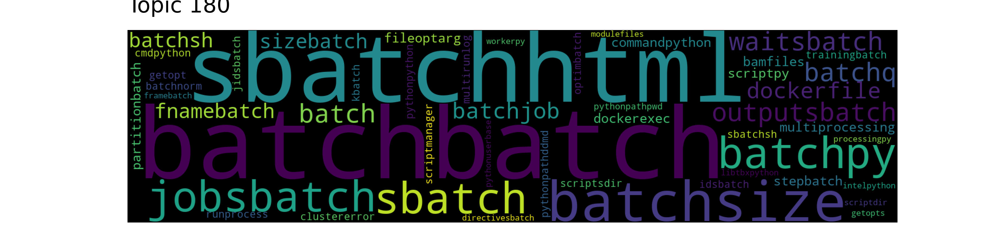

## Topic 181

```console
gmapcsv sbatchhtml datasetpy pmapcsv deeplabv population formatcsv populations datafiles eachfile endcsv clusteryaml datafile gvfs datasetdataset tmpfiles dataset zshrc bamfiles pythonpathpwd getopt clustererror commandpython partitionbatch clustergres batchbatch pythonpackages dockerfile clusteroutput idcsv gnuplot clusterjson pythonuserbase pythonpathhome getopts outputsbatch batchsize clustermem populate fileprefix scancel sbatch deeplab pythonpathddmd batchq libpythonpath bashrcn nullglob virtualenv idxstats
```
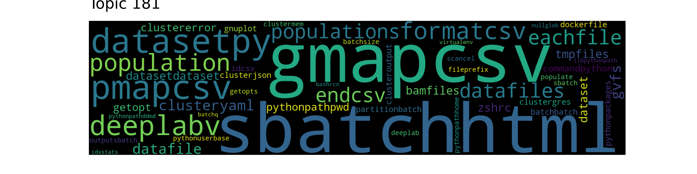

## Topic 182

```console
sbatchhtml batchbatch sbatch batchq waitsbatch outputsbatch jobsbatch batch batchsize stepbatch batchjob batchpy partitionbatch batchsh sizebatch sbatchsh jidsbatch optimbatch kbatch framebatch fnamebatch idsbatch minibatch trainingbatch runprocess scriptmanager cputime multiprocessing pbatch scriptpy scriptsdir scriptspath cronlogfile scriptnow script cmdpython commandpython dockerexec partitiongpu multigpu scriptpath execfilepath performancepy scriptdir ipython dockerfile gresgpu execpy slowstart batchnorm
```
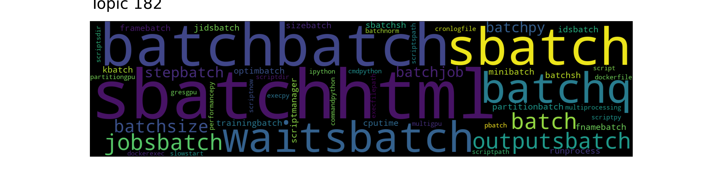

## Topic 183

```console
sbatchhtml batchbatch outputsbatch sbatch batchq jobsbatch partitionbatch dockerexec batchsize idsbatch waitsbatch batch kbatch scriptmanager runprocess dockerfile batchjob batchpy hhecho autolab scancel echoinfo yecho cmdpython multiprocessing cmds nodeecho melanoma commandpython outputecho stepbatch xecho mmecho corecount taskset taskslurm cmd hsecho echoerror jobsproc ipython cmdfile printshellcmds outputgmx kernelexe iecho deeplab scriptpy chimera tasksslurm
```
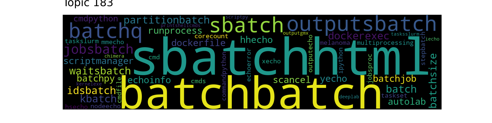

## Topic 184

```console
exportall export exports outputrfm exportnone exported outputfile outputsrun outputx outputxjout fileoutput outputecho outputtxt outputgmx outputdirectory outputerr outputbase diroutput outputr outputsbatch tmpdirlocal diroutputs tmux datel outputjtxt timedatectl datafile outputdir dockerexec simoutput outputoutput paramsportport nodefile outputout dockerfile libtbxfind xlsf kernelexe outputname tmpfile outputoutputs execdir nodeecho outputhrrrconus outputmpi outputscript cmdfile outputroot execfilepath outputn
```
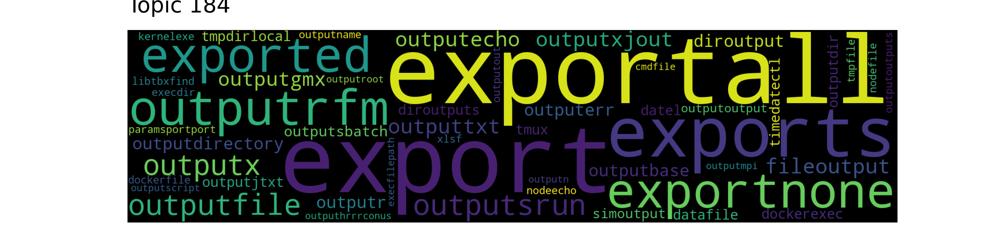

## Topic 185

```console
sbatchhtml batchbatch outputsbatch sbatch batchq partitionbatch waitsbatch dockerexec cronlogfile cputime batchsize slowstart getopt batchpy crontab getopts commandpython intelpython nodeecho sysctlconf partitioncpu scheduler xinitrc kernelexe batch gpuqueue kernelsasc nodesecho sysctl tensorflow batchsh modulespath kbatch modulefile dockerfile modulefiles timedatectl printshellcmds outputgmx clusteroutput pkgconfig nodelistgpu modulepy datestart partitionepyc cpuinfo optimbatch sizebatch sbatchsh cpuq
```
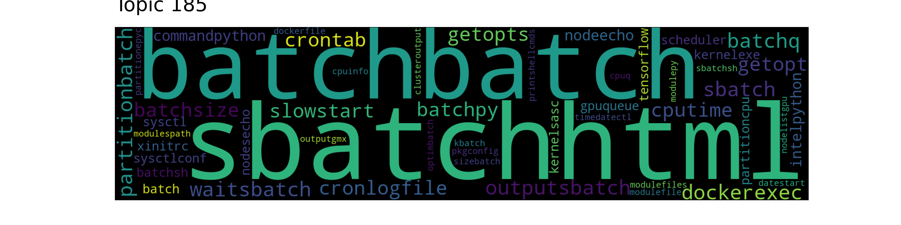

## Topic 186

```console
dockerexec dockerfile nodemanager sysctlconf scriptmanager nodeecho remotehostname cmdhostname bashrcn docker nginxconf sysctl nodesecho cmdlauncher cmdsrun nethost ignorerhosts zshrc nodefilepbs nodesn systemd sbatchhtml slurmscript nodefile networkhost cronlogfile openssh udocker ifnamedocker printshellcmds nodejs runprocess hostsmpsize pidgin echoinfo ftrace nginxconfpacnew cmds remotepy nodelistgpu roothome jobscriptsh modulessh cmdfile nodesh outputsbatch execfilepath libexec hostnamectl execdir
```


## Topic 187

```console
outputsbatch experimentpy sbatchhtml jobsbatch batchbatch datasetpy testpy experimentspy experimental multiprocessing experiments batchnorm batchjob sbatch experimenting clusteroutput experiment batchpy batchq datasetmnist simulationpy batchsize dataset databasepy datasetdataset direxperiment performancepy clustererror datasettemplama jobsproc outputecho scripttest sampling outputbase simoutput deeplab outputslurm taskslurm testreport accountproject tasksslurm waitsbatch outputjob testset datatestdata partitionbatch evaluatepy dataproces erroroutput jobpy
```
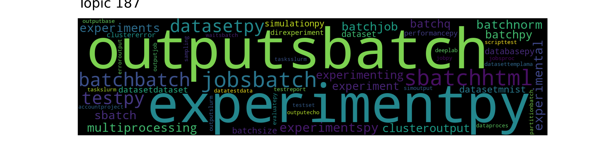

## Topic 188

```console
stdout stdoutj stdouttxt outputtxt jstdout dockerexec outputgmx outputsbatch fopenmp outputsrun outputfile outputjob outputecho stdoutpbs nodefilepbs outputjobout bashrcn outputrfm outputx outputbase runprocess outputoutj zshrc outputoutput outputlog restartlmp outputerr remotepy nodelisttxt ftrace outputoutputs outputj openmp bashrc outputr nodeecho execpy outputmpi execfilepath cronlogfile outputscript remotehostname skypeforlinux outputxjout outputxojn outputdir outputslurm outputname pythonpathpwd dockerfile
```
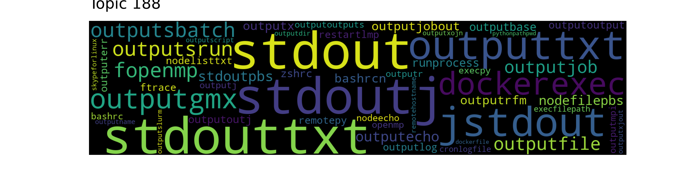

## Topic 189

```console
nodeecho dockerexec nodesecho sbatchhtml getopt echoinfo nodefilepbs outputsbatch jobsbatch batchjob getopts dockerfile jobtmp bashrcn nodemanager nodefile partitionbatch jobfile fileprefix batchbatch grep prefixprefix bashrc jobsproc outputecho iecho concat procname execdir batchsize jobscriptsh sbatch fopenmp nodeslurm basesprefix concatenate execpy outputjob nodescat commandtrace yecho makefile zshrc cmdhostname tasksslurm gmp execfilepath jobscript sprefix libexec
```
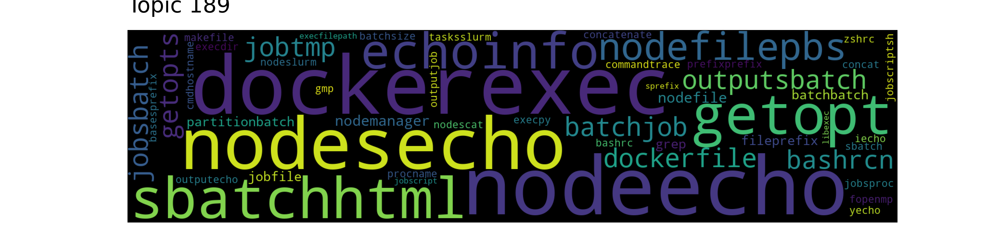

## Topic 190

```console
nodefilepbs nodefile nodelistnode nodesn nodesnodes nodemanager nodesecho nodeslurm nnode nodesnnodes nodesslurm nodelisttxt nodelistslurm nodeecho nodelistgpu nodelist nnodes nodesh nodes node nnodesslurm nodempi nodename stringnode nodejs nodesbls npernode arraynodes nodesmy nodenames pernode nnodesnnodes nodescat vnode datanode nodesnum nodea nodescontrol addnode nodeid npnumnodesmpi nodesscontrol nnodeswc processorsnodes fluxnode numnodes pbsqueue nwpernode nodecat lnodes
```
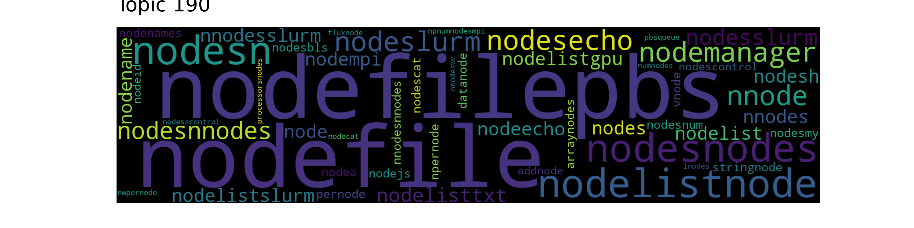

## Topic 191

```console
sbatchhtml batchbatch outputsbatch batchsize sbatch gpufile batchq outputgmx partitionbatch multiprocessing kbatch batch runprocess gpuqueue loadmodule multithreading multigpu xinitrc dockerexec batchpy aloadmodule clusteroutput openmp cpuinfo makefile sizebatch framebatch exportall stepbatch nprocs excludegpu outputsrun cpu fopenmp lhyperthreading multicore multithreaded cpuq gmp kernelexe waitsbatch configpy batchsh configslurm gpulog modulefiles multirunlog pkgconfig nvidiaconf hyperthreading
```
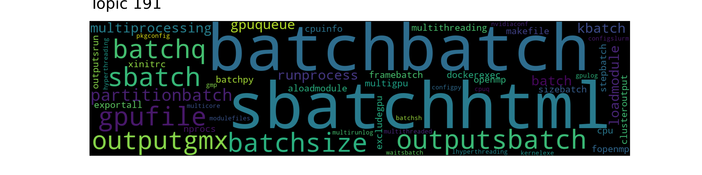

## Topic 192

```console
datasetdataset datatraindata dataset datatestdata datasetn datasetpy dirdataset datasetgta datasets datadata datatrainimg datapy datatrainann datasetcifar namesdataset datainput datafile datascience rdata rdatadir datapath datanv datafiles datatarget datadir datasetairport namedataset datatestimg rawdata hhdata data datasettwitch rootdataset dirdata datasetpolbook datasetmnist datain filedata asciidatainput datasettemplama datadirdatadir datash cdatadir metadata datalad datatestann dataprecaggr typesdataset typegtadataset datawork
```
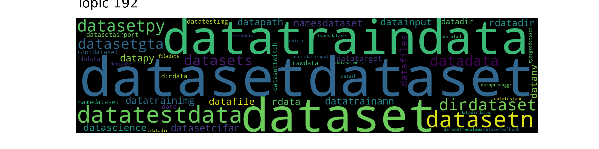

## Topic 193

```console
datapy fileresults datasetpy datafile testpy datafiles commandpython filedata filespy fileoutput datatestdata pythonpython databasepy datasetdataset outputfile filetests workerpy performancepy outputsbatch dockerfile libpythonpath dataset datatraindata dirdataset ipython filestrue clusteroutput outputtrain filetrue libtbxpython pythonpathpwd sklearn filetesttxt filefalse outputfalse pythonpathhome datasetn rawdata datapath pathpython datainput datalad datascience outputtxt remotepy datasettemplama datasetmnist datasetcifar dataproces testfile
```
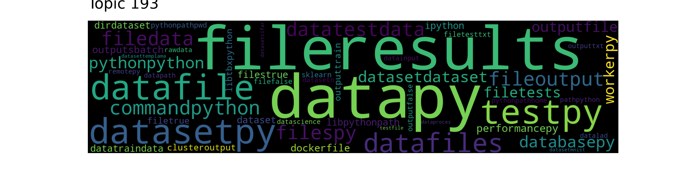

## Topic 194

```console
sbatchhtml batchbatch sbatch batchq outputsbatch waitsbatch partitionbatch batchsize jobsbatch batch batchjob fnamebatch idsbatch framebatch batchsh kbatch batchpy sbatchsh sizebatch jidsbatch stepbatch echoinfo cmds getopt ctxtecho getopts cputime bashrc iecho hsecho hhecho batchnorm directivesbatch dateecho nodeecho bamfiles outputtxt yecho optimbatch cmdfile cmd trainingbatch mxecho parsec dockerexec counttxt dockerfile timetxt outputecho crontab
```
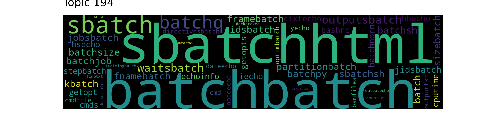

## Topic 195

```console
sbatchhtml batchbatch sbatch batchq waitsbatch batchsize batch outputsbatch batchpy jobsbatch loadmodule sizebatch aloadmodule fnamebatch batchjob trainingbatch batchsh framebatch partitionbatch jidsbatch modulepy modulefile modulefiles loadedmodules sbatchsh batchnorm kbatch moduleslurm minibatch multiprocessing stepbatch cudatoolkit modulespath commandpython moduletable pbatch multirunlog modulepath scriptpy ipython optimbatch pythonpython bitseq configslurm multigpu pythonuserbase idsbatch gpuqueue load scriptmanager
```
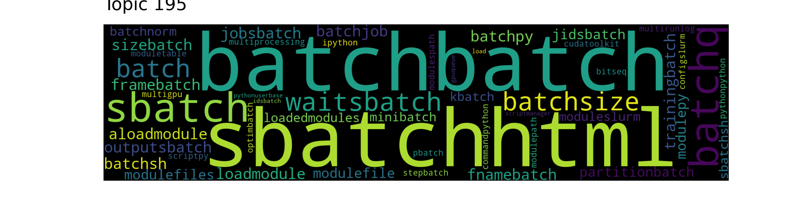

## Topic 196

```console
sbatchhtml outputsbatch batchsize jobsbatch batchjob batchbatch sbatch commandpython dockerexec multiprocessing batchq nodeecho dockerfile tasknum partitionbatch tasksslurm outputecho nodesecho taskslurm jobfile outputjob commands jobsproc jobscript command cmdpython runprocess cudapath nodefile sizebatch jobscriptsh taskset directivesbatch commandstxt performancepy outputfile outputsrun commandtrace eachfile getopt libtbxpython nodelisttxt execfilepath nodefilepbs jobpy outputtxt countjobs taskpkl waitsbatch ntasksslurm
```
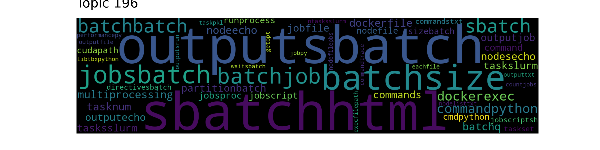

## Topic 197

```console
packagepy pythonpackages gmkpack modulefiles spack modulepy specspack packagevalgrind cmakecachetxt ifpack pkgconfig arpack mpmdconf lapack packerc packagehypre dockerexec packages package bpacked configpy loadirhomepack customcmd moduleslurm sourcehomepack modulespath dependenciespy loadmodule envmodules modulefile aloadmodule pkgconfigpkg compile batchpy scalapack batchsize distributedpy xdpyinfo pack qmcpack configslurm modulessh compilerintel slurmfiles openmp libtbxpython libpythonpath execpy strumpack partitionepyc
```
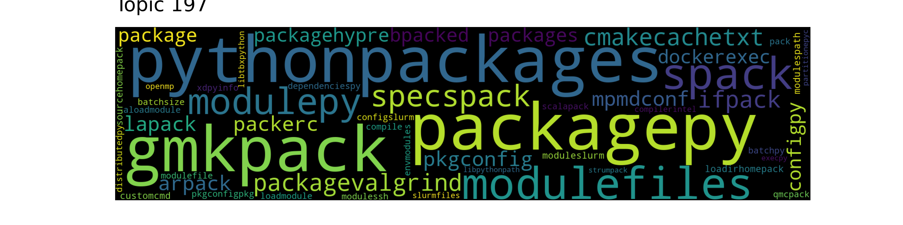

## Topic 198

```console
nvidiaconf sysctlconf logfile gpufile gpulog fxdlog fopenmp partitionbatch nvidia radeonconf memtest xorgconf modprobeconf sddmconf partitioncpu mdlog partitiongpu gpuqueue mpmdconf sysctl kernel xinitrc archlinux adminerconf cvmfs sudolog logfilename catalystconf cpuinfo bashrc kernelexe vmware systemd sbatchhtml nconf bashrcn logfilelogdir ftrace logstxt multirunlog gputrue logfiles systemctl makefile outputsbatch cronlogfile cmdfile jlogfile ubuntu outputlog
```
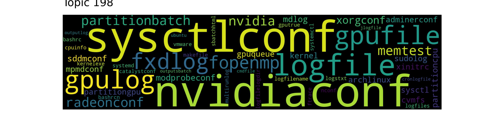

## Topic 199

```console
sbatchhtml batchbatch sbatch gresgpu partitionbatch outputsbatch batchq batchsize partitiongpu stepbatch batch fnamebatch waitsbatch idsbatch gpufile kbatch multigpu jobsbatch batchsh batchpy gmp sizebatch cmds nodelistgpu sbatchsh excludegpu gpulog partitioncpu gpuqueue matlab scripthome batchjob cmdfile cmd jobtmp gresgputesla jidsbatch namegpu bamfiles coded gpgpu qosgpu amdgpu cpuinfo tmpfiles fopenmp simoutput gpuname gpuq optimbatch
```
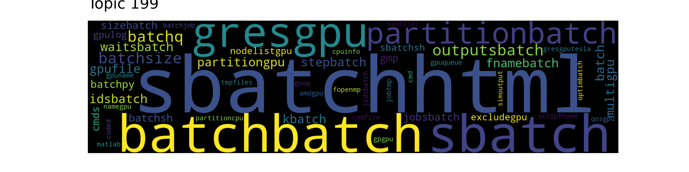

## Topic 200

```console
sbatchhtml dockerexec execfilepath outputsbatch modulespath execpy pkgconfig makefile getopt libpythonpath archlinux dirtmpdir dirtmp runprocess outputsrun batchbatch pathoutput pathcudapath commandpython partitionepyc batchsize configpy cmdpython configslurm configfile execdir runpy pkgconfigpkg bashrc dockerfile pathpython srcpath modulefile outputgmx cudapath outputdirectory diroutput getopts cmsrun libexec cmdlauncher outputfile mpiexec modulepath runfile commandtrace slurmfile bamspath dmpiexec cmdsrun
```
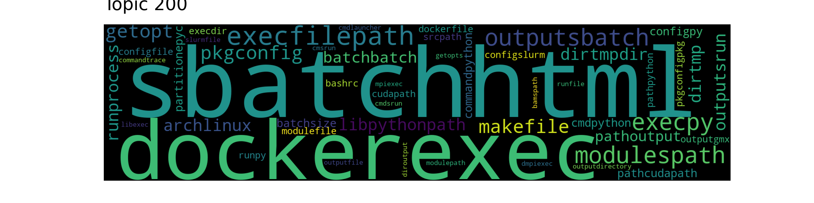

## Topic 201

```console
sbatchhtml batchsize tasksslurm jobsbatch batchbatch taskslurm multiprocessing jobsproc runprocess dockerexec taskset sbatch tasklist scriptname taskid idsbatch batchjob scriptspath taskthreads argsargs scriptsdir sizebatch commandpython outputsbatch batchq tasknum fnamebatch scriptmanager scriptpy optimbatch commandtrace scriptdir filenames scriptpath tasks execpy queueoptarg xargs stepbatch ntasksslurm jobtracker getopt scripts batchpy procname getopts execfilepath script waitsbatch multithreading
```
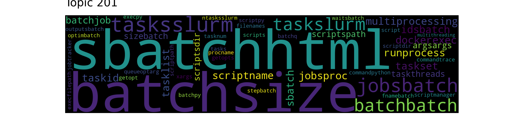

## Topic 202

```console
nprocscat libpythonpath libtbxpython commandpython pythonpathhome outputfile pythonpython pythonpathpwd nprocs filehomeobsproc pythonpackages nprocswc fopenmp pipelinepy nproc subfile pythonuserbase deeplab pathpython databasepy launcherpython nprocnproc makefile bfile runprocess numpy fileoutput cmdpython nprtrwnproc stdout runpy outputmsub filenames pgsql nullglob filebasename matplotlib pythonpathddmd datasetpy datafile ipython datapy portpython nfile pythonpath modulefile jobsproc stdouttxt nodefilepbs bamfiles
```
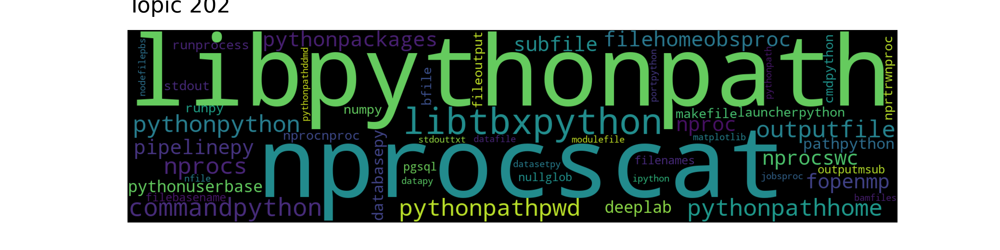

## Topic 203

```console
dockerexec nodemanager github exportall gdb libtbxfind nodefilepbs nodeecho export dockerfile exports nodesecho commandtrace jobtracker nodelistgpu githubcom exportnone nodefile zshrc deeplab execdir nodejs nodesn exported nodelistslurm jobscriptsh nodesh flagsdevicegpu jobsproc nodeslurm jobfile clusteroutput outputbase databasespbs libexec nodelist jobscript sourcetarget outputsbatch malloc aggregator nodesslurm kernelexe nodesbls cudapath libtbxpython jobend autolab ftracedir ftrace
```
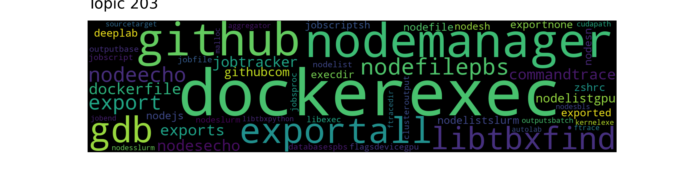

## Topic 204

```console
fopenmp gmp mpmdconf mdlog dirtmp nodefilepbs pstmp restartlmp pbsdsh pdebug openmp ddpm tmpfile mdrun pbsqueue pbs cpm mmps intmpdir ctmp pde tmpfiles fpm pbsidpbs pb stmp dddmp modulessh hostsmpsize pkgconf cmdfile lmp modulefile jtyppdyjlogfile logfile hcpmmp inpfile gdb cerrctmp dirtmpdir mppnppn smp tpm pythonpathddmd nproc partitionepyc mdns bamfiles kpsmp outtmp
```


## Topic 205

```console
echoinfo sbatchhtml scriptspath scriptmanager getopt getopts dockerexec outputsbatch zshrc outputdirectory bashrc scriptpath scriptsdir echo yecho outputecho iecho scriptdir bashrcn echodebug scriptsh jobscriptsh execfilepath ctxtecho echoecho envirovariables echocat outputtxt dockerfile scripttest defaultsh outputscript scriptpy hhecho slurmscript cronlogfile echoerror jobfile outputfile sbatch nextflowconfig deeplab stdouttxt printshellcmds fopenmp cmdfile libstdc batchbatch pkgconfig jobsbatch
```
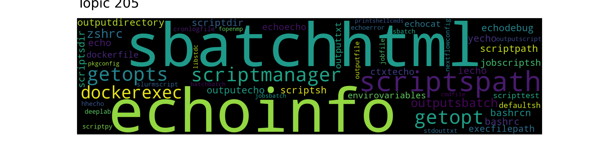

## Topic 206

```console
pbs pbsidpbs jobnamepbs nodefilepbs jobfile pbsqueue jobtmp pythonpackages jobsproc workdirpbs pythonpathhome pbsdsh pb jobidpbs bamfiles jobpy jobnamejob pythonpathddmd pdebug pythonpathpwd dirpbs modulefile libpythonpath dirtmp pgsql pstmp pathpython filehomeobsproc databasespbs modulespath jobnameojob modulefiles wpb inpfile packagepy modulessh dirtmpdir pdb pythonpython fopenmp modulepy nbitpg ppc pdbedit libtbxpython jobsparkpi bamfile filebasename postgresqlconf bfile
```
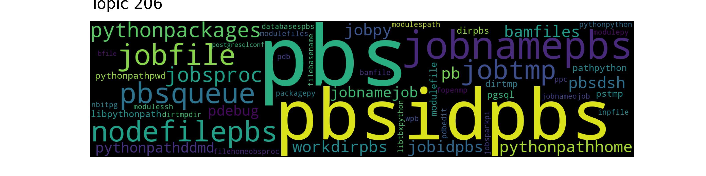

## Topic 207

```console
nprocs nprocswc nmap outputgmx nproc nprocmin zshrc nodefilepbs nodesn nconf networkpy nodeecho runprocess nodesh nodefile runmode sysctlconf modulessh nodesecho nodelistgpu bashrcn debugnxf dockerexec cmsrun sbatchhtml outputsrun dockerfile pkgconf nprocscat modulefile outputsbatch modulefiles nodemanager nprocnproc runpplsh clusteroutput outputrfm mpmdconf nnode mdrun psdef fopenmp nodeslurm nginxconf gmp sddmconf modulespath cmdsrun githubcom modulepy
```
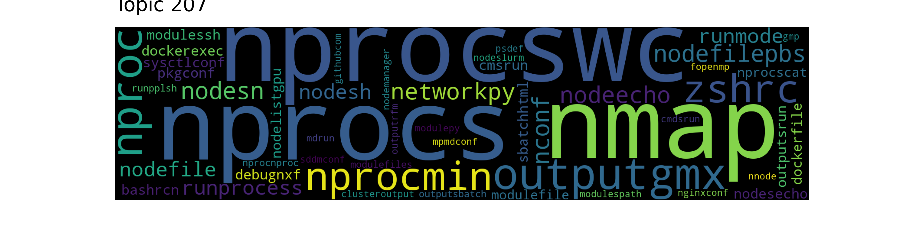

## Topic 208

```console
dockerexec dockerfile docker ifnamedocker imagedocker udocker beckers sbatchhtml nodemanager zshrc nodeecho cmdpython clusteroutput batchbatch cmdlauncher sysctlconf packagevalgrind outputsbatch bashrcn remotepy idsbatch containername printshellcmds sbatch github scriptmanager cmdhostname commandpython cpuinfo pythonpackages batchsize nodesecho mldock nodelistgpu customcmd bashrc githubcom cmsset workerpy excludegpu jobsbatch echoinfo gpufile shellbash packagepy addrhostname hostnamectl xinitrc remotehostname cmdgmake
```
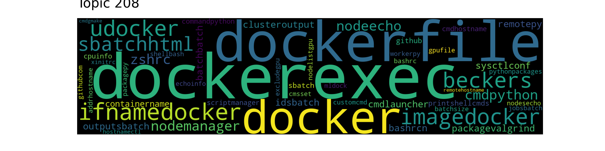

## Topic 209

```console
outputsbatch outputsrun outputlog scripttest outputdirectory logfile outputlogs outputfile debugtrace outputecho outputgmx outputtxt runlog logfilename outputrfm filetests testlog outputbase runprocess dockerexec commandtrace outputx testfile topoutputlogs ftracedir memtest logfiles ftrace logstxt scriptmanager execfilepath outputerr postgresqlconf execdir cmdsrun logfilelogdir scriptsdir outputdir filetesttxt testreport outputjobout logbasesprefix sbatchhtml bashrc logbaselogbase printshellcmds outputoutj outputroot stdout jlogfile
```
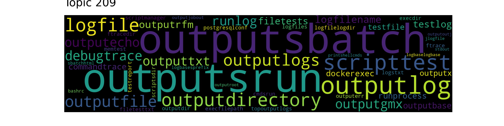

## Topic 210

```console
restartfilefind restartfile fopenmp nodefile sorttxt ftrace nfile nodefilepbs nodelisttxt cronlogfile restartfiles tmpfile ftracedir restartstring stdouttxt filesnum outputtxt restartlmp filetesttxt restartnum nprocs printfile indexfile nprocscat zshrc restartpy makefile grep cfile scriptnow scriptsdir commandstxt outputfile deeplab scriptdir seqfile fastqfile counttxt malloc jobfile runfile nproc cron cmdfile filestxt gputxt execfilepath deepseek jobscriptsh nccllog
```
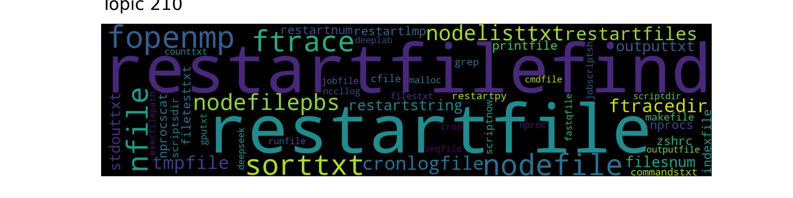

## Topic 211

```console
dockerexec dockerfile pkgconf nginxconf mpmdconf zshrc bashrcn sysctlconf pkgconfig bashrc pkgconfigpkg libexec cmakecachetxt nginxconfpacnew cmdlauncher postgresqlconf libstdc roothome cpuinfo gconftool networkpy xdpyinfo scriptmanager httpdconf githubcom xinitrc nodemanager xorgconf clamdconf nodefilepbs grep github ubuntu libxc networkmanager installsh openssl dirtmpdir libpythonpath skypeforlinux echoinfo nconf remotepy getopt commandpython tmux radeonconf nginx archlinux defaultsconf
```
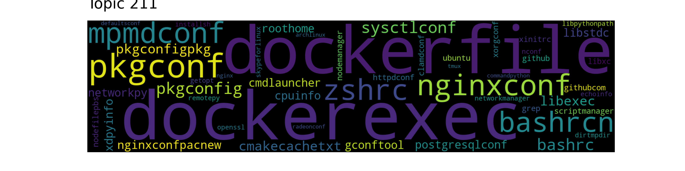

## Topic 212

```console
cronlogfile crontab dirtmpdir cron modulespath rundir sbatchhtml modulefiles dirtmp scriptspath getopt printshellcmds defaultsh dockerexec rundirs getopts scriptsdir modelcsv cmsrun partitionepyc echoinfo dirdirname modulefile commandsh zshrc optimbatch psdef scriptmanager mpmdconf customcmd tmpdirlocal cronjobs execfilepath codedir pythonpathddmd pythonpathpwd logfilename mpdset xargs dirproject echodebug multirunlog tmpdir scriptsh bamfiles scriptpath outputgmx scriptdir powercmddir formatcsv
```
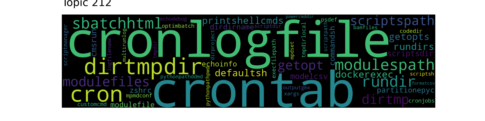

## Topic 213

```console
sbatchhtml jobsbatch batchjob outputsbatch batchbatch batchsize sbatch batchq waitsbatch runprocess jobsproc dockerexec outputjob optimbatch getopts envirovariables queueoptarg getopt outputjobout sizebatch execfilepath fnamebatch batch nodeecho taskthreads directivesbatch execpy jstdout multiprocessing dockerfile stdout tasksslurm nodelistgpu nodesecho outputecho jobscriptsh execdir ntasksslurm batchnorm taskslurm batchpy partitionbatch cronjobs clusteroutput jobpy taskpkl runjob jobend jobtmp batchsh
```
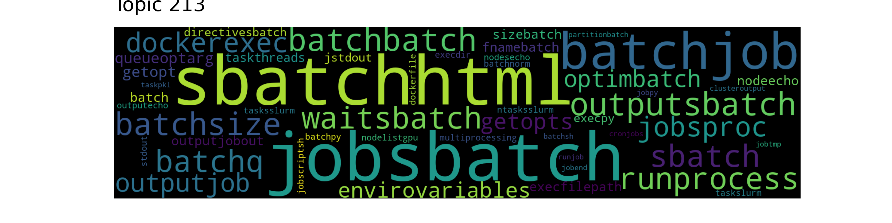

## Topic 214

```console
sbatchhtml outputsbatch batchbatch sbatch batchsize partitionbatch batchq batchpy getopt getopts commandpython cmdpython multiprocessing datasetpy jobsbatch waitsbatch dockerexec pythonpython performancepy dockerfile partitionepyc outputecho networkpy eachfile runprocess ipython sizebatch batch remotepy clusteroutput optimbatch pythonpackages echoinfo partitioncpu processingpy batchnorm kbatch cputime iecho outputrfm numpy outputgmx excludegpu mmecho pythonpathpwd outputbase batchsh pythonpathddmd pythonuserbase yecho
```
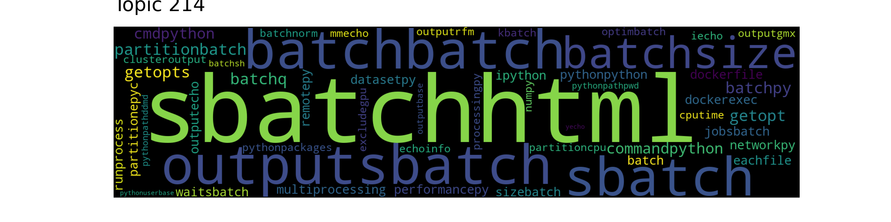

## Topic 215

```console
adapterpy kadapteradapter methodkadapter kadapter kadapterlayer wmtkadapter kadapters adapttr kadapteryear adapt libpythonpath adaptive adapter datasetpy pythonpython modeadapter adapters ipython commandpython pythonpathhome pathpython tensoranaconda trainingpy adaptivemtxgz pythonpathpwd tensorflow pythonpath checkpointpy adaptation trainerpy launcherpython intelpython datapy pythonpathddmd performancepy cmdpython runpy pythonpackages gridsearchpy pluginpy python workerpy baselinepy pythonhome classifierpy networkpy databasepy configpy adapted pythonwhich
```
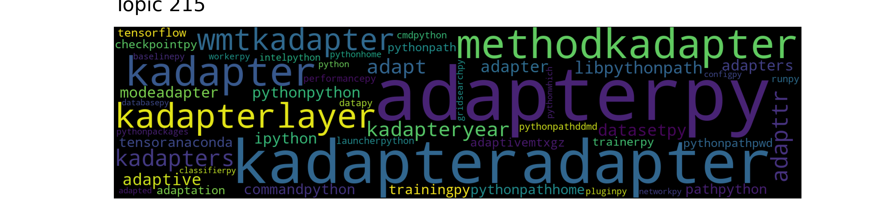

## Topic 216

```console
cronlogfile getopt getopts eachfile crontab nodelisttxt commandstxt directivesbatch sorttxt outputdirectory outputtxt mpmdconf outputjtxt pgsql indexfile psdef outputfile postgresqlconf commandline cron postgresql modulefiles execfilepath queueoptarg nfile commandsh performancepy seqfile stdouttxt jobfile configfile endcsv fileprefix nodefilepbs configyml xargs cpgdfile dockerexec commandpython pythonpathpwd dockerfile fastqfile nliqopt modulefile nodefile outputsbatch sbatchhtml scriptspath counttxt nmap
```
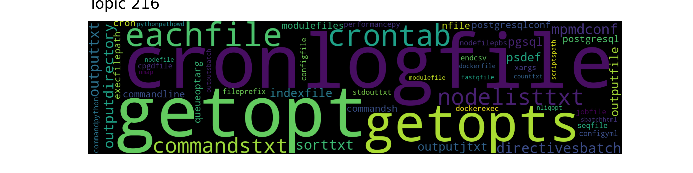

## Topic 217

```console
sbatchhtml batchbatch batchsize sbatch batchq outputsbatch jobsbatch batchjob batchnorm waitsbatch partitionbatch batch sizebatch batchpy getopts kbatch multiprocessing getopt fnamebatch stepbatch optimbatch batchsh directivesbatch pkgconfig trainingbatch runprocess snakemakestats dockerexec queueoptarg snakemake jobsproc multithreading dockerfile commandpython sbatchsh snakefile pbatch idsbatch endcsv outputgmx packagevalgrind jobtmp configslurm pythonpathpwd execfilepath commandstxt pythonpackages execpy performancepy pbsqueue
```
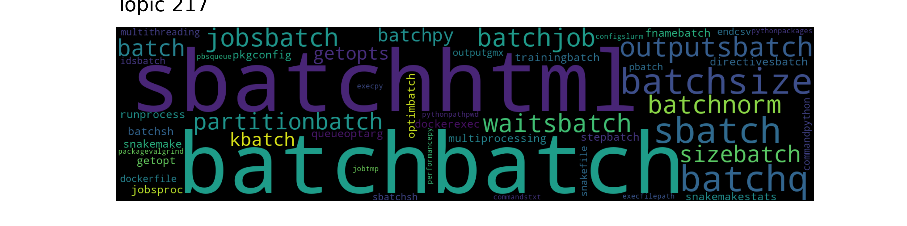

## Topic 218

```console
matplotlib gnuplot tmpfile datafile tmux xinitrc xlsf dockerfile gmp pgsql timedatectl cronlogfile makefile datasetpy fileprefix xdamp restartlmp tmpfiles restartfile cmdfile seqfile eachfile postgresql tfile nodefile scriptmanager scriptsh aqmplots dockerexec datapy nfile gresgpurtx scriptpy tmpdirlocal intmpdir scriptnow fopenmp zshrc postgres mpmdconf cpgdfile restartfilefind nodefilepbs tmploctmpdir ntimefmt xdrmtk sorttxt cdiminfofmap scriptsdir nmap
```
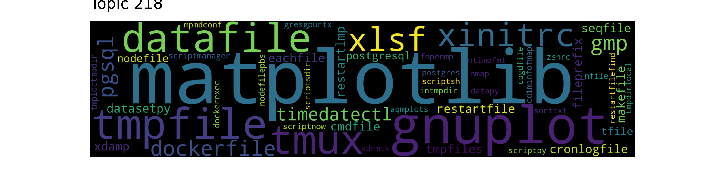

## Topic 219

```console
nsamples libpythonpath testpy launcherpython idsample libtbxpython centos libstdc nprocs ipython samplestsv pythonpathpwd commandpython dirsample nprocscat stdout sampling datasetpy nodesn pythonpathhome nccllog pythonpython scripttest dockerfile tensorflow datapy cudapath numpy sklearn sampleline pathpython intelpython nproc nvidiaconf modulespath scriptspath gnuplot autolab networkpy nodesh fastsample stdoutj clusteroutput nvprof datasetn subsample nodelistgpu cnppath snpeffpath deeplab
```
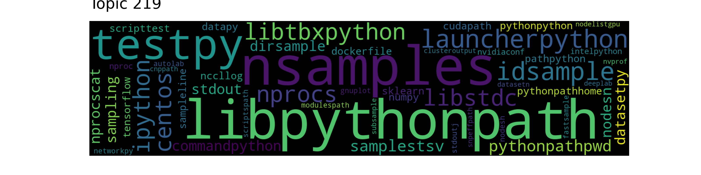

## Topic 220

```console
pythonpython cmdpython commandpython portpython pythonpathpwd pythonpathddmd pathpython scriptdir launcherpython workdirpbs workdir libpythonpath scriptsdir remotepy dirtmpdir rundir networkpy workdirpwd powercmddir pythonpackages bamdir python workingdir scriptpy workerpy libtbxpython ipython intmpdir workdirworkdir modulepy mkdir intelpython loadmodule jobpy modulefile rundirs wdir indir mydircomdir runpy pythonpathhome aloadmodule srcdir tmpdir jobdir execpy scriptmanager modulessh workdirorigdir jobfile
```
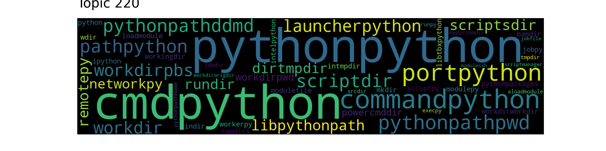

## Topic 221

```console
sbatchhtml partitionbatch batchq queuepbs outputsbatch fastqfile pbsqueue seqfile queueoptarg queuequeue sbatch batchbatch fastqfiles batchsize sorttxt squeue outputfile outputtxt getopts waitsbatch getopt dockerfile fileprefix queued dockerexec seqproc filetesttxt tmpfiles tempfile fopenmp bashrcn bashrc zshrc filesystem filetests xargs fnamebatch psdef tmpfile outputdirectory batchsh partitioncpu sbatchsh splittxt cpgdfile grep ffmpeg fastqdir queueing filetime
```
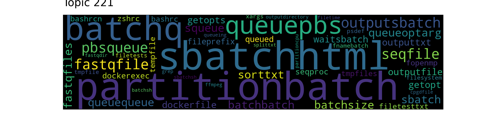

## Topic 222

```console
nodefilepbs nodefile getopt pkgconfig nodeecho dockerexec batchsize sbatchhtml outputsbatch getopts nodesecho execpy nodemanager nodelistgpu runpy pkgconfigpkg fopenmp pythonpathpwd configpy pkgconf pythonpackages commandpython execfilepath libpythonpath deeplab gnuplot cmdpython pythonpathhome tensorflow performancepy packagepy ftrace networkpy libtbxpython eachfile runprocess sizebatch nodelistnode partitionepyc gpufile clusteroutput nodesnum commandtrace ftracedir partitionbatch mpmdconf modulespath workerpy runpdy nodesn
```
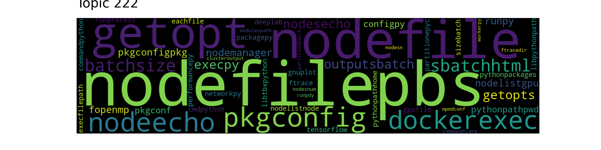

## Topic 223

```console
sbatchhtml deeplab batchbatch sbatch partitionbatch batchsize deeplabv batchq matlab deepmd sizebatch batch kbatch waitsbatch deeplearn outputsbatch batchsh partitioncpu stepbatch autolab multiprocessing batchpy trainingbatch sbatchsh cputime basefbase dockerexec srlab printshellcmds bashrc maxdepth databasespbs framebatch scriptsdir jidsbatch idsbatch deepdrivemd cmdpython modulefiles cmsset cmds partitionepyc deeplearning partitiongpu socketbase cmdfile lscpu basepy kernelexe parallelcore
```
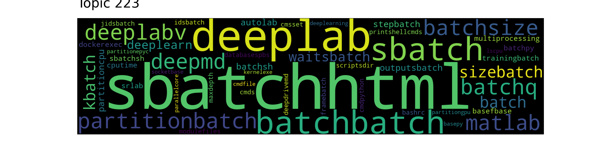

## Topic 224

```console
sbatchhtml jobsbatch batchbatch batchjob sbatch multiprocessing tensorflow batchq jobsproc jobfile dockerfile multithreading scriptspath batchsh githubcom jobscriptsh bamfiles batchsize taskthreads bamspath waitsbatch fileoptarg github outputsbatch directivesbatch tasksslurm queueoptarg batchnorm clusterthreads runprocess filesystemshome multithreaded sbatchsh fastqfile jobksh scriptsdir jobrnderr pythonpathhome scriptpath subjobs rawnetworkfs taskslurm pythonpathddmd getopt execfilepath getopts pipelinepy fastqfiles pathpython jobscript
```
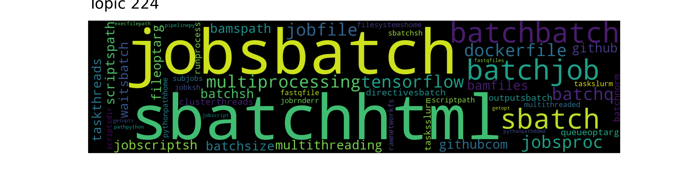

## Topic 225

```console
dockerfile scriptmanager dockerexec jobfile jobscriptsh cronlogfile libpythonpath jobpy scriptspath scriptsdir summaryfilejob jobterasort pythonpathhome pythonpathpwd workerpy jobscript jobksh scriptdir cronjobs jobsproc pyspark pythonpathddmd cmdpython nodemanager crontab performancepy jobfs scriptpy jobscrp commandpython gnuplot nfpcli scriptpath scriptsh zshrc ftrace launcherpython gmapcsv fopenmp ftracedir outputjob jobarray jobtracker libtbxpython jobsparkpi getopt script libexec jobidtxt modulespath
```
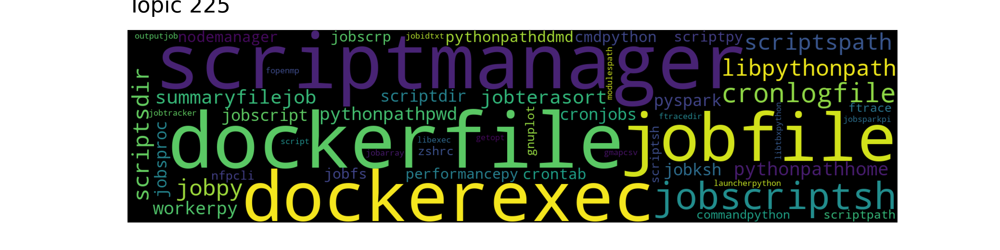

## Topic 226

```console
modulessh pdebug nvidiaconf modulepy pythonpython commandpython pythonpathhome libpythonpath partitiondebug modprobeconf modulespath pythonpathddmd modulefile pythonpathpwd gdb modulepath xinitrc launcherpython libtbxpython debuginfo cmdpython nmap mdlog moduleslurm vimrcn kernelexe debug pdb mpmdconf portpython mapperdebug pythonpath modulefiles numpy intelpython xinit vim qosdebug benchmarkpy pathpython depmap ipython gmp kernel gpufile nodemanager bsmap dirtmp moduleshome testpy
```
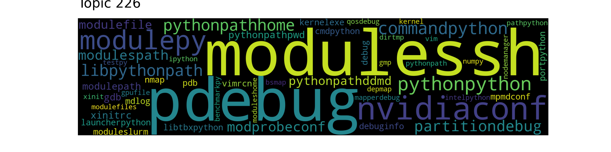

## Topic 227

```console
sbatchhtml batchbatch jobsbatch outputsbatch sbatch batchsize batchjob batchq jobsproc fnamebatch commandpython batchpy waitsbatch multiprocessing evalpy autolab dockerfile nameproject sizebatch dockerexec batchnorm procname workerpy runprocess optimbatch kbatch nameexp numpy outputgmx batch execpy numtasksslurm errorjob performancepy idsbatch deeplab cmdpython jobpy jobnamejob batchsh stepbatch namesdataset taskslurm partitionbatch tasknum deeplabv clusteroutput outputjob clustererror pythonpython
```
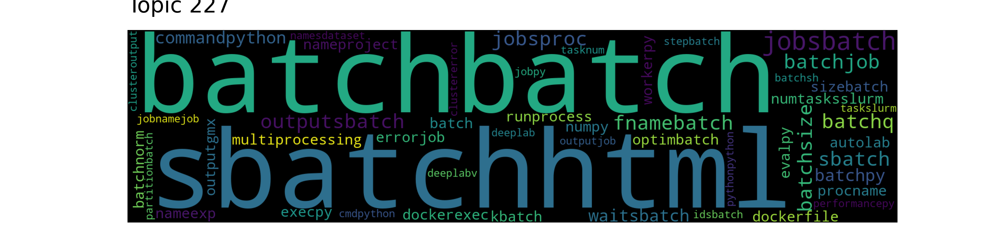

## Topic 228

```console
sbatchhtml outputsbatch batchbatch batchsize sbatch nodelistgpu partitionbatch batchjob jobsbatch batchq bashrcn packagevalgrind bashrc mdrun sizebatch dockerexec gpufile gpuqueue getopt jobsproc multiprocessing outputgmx gromacs getopts waitsbatch gnuplot kbatch cmdsrun fnamebatch batchsh stepbatch partitiongpu jobscriptsh directivesbatch gregtemp multigpu partitioncpu gmrun nodefilepbs gpgpu cputime runprocess xargs commandsh gccsv excludegpu nodeecho scriptmanager cmsrun cpm
```
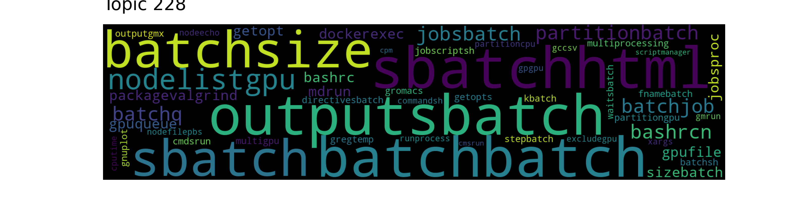

## Topic 229

```console
outputgmx gpufile nodelistgpu matlab nprocs nvtx nodesn outputsbatch kernelexe nprocmin nvidiaconf xorgconfd outputsrun gmp outputx npesexpr tensorflow github nprocscat nproc matplotlib nodeslurm lxde nodefile runj gcccore gpuqueue xorgconf excludegpu clusteroutput kernel xorg outputbase npm sbatchhtml nmap xdamp memnxf gpuv nodesh packagevalgrind fopenmp outputxjout nodesslurm partitiongpu nodedgxngpu nodejs xinitrc fortran gpulog
```
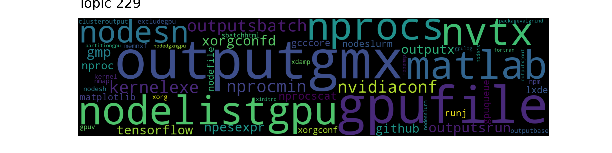

## Topic 230

```console
sbatchhtml sbatch batchbatch waitsbatch partitionbatch stepbatch outputsbatch batch batchpy sizebatch idsbatch batchq multigpu deeplab batchsize gpufile excludegpu gresgpu partitiongpu batchsh fnamebatch steinba jidsbatch gpulog sbatchsh kernelexe deeplabv trainingbatch kbatch bashrc cputime partitioncpu bashrcn terabyte cpuinfo packagevalgrind pbatch idlog configpy xinitrc multirunlog setcpuaffinity dockerexec multiprocessing jobsbatch optimbatch gregtemp homebrew cpu scriptpy
```
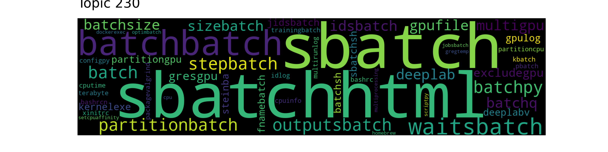

## Topic 231

```console
sbatchhtml batchbatch outputsbatch multiprocessing sbatch commandpython runprocess waitsbatch batchpy batchsize batchq pythonpython batchjob processingpy pythonpathpwd cputime partitionbatch jobsbatch cmdpython dockerfile taskthreads launcherpython pythonpackages remotepy scheduler pathpython postprocess ipython multithreading dockerexec batch pythonpathddmd pythonuserbase stepbatch intelpython workerpy schedulerhead networkpy fnamebatch cronlogfile libpythonpath threadsnprocs taskskip python idsbatch sizebatch scriptpy lhyperthreading runpy nprocess
```
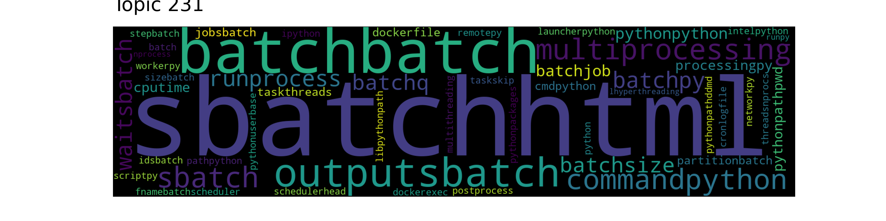

## Topic 232

```console
sbatchhtml batchbatch jobsbatch outputsbatch batchjob dockerexec execfilepath nodeecho sbatch nodemanager modulespath dockerfile bamspath multirunlog outputdirectory pathoutput pathcudapath logbasesprefix nodesecho runpath runprocess nodefile nodelistgpu batchq jobsproc cudapath joblog cronlogfile nodefilepbs githubcom scriptspath remotehostname directivesbatch cmdhostname pathhome outputsrun jlogfile outputjob processorsnodes idlog logfilename partitionbatch outputlog waitsbatch nodeslurm clusteroutput stepbatch outputlogs jobtmp bashrcn
```
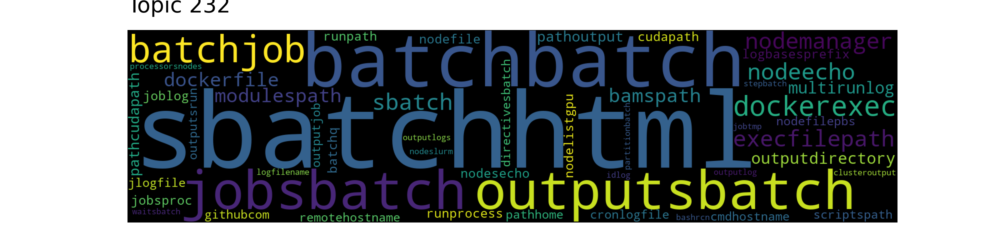

## Topic 233

```console
pathconda libpythonpath commandpython cmdpython dockerexec pathpython pythonpathpwd libtbxpython pythonpathhome shellbash execfilepath launcherpython pythonpackages cmsrun dockerfile bashrc pythonpython cmdlauncher tensoranaconda bashrcn runpy execpy printshellcmds remotepy cmdfile pathcudapath libexec anaconda cudapath pythonpathddmd bioconda cmdsrun pipelinepy snakemake miniconda snakefile ipython pythonpath cmdgmake jobpy scriptspath cmd execdir sbatchhtml runprocess outputsbatch outputtxt yecho pythonuserbase outputecho
```
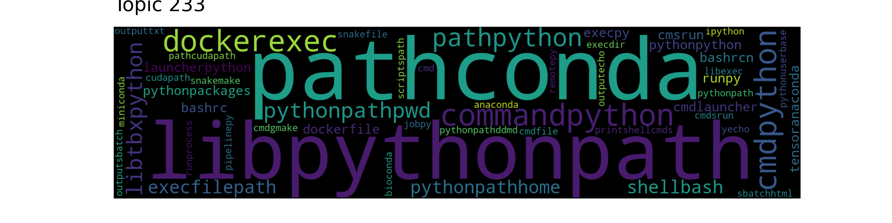

## Topic 234

```console
sbatchhtml batchbatch batchsize sbatch outputsbatch cmdpython partitionbatch sizebatch batchpy commandpython batchq batch libtbxpython kbatch waitsbatch batchsh modulepy modulefile partitionepyc dockerexec pythonpython pythonuserbase pythonpathpwd modulefiles pythonpackages pkgconfig trainingbatch dockerfile getopt sbatchsh scriptpy libpythonpath pythonpathddmd launcherpython fnamebatch intelpython valexpr modulessh pathpython numpy printshellcmds bashrc configpy ipython gnuplot jobsbatch customcmd stepbatch deeplab snakemake
```
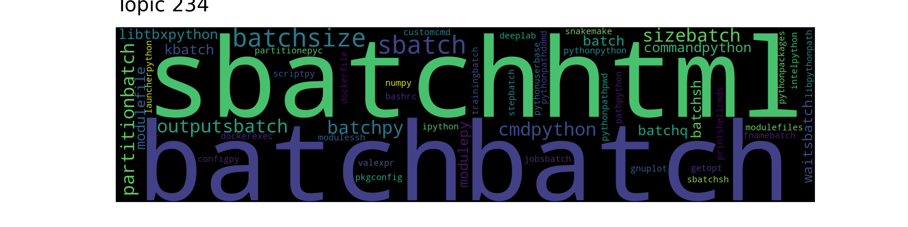

## Topic 235

```console
sbatchhtml outputsbatch jobsbatch batchbatch batchjob sbatch partitionbatch nodeecho nodesecho batchsize jobtmp batch batchq outputjob runprocess taskslurm jobsproc fopenmp taskthreads kbatch tasksslurm dockerexec outputecho nodemanager gmp idsbatch waitsbatch batchpy taskset clusteroutput openmp ntasksslurm fnamebatch nodefilepbs execpy outputrfm outputgmx outputbase sizebatch workerpy jobpy ntask jobscript batchnorm outputjobout nodesn nodelistgpu nprocs nodeslurm jobscriptsh
```


## Topic 236

```console
matrixhead sbatchhtml outputsbatch matrixmatrix outputgmx mpmdconf matrixout echodebug outputecho echoinfo batchq getopt bashrc outputmsub echocat outputbase echo matrixbody getopts directivesbatch mxecho matrix matlab makefile outputrfm dockerexec matrixcountf bashrcn iecho commandsh matricesamd commandpython echoecho batchbatch xecho echoerror outputdirectory basesprefix autolab yecho matrixcount deeplab hhecho modulespath scriptpy mpdset deeplabv tmux outputx modulepy
```
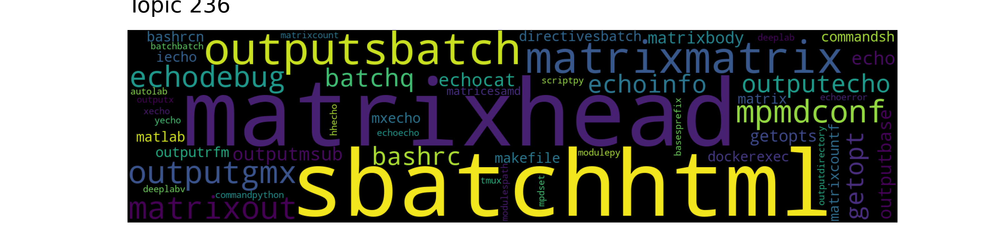

## Topic 237

```console
tensorflow pbsqueue pythonpackages cronlogfile modulepy pythonpathpwd partitionepyc modulefiles libpythonpath pythonpython modulefile workerpy distributedpy pythonpathddmd queuequeue performancepy fastqfile libtbxpython dockerfile launcherpython cputime partitioncpu pipelinepy matplotlib clusteroutput modulespath queuepbs tensoranaconda multirunlog cmdpython pathpython testpy pythonpathhome gpuqueue snakemakelog loadmodule intelpython networkpy stdout fastqfiles partitiondebug squeue portpython pstat mlflow runpy postgresqlconf snakemakestats nprocscat checkpointpy
```
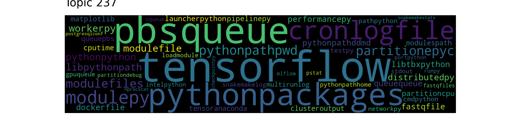

## Topic 238

```console
sbatchhtml batchbatch sbatch outputsbatch batchsize batchjob batchq partitionbatch jobsbatch waitsbatch batch taskthreads stepbatch taskset sizebatch taskslurm tasksslurm tasknum runprocess framebatch ntasksslurm taskid partitiongpu partitioncpu batchpy tasklist dockerexec multiprocessing ntask jobsproc idsbatch taskcpus taskpkl trainingbatch batchsh task kbatch ntasks tasks minibatch arraytaskid processor excludegpu sbatchsh multithreading execpy gpufile taskskip processors optimbatch
```
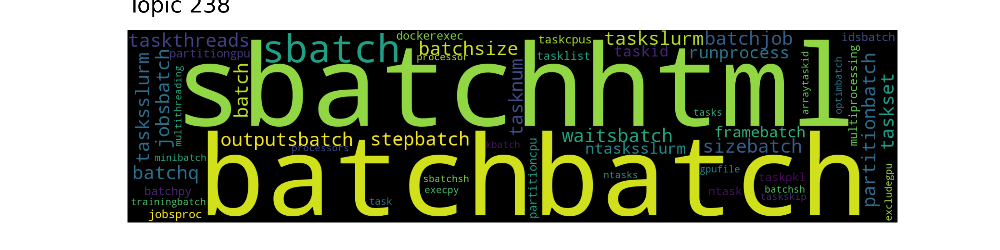

## Topic 239

```console
scp ncp cp qecp tcp pkgconfig hcp cpmmh pkgconfigpkg ecp depmap kpoints urltcp ccpvdz ncpux inpfile ratiorcp kpsmp tunecp domainp pdypdy pfs ftp gchp cppdefs tcpkeepalive gchprc pde cpp gmp pmapcsv nodefilepbs ksp pdef gvfs nmap pcom isp gplv gpfs pppp inp gzip wp cinpmatfmap psdef ppc localdisk portcomm dpkg
```
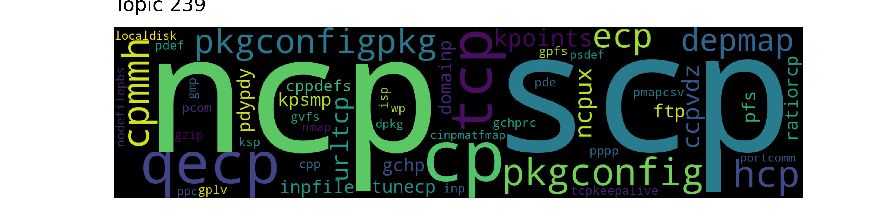

## Topic 240

```console
nodefile nodefilepbs nodesn nodeslurm nprocs nodelistgpu nodejs nodesslurm nodeecho nodesnum nodesecho nodemanager nodesh fopenmp networkpy batchsize ftrace nodesnnodes nproc nodes jobsproc nodenames nprocscat gpufile multiprocessing ftracedir maxdepth nodelistslurm outputsbatch mpmdconf node sbatchhtml nmap makefile nodelist eachfile nodempi nodescat execpy nprocswc deeplab mapreduce nprocmin outputfile dockerfile nodesnodes nodelisttxt nfile tempfile openmp
```
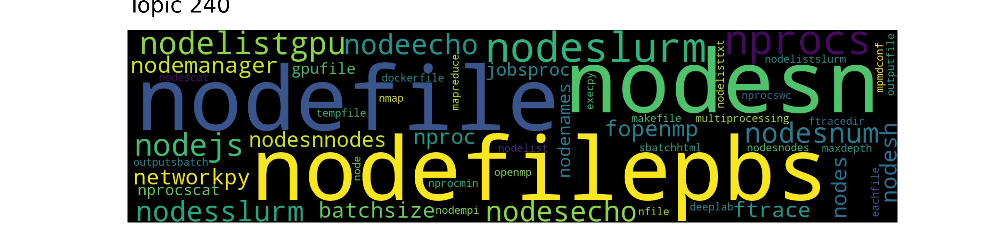

## Topic 241

```console
sbatchhtml batchbatch outputsbatch sbatch jobsbatch batchjob partitionbatch batchsize batchq nodeecho nodesecho batch waitsbatch stepbatch fnamebatch outputscript kbatch idsbatch nodefile nodelistgpu jobscript nodefilepbs batchpy jobsproc sizebatch runprocess makefile jobscriptsh bamfiles gpufile scriptmanager jobtmp nodeslurm gmp batchsh dockerexec dockerfile outputecho cronlogfile tasksslurm openmp jobfile nodesslurm outputrfm framebatch nodemanager outputfile deeplab fopenmp eachfile
```
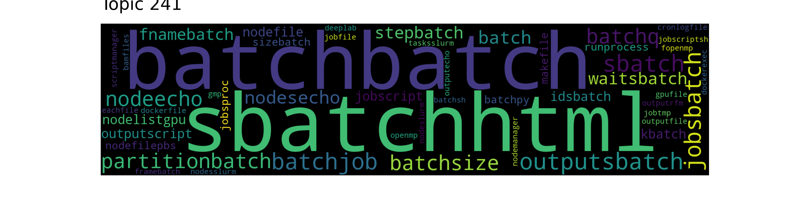

## Topic 242

```console
outputsbatch mlflow tensorflow outputgmx jobsbatch batchbatch sbatchhtml batchsize batchjob workflow outputfile clusteroutput waitsbatch batchq nextflowtrace outputsrun workflows outputtrain sbatch outputjobout templateflow outputjob multiprocessing nextflowconfig jobfile deeplabv outputx summaryfilejob gmxdir outputslurm multirunlog partitionbatch jobsproc outputxjout stepbatch exportall jobtmp fileoutput exports deeplab multithreading batchpy outputout mlx export batchnorm outputtxt outputbase outputoutj gmx
```
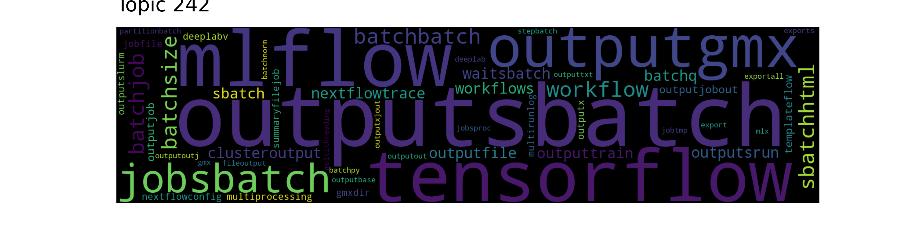

## Topic 243

```console
nodefilepbs dockerexec echoinfo jobnamepbs nodeecho jobtmp execfilepath pbsqueue jobfile nodesecho bashrcn nodefile logfilename echodebug outputjob outputecho outputfile nodelisttxt outputname fopenmp echo jobnamejob outputdirectory pbsidpbs dirpbs deeplab outputsbatch cmdhostname dirtmp namepbs outputtxt pstmp bashrc dockerfile nodemanager stringnode grep pathname pathoutput printfile execdir getopt nodename jobnameojob pathdirname outputjobout jobidpbs sbatchhtml xpbs filebasename
```
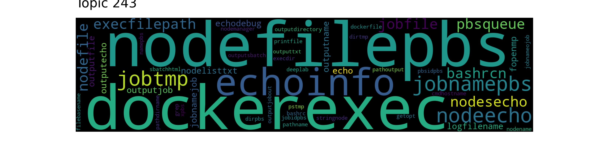

## Topic 244

```console
cmdpython commandpython pythonpython libpythonpath modulepy modulespath intelpython modulefile ipython launcherpython pathpython pythonpathddmd pythonpackages libtbxpython pythonpathpwd portpython runprocess npython modulepath pythonpathhome nprocscat modulefiles pythonuserbase numpy modulessh python xinitrc matplotlib pythonpath runpy multiprocessing aloadmodule testpy moduleslurm execpy nprocess remotepy pathconda xdpyinfo workerpy evalpy nprocs nprocnproc module nproc restartpy tensoranaconda scriptpy dockerexec gnuplot
```
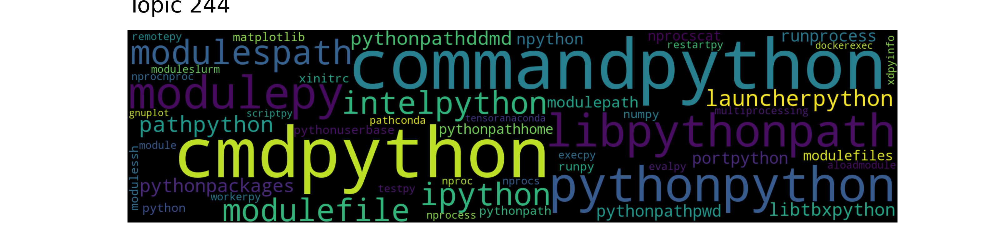

## Topic 245

```console
tensorflow gnuplot libpythonpath fopenmp matplotlib libtbxpython nvidiaconf pythonpackages pythonpathpwd datapy dockerfile gpufile networkpy pythonpathhome datasetpy pythonpython pathpython launcherpython github deeplab nodefilepbs deeplabv libstdc pythonpathddmd nodefile tmpfiles sysctlconf xinitrc datafile workerpy commandpython snpeffpath portpython postgresqlconf pyspark radeonconf tensoranaconda gvfs partitionepyc dataframe tmux cmdpython xdpyinfo datafiles filedata execfilepath openmp clusteroutput ipython nodelisttxt
```
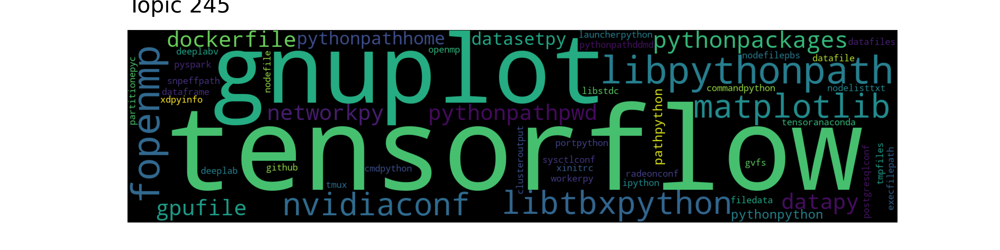

## Topic 246

```console
nodemanager nodesn nodelistnode nodesecho nodefilepbs nodefile nodeecho nodejs nodenames nodeslurm nodesnodes nodesslurm nodesnnodes nnode nodelistgpu nodename nodesh nodelistslurm node nodempi nodes nnodes nnodesslurm nodescontrol nodelist nnodesnnodes nodescat headnode nodesbls nodesscontrol nodea nodelisttxt commandtrace exportall hostnamectl npernode clusteroutput nodeid pernode stdout namenode nodesnum datanode gpuspernode exportnone arraynodes lnodes stringnode nodesmy outputsrun
```
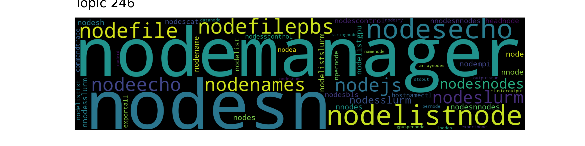

## Topic 247

```console
sbatchhtml batchjob jobsbatch batchbatch tasksslurm taskset taskslurm sbatch waitsbatch batchq dockerexec jobsproc ntasksslurm outputsbatch batchsize tasknum taskthreads multiprocessing cputime ntasks tasks dockerfile tasklist numtasksslurm taskid jobksh ntask countjobs runprocess jobscriptsh jobpy performancepy batch mpitasks scriptmanager jobscript sizebatch multithreading batchpy partitionbatch taskcpus jobfile intelpython workerpy commandpython jobnameojob execpy processors taskpkl jobtmp
```
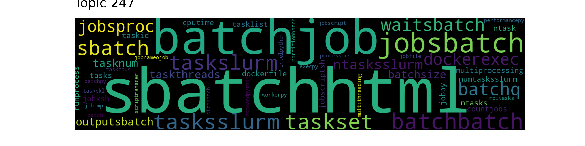

## Topic 248

```console
clusteroutput partitionepyc dockerfile eachfile sparkwordcount zshrc pyspark cronlogfile dockerexec filedata jobfile mywordcountfile clustermem mapreduce outofmemory endcsv idcsv filesystem datasetdataset summaryfilejob clusteryaml centos cmdfile cmdlauncher storagegdata cmakecachetxt sparkleshare datasettemplama filesystemshome fileoutput powercmddir clustergres datafile datasetpy idxstats clustererror restartfilefind crontab performancepy libpythonpath sparsesuperlu datasets datafiles customcmd storage clusterjson libtbxpython clustertime gmapcsv jobksh
```
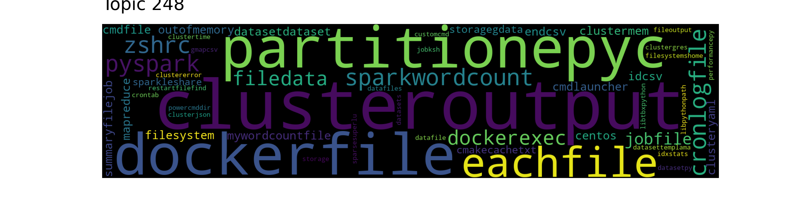

## Topic 249

```console
cronlogfile nodefile exportnone nodemanager exportall outputjobout export outputgmx outputjob libtbxpython outputsrun exports outputfile outputx nodefilepbs dockerfile pathoutput execfilepath cudapath synclimit libpythonpath pythonpathpwd nodeecho nodesn gmxdir cronjobs async outputbase lsync nodejs pathcudapath clusteroutput syncing gmx stdout fileoutput outputlog crontab nodesecho cmdpython exported runprocess pathpython cron nginxconfpacnew sync pythonpathhome isync execpy rsync
```
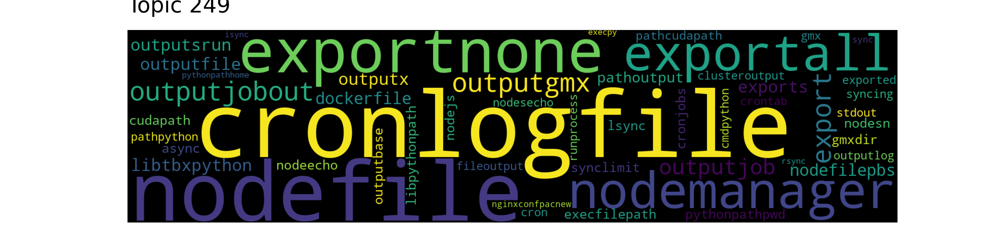

## Topic 250

```console
execfilepath jobsproc scriptspath execdir jobfile postgresqlconf dockerexec pipelinepy argsargs getopts getopt outputdirectory execpy diroptarg pathoutput argparse runprocess jobscriptsh queueoptarg postgresql fileoptarg summaryfilejob pathpython commandtrace scriptmanager jobscript libexec ftrace snakefile pathname pythonpathpwd nodelisttxt cronlogfile jobsbatch bashrcn runfile directivesbatch libpythonpath runjob ftracedir pythonpathhome commandpython pipelineyaml xargs nodemanager jobtracker fopenmp commandstxt outputjob batchjob
```
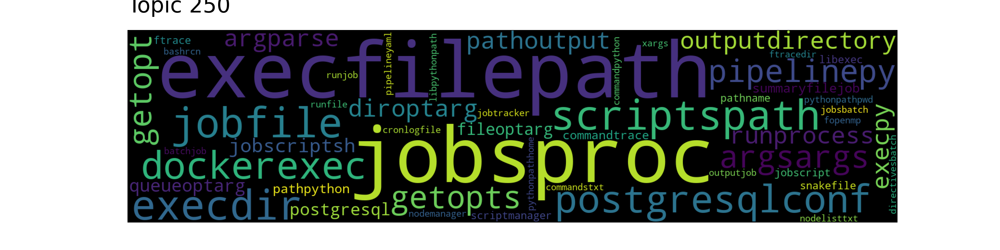

## Topic 251

```console
ipython libpythonpath commandpython launcherpython cobalt pythonpathhome pythonpython testpy libtbxpython networkpy scipy runpy pathpython remotepy portpython npython gnuplot datapy trainpy numpy modulespath decodepy trainingpy stlearn cmdpython xdpyinfo datasetpy python intelpython configpy pythonpath gcnnpy modulepy matplotlib pythonhome workerpy pythonpathpwd epyc pyxis learningpy sklearn checkpointpy pyenv autolab githubcom pyspark pythonpackages packagepy trainerpy modulefile
```
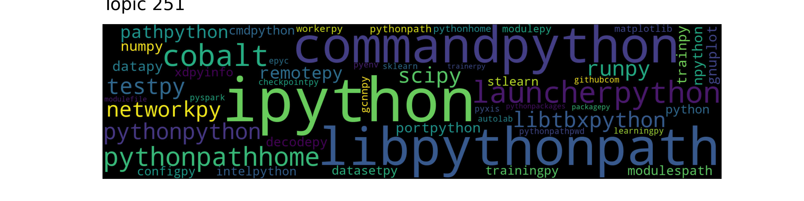

## Topic 252

```console
gcccore zshrc gmp gromacs gdb gset gencode nprocs gcc malloc nprocswc grep gmap gcmdir nproc gnu recursive csc gcm nprocscat iqtree csnow gdk gdas cfile recursion gsp glog gchprc gpl kernelsasc genomefasta gmake gccsv greggreg rcsn gsl tree ccgcc cdatadir gcvads commandsh nodesh cxxg nprocnproc crc kdebase scriptsh nsc gcrn
```
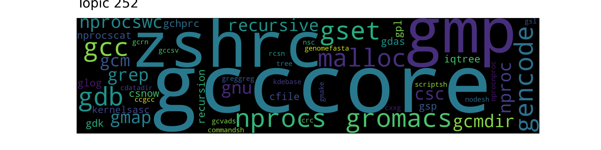

## Topic 253

```console
sbatchhtml batchbatch modulefile outputsbatch modulespath sbatch batchq moduleslurm batchjob jobsbatch batchsize modulefiles modulepy modulepath aloadmodule getopt partitionbatch getopts multiprocessing module loadedmodules modules envmodules batch waitsbatch propagatestack moduletable loadmodule batchpy dockerexec framebatch modulessh scriptmanager nodeecho fnamebatch jobtmp sizebatch runprocess multithreading jobscript optimbatch jobscriptsh nodesecho dockerfile nodefile concat moduleshome nodelistgpu jobsproc outputgmx
```
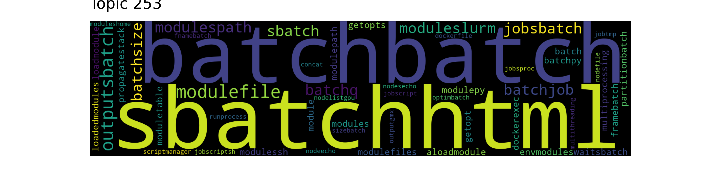

## Topic 254

```console
libpythonpath pythonpathhome pythonpackages pythonpython pathpython commandpython pythonpathpwd randompy matplotlib pythonpath pythonpathddmd numpy packagepy workerpy networkpy libtbxpython ipython depmap pyspark snakefile inpfile launcherpython pythonhome pytorchpy cmdpython python portpython fopenmp testpy nodefilepbs runpy tmpfiles pstmp datapy pixel pythonwhich eachfile pyyaml gmp checkpointpy pdebug stdout gnuplot dockerfile remotepy libpng filespy pytorchext pbsqueue execfilepath
```
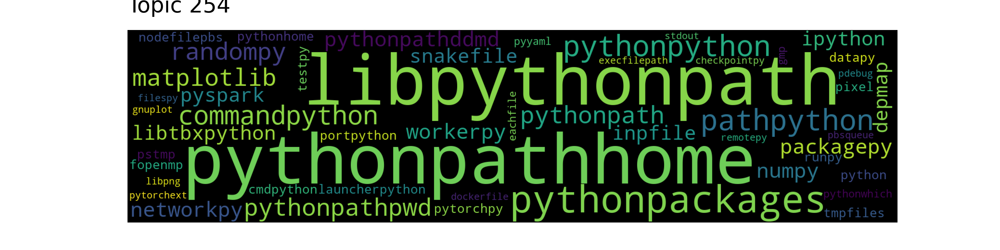

## Topic 255

```console
cmdfile cmds outputtxt outputdirectory scriptsdir outputfile dockerexec outputrfm outputsbatch scriptmanager cmd fopenmp scriptdir outputjtxt scripttest cmdsrun commandstxt seqfile sbatchhtml fastqfile outputlog mdlog bashrcn zshrc scriptsh sorttxt cronlogfile outputmsub outputsrun sysctlconf jobfile makefile simoutput logfile tmpdirlocal printshellcmds powercmddir bashrc grep scriptspath execfilepath nprocscat batchq cmsrun execdir qstat mdrun dockerfile dirtmp getopt
```
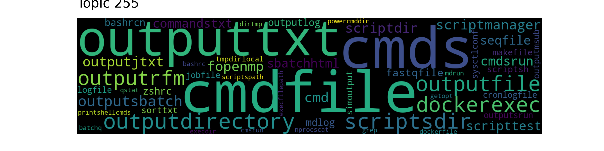

## Topic 256

```console
ipython sbatchhtml pythonpython outputsbatch lognamelog idlog commandpython runprocess logfile networkpy pipelinepy logfilename performancepy cmdpython launcherpython pythonpathpwd intelpython runpy stdout outputlog sbatch cronlogfile pythonpathhome syslogfacility batchpy loggingmllog mdlog datasetpy fxdlog configpy outputlogs runlog configurelog loglammps libpythonpath pythonuserbase pythonpath log debugtrace loglevelinfo pythonpathddmd fnamebatch remotepy python batchbatch logfiles databasepy dockerfile eachfile libtbxpython
```
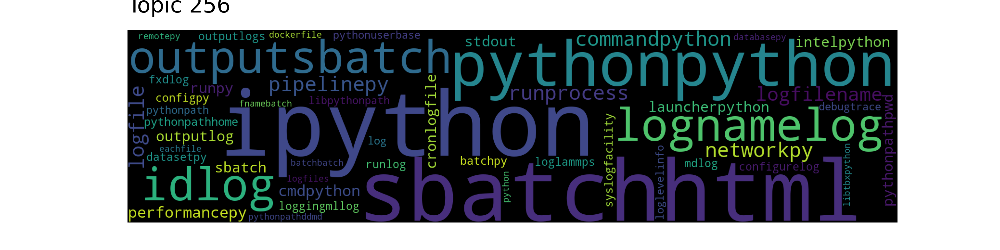

## Topic 257

```console
outputsbatch jobsbatch batchbatch sbatchhtml sbatch dataset batchjob clusteroutput seedrandom clustergres batchsize datasetn arraytaskid batchq dirdataset datasetmnist jobsproc outputbase datasetdataset clusteryaml datasetpolbook tasksslurm taskslurm partitionbatch datasetpy stepbatch basebasename toolbox multiprocessing idsbatch taskset dataproces databasespbs datasets databases databasepy batch autolab numtasksslurm database simulationlog jidsbatch waitsbatch taskid simoutput sizebatch jobarray clustermem noisemapbuilder outputivecs
```
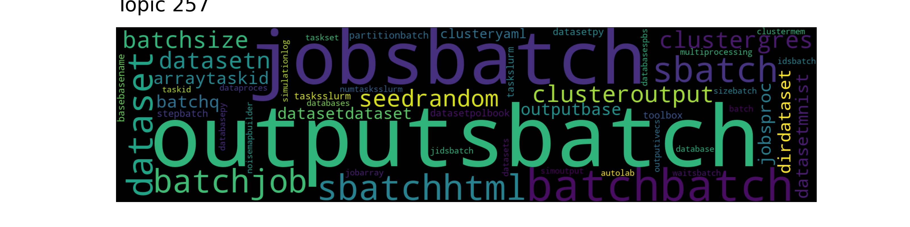

## Topic 258

```console
pythonpackages pathpython pythonpython libpythonpath pythonpathpwd commandpython pythonpathhome pythonpathddmd cmdpython launcherpython jobpy libtbxpython portpython packagepy remotepy pythonpath jobnamepbs python pdebug jobsproc pythonuserbase jobnamejob dockerexec modulepy runpy jobfile execpy pythonhome modulespath databasepy nameproject checkpointpy pythonwhich pathconda workerpy pytorchpy pbsdsh pgsql jobnameojob pbs modulessh pbsqueue pbsidpbs ipython pyspark execfilepath pyyaml pb matplotlib xdpyinfo
```
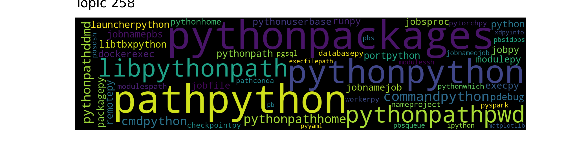

## Topic 259

```console
sbatchhtml nodeecho cmds execfilepath nodesecho dirtmpdir scriptspath nodefilepbs outputdirectory cmdfile pathoutput outputsbatch nodefile pathdata datafiles datapath dirtmp datatarget echoinfo datafile rsync tmpdirlocal bashrc partitionbatch rdatadir datadirdatadir cmd outputtxt tmpfiles datasettemplama centos bashrcn dirdisk clusteroutput pathdatasets cudapath datadir outputecho nodelisttxt filedata zshrc fopenmp maxdepth jobfile powercmddir cmdsrun deeplabv scriptsdir deeplab localdisk
```
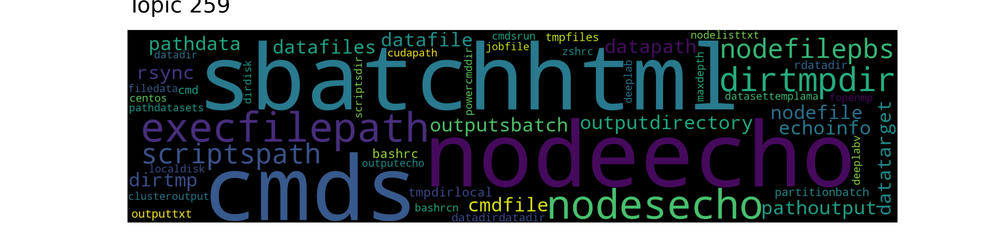

## Topic 260

```console
libpythonpath pathpython cmdpython commandpython modulespath pythonpython libtbxpython pythonpathhome ipython portpython pythonpackages launcherpython pythonpathpwd intelpython modulefile pythonpath modulepath remotepy modulepy scriptspath execfilepath pythonpathddmd python scriptpath loadmodule aloadmodule pythonhome modulefiles npython matplotlib runpy modulessh scriptpy libstdc pythonuserbase cmdfile sbatchhtml cudapath xinitrc outputscript pathcudapath libxml pathconda githubcom pythonwhich scriptdir snakefile libxc xdpyinfo scriptsdir
```
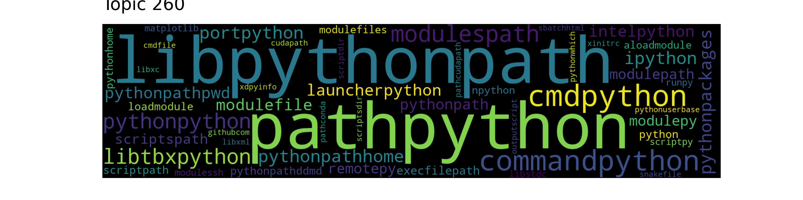

## Topic 261

```console
libpythonpath pathpython pythonpackages pythonpython commandpython tensoranaconda pathconda pythonpathpwd pythonpathhome launcherpython checkpointpy pythonpath cmdpython datasetpy ipython packagepy runpy adapterpy workerpy pythonpathddmd pipelinepy gridsearchpy remotepy datapy modulespath snakefile trainingpy intelpython numpy scipy networkpy libtbxpython python pythonhome testpy pytorchpy performancepy pluginpy anaconda miniconda epyc tensorflow trainpy portpython modulepy idparray pythonwhich bioconda partitionepyc trainerpy
```
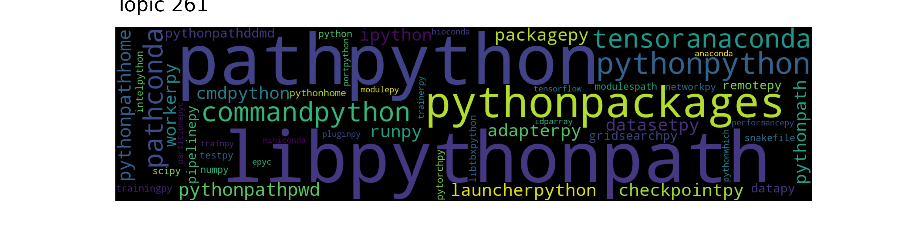

## Topic 262

```console
jobfile jobsproc jobnamepbs jobnamejob jobpy jobtmp jobnameojob pbsqueue jobscriptsh jobscript jobend jobrnderr jobstart jobidpbs jobname outputjob runjob dockerexec cronjobs batchjob psdef cronlogfile joblog libpythonpath mpmdconf execfilepath nprocscat ftrace pythonpathddmd procname jobidtxt runprocess pythonpathpwd ftracedir matplotlib jobfs libexec postgresqlconf bashrcn fopenmp workdirpbs pstat fileprefix prefixprefix scriptmanager summaryfilejob nprocs workerpy commandpython jobsbatch
```
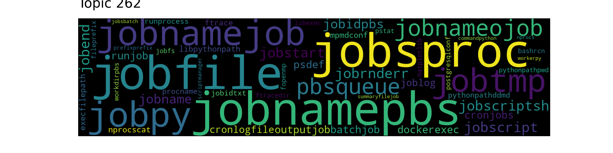

## Topic 263

```console
uselocalhost dockerexec rstudio adminerconf sysctlconf libexec modulessh remotehostname runlocal openssl remotepy httpdconf zshrc localhost githubcom dockerfile postgresqlconf nginxconf libtbxpython defaultsconf github xinitrc networkhost tmpdirlocal libstdc openssh rserver pkgconf setlocale studio networkpy clamdconf logbasesprefix deeplab scriptmanager cmdhostname syslogauth cmakecachetxt zeroconf compilervarssh nethost autolab hostnamectl deeplabv srlab webserver execfilepath pyspark radeonconf freshclamconf
```
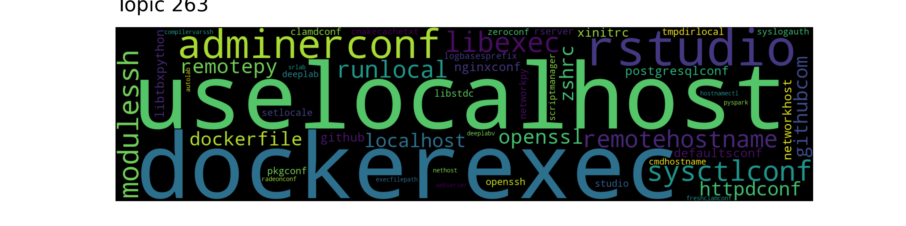

## Topic 264

```console
datasetmnist datasetpy gnuplot dataframe pythonpython commandpython matplotlib jobpy pbsqueue datapy multiprocessing libtbxpython pythonpackages deeplabv dataset dockerfile cputime datasetcifar batchjob datasettemplama datasetn endcsv clustertime workerpy cronjobs datasetpolbook countjobs libpythonpath datanode jobsproc datanv dockerexec clusteroutput arrayjob jobfile pgsql jobsbatch databasepy numpy summaryfilejob clusterjson datanum jobrnderr jobarray cmdpython nodelistgpu remotepy multiviewmds datasetdataset nodefilepbs
```
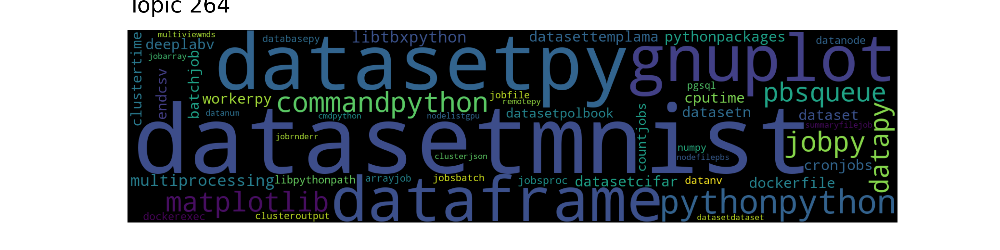

## Topic 265

```console
outputsbatch sbatchhtml pathoutput batchbatch outputgmx batchsize pathcudapath pathpath sbatch stepbatch runpath outputsrun pathpathhome pathhome pathdirname outputecho bashrc outputjobout outputname hpctoolkit jobsbatch execfilepath outputbase pathname cudapath partitionbatch srcpath bamspath outputjob pathscale batchjob bashrcn outputdirectory outputroot execdir sizebatch rundir jobsproc execpy outputx outputxojn pathsout exportall rundirs outputfile pbatch workpath pathmsccl binpath outputivecs
```
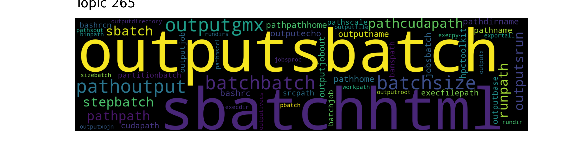

## Topic 266

```console
sbatchhtml batchbatch sbatch partitionbatch batchq waitsbatch outputsbatch batchsize batchpy batch batchjob jobsbatch sizebatch stepbatch fnamebatch batchsh commandpython yecho dockerexec framebatch idsbatch execfilepath ctxtecho hhecho multiprocessing hsecho trainingbatch sbatchsh kbatch cmdpython partitiongpu execpy iecho jidsbatch commandstxt echoinfo outputtxt getopt partitionepyc xecho optimbatch nodeecho multigpu partitioncpu counttxt minibatch pythonpython getopts runprocess cudapath
```
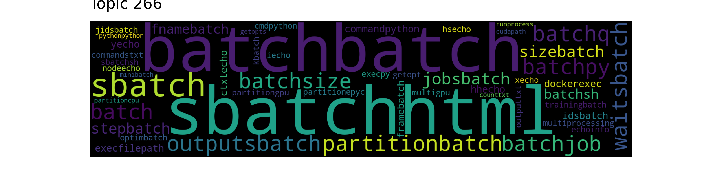

## Topic 267

```console
sbatchhtml outputsbatch batchbatch sbatch partitionbatch bashrc bashrcn batchsize cmdpython idsbatch jobsbatch fopenmp jobsproc cmdfile scriptmanager cmds execpy cmd batchpy runprocess scripttest autolab libtbxpython shellbash cmdlauncher outputtxt taskcpus matlab taskset execfilepath arraytaskid idparray cmakecachetxt scriptpy batchjob cmdsrun ftrace dirtmp taskslurm scriptsdir dockerexec batchq outputgmx memtest partitionepyc execdir stepbatch jobfile echodebug commandpython
```
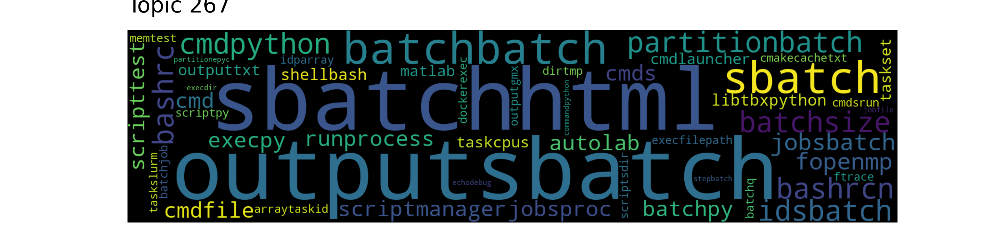

## Topic 268

```console
outputsbatch launchpy sbatchhtml execpy packagepy dockerexec export dockerfile openmp exports runpy outputfile epyc outputgmx launcherpython batchpy outputerr tensorflow workerpy pathoutput pytorchpy exportall outputtrain outputx bashrc depmap outputsrun makefile bashrcn execfilepath clusteroutput pythonpathhome exported pipelinepy pathpython batchbatch outputrfm runprocess datapy swbuild pythonpathpwd partitionepyc fopenmp diroutput distributedpy runpplsh pytorchext sbatch tmpdirlocal networkpy
```
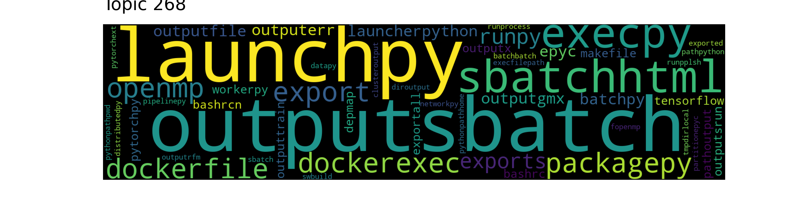

## Topic 269

```console
libtbxpython templatefile pythonpackages libpythonpath modulespath datasetpy pythonpathpwd pythonpathddmd pathpython mpmdconf templateflow hostnamectl databasepy configyml modulepy namesdataset pythonpython matplotlib sysctlconf modulefiles pbsdsh commandpython modulefile pkgconf namedataset portpython xdpyinfo filebasename libstdc dumpname datasettemplama datapy libtbxfind packagepy debugtrace flagtemplate configpy nginxconf postgresqlconf tmpfiles libxml namecompiler dockerfile pgsql cmdhostname cmdpython libvdpau dockerexec tensorflow nametxt
```
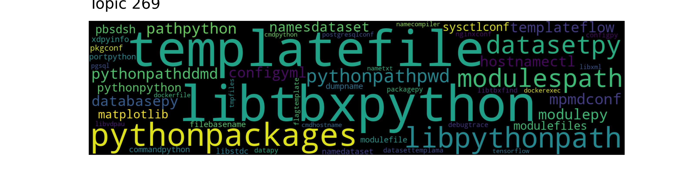

## Topic 270

```console
distributedpy tensorflow pythonpython diffusion mlflow batchsize pythonpackages sbatchhtml pathpython ipython outputsbatch width datapy databasepy batchpy sizebatch runpy datasetpy pythonpathhome commandpython networkpy xdpyinfo pythonpathpwd portpython distributionspy pipelinepy libtbxpython datash scipy pythonpathddmd postgres pythonpath datasetfacebook spread packagepy variationspy libpythonpath spreading trainingpy distributions python simulationpy distribution pythonuserbase cmdpython distributed fluxdata dataexpanded infillpy trainingbatch
```
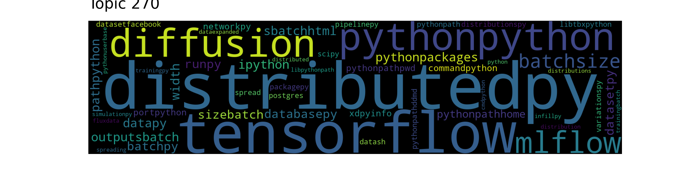

## Topic 271

```console
pythonpython libpythonpath tensorflow datasetpy pathpython commandpython ipython pythonpackages modulepy pythonpathpwd datapy modulespath libtbxpython modulefile matplotlib launcherpython pythonpathddmd pythonpathhome cmdpython numpy portpython dataframe intelpython python modulefiles networkpy loadmodule pythonpath datasetdataset aloadmodule pythonuserbase modulessh scipy gnuplot modulepath pythonwhich npython dataset loadedmodules remotepy databasepy tensoranaconda sklearn datafile datasetn moduletable envmodules xdpyinfo workerpy moduleslurm
```
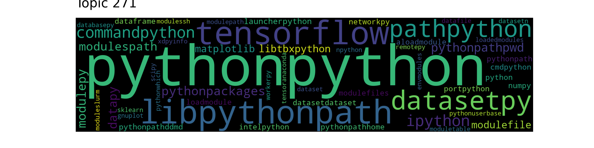

## Topic 272

```console
batchbatch sbatchhtml outputsbatch batchq jobsbatch sbatch nextflowconfig tensorflow waitsbatch batchjob nextflowtrace workflows batchsize workflow fnamebatch mlflow stepbatch jobsproc batch batchpy nodelistgpu batchsh particleflow ebola idsbatch simoutput jidsbatch loadmodule bamfiles debugtrace bamfile outputgmx bamspath trainingbatch aloadmodule autolab sizebatch getopt optimbatch getopts jobpy modulespath templateflow dockerexec sbatchsh partitionbatch github runprocess bams execpy
```
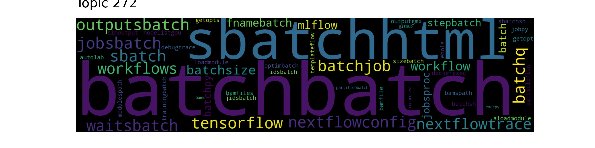

## Topic 273

```console
ftracedir outputgmx dockerexec ftrace commandtrace execdir outputdirectory exportall tmpdirlocal libexec outputx execfilepath fopenmp outputsbatch outputsrun outputfile mpmdconf outputecho bashrcn execpy export xdef bashrc intmpdir zshrc outputtxt echoinfo rundir dockerfile exports tmux fileoutput libtbxfind scriptsdir gmxdir outputjobout gnuplot scriptdir outputjob outputrfm psdef runlocal deeplab xorgconfd rundirs outputdir outputerr dirtmpdir xdamp outputxjout
```
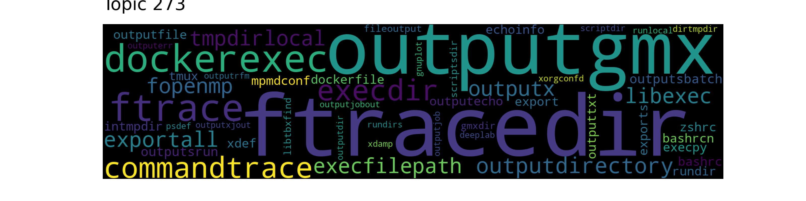

## Topic 274

```console
sbatchhtml sbatch configslurm batchbatch outputsbatch trainingbatch configfile outputtrain waitsbatch configconfig xinitrc datatrainann datatrainimg datatraindata autolab rccl configpy batchjob configtxt configjs dockerexec jobsbatch configsh configs sysctl configurelog cronlogfile kernelexe configyml fnamebatch commandtrace configdir simulationlog getopt zshrc scancel optimbatch partitionbatch rcsn scriptmanager dockerfile matplotlib bamfiles logfiles trainpy config runlog dataproces pkgconfig logfile
```
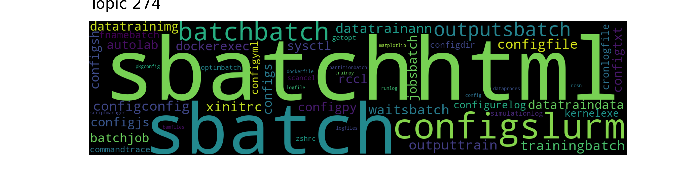

## Topic 275

```console
datasetpy trainingpy trainingbatch datatraindata datapy datasetdataset datatrainann workerpy simulationpy trainpy databasepy pythonpackages pythonpython commandpython remotepy dataset batchpy networkpy numpy libpythonpath tensorflow libtbxpython datasetfacebook training sklearn matplotlib multiprocessing pythonpathpwd datasetn datatrainimg pathpython performancepy distributedpy datasetmnist cmdpython dirdataset ipython datasettemplama datasets configpy trainingtrainer sbatchhtml trainingckpt evalpy scipy datasetcifar pythonuserbase runpy xdpyinfo dataproces
```
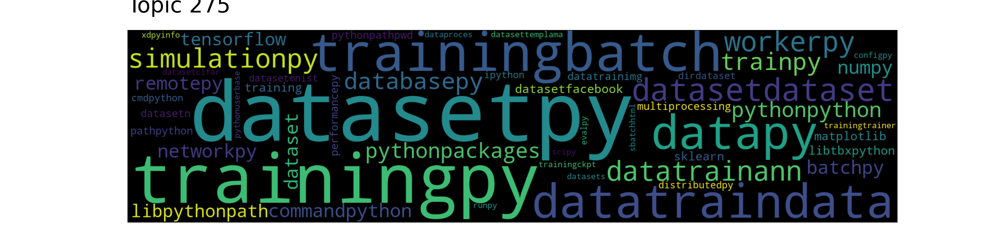

## Topic 276

```console
exportall export exports exportnone outputsbatch exported outputgmx sbatchhtml batchsize outputbase clusteroutput dockerexec fopenmp dockerfile deeplab tempfile outputecho diroutput diroutputs sbatch batchbatch fileoutput outputslurm ftrace outputfile tmpdirlocal partitionbatch dirtmp gmp ftracedir tmux simoutput outputsrun reporthtml outputx nodeecho tmpdirbase openmp tmpfiles framebatch dirtmpdir gcccore outputrfm ghz paramsportport dirdataset slurmscript expmap datatarget kbatch
```
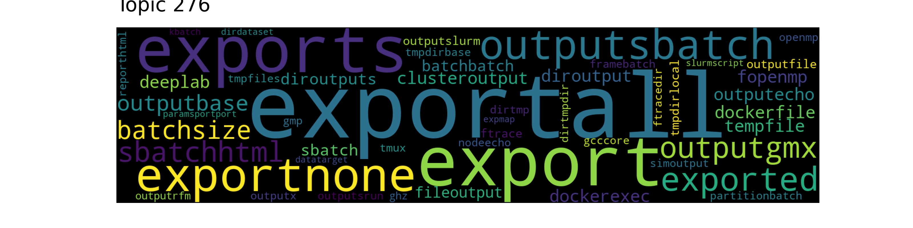

## Topic 277

```console
nccllog xorgconf nvidiaconf xorgconfd xorg lxde fxdlog nprocs xconfig nmap kernelexe xinitrc nliqopt nx nprocscat archlinux gpulog xdamp multirunlog nodesn runlog sysctlconf gpufile numgpus nprocmin nconf nvprof nodefilepbs nproc mdlog gpus xinit nvtx xargs nodefile radeonconf dirlog outputgmx debugnxf nblocks nprocswc xtccibits libxc sysctl nfile nxf kernel nodelistgpu nvidia craylinux
```
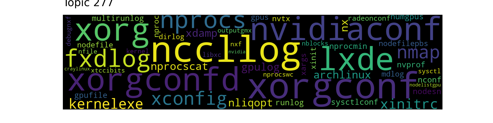

## Topic 278

```console
pythonpackages libpythonpath pythonpathhome libtbxpython pythonpathpwd pgsql pathpython packagepy modulespath pdebug pbsqueue pbsdsh libexec pbs execfilepath dockerexec pbsidpbs pythonpython pythonpathddmd commandpython remotepy postgresqlconf launcherpython pb postgresql pdbedit cmdpython pdb matplotlib pgsqlso jobpy databasepy execpy libvdpau modulefile pythonpath nodefilepbs jobfile psdef dockerfile modulepy portpython runpy jobtmp pkgconf xdpyinfo loadmodule bamspath libstdc zshrc
```
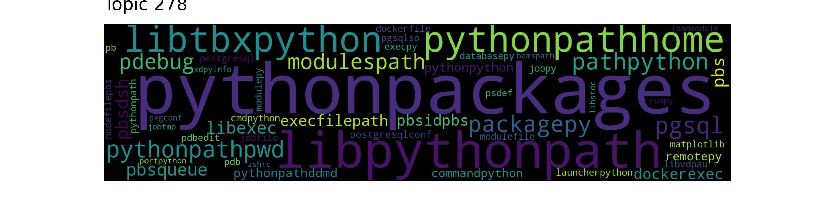

## Topic 279

```console
gpufile gpuqueue gpuv gpuq gpu gpuer gpulog partitiongpu multigpu excludegpu nodelistgpu gpuname gmp gpua flagsdevicegpu partitioncpu gresgpu nvidiaconf gputrue cpuinfo amdgpu lscpu cpu gpuvolta namegpu openmp cpuq sbatchhtml fopenmp benchmarkpy dirtmp ghz devicecpu qosgpu partitionbatch stmp gpus pstmp lmp gpgpu sbatch mpmdconf batchbatch kernel ompthreads mcpu prioritygpu devicesgpu radeonconf intmpdir
```
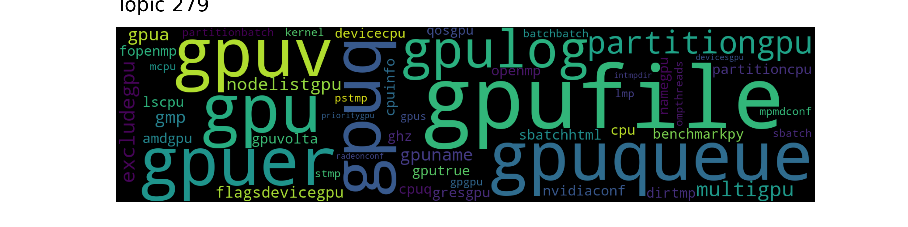

## Topic 280

```console
sbatchhtml batchbatch sbatch outputsbatch batchsize batchq waitsbatch batch sizebatch stepbatch partitionbatch batchpy jobsbatch batchjob minibatch mlflow idsbatch batchsh fnamebatch kbatch batchnorm sbatchsh optimbatch trainingbatch runprocess mpiprocs multiprocessing cmdlauncher jidsbatch ml getopt pbatch opencl getopts mlpy nprocs directivesbatch excludegpu nprocscat taskthreads outputgmx cmdgmake cmdsrun ntasksslurm queueoptarg nprocswc schedulerjson tasksslurm outputecho multigpu
```
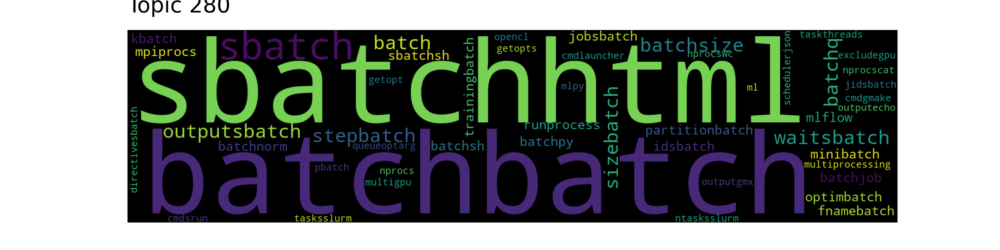

## Topic 281

```console
dockerexec execfilepath workdirpwd execdir execpy workdir cmdfile workdirorigdir jobfile workingdir jobpy workdirworkdir dockerfile cmsrun workdirslurm powercmddir workerpy cmdpython cmsset cmdlauncher rundir cmssw jobksh workpath pythonpathpwd gcmdir workfile libexec cmdgmake jobdir zshrc xinitrc proxyccsornlgov proxy workdirpbs srcdir cmd jobscrp dirtmpdir libxml mkdir cmds rundirs jobtmp workdirwork rootpwd jobsproc scriptmanager cmsstage jobrnderr
```
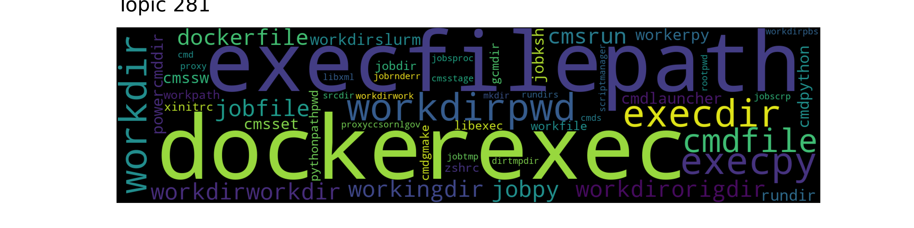

## Topic 282

```console
pythonpackages pythonpython commandpython tensorflow launcherpython libpythonpath pathpython pythonpathhome modulepy ipython pythonuserbase modulespath pipelinepy cmdpython pythonpathpwd modulefile loadmodule portpython libtbxpython tensoranaconda aloadmodule pythonpathddmd intelpython pythonpath snakefile python postgresqlconf pythonhome modulefiles packagepy snakemake networkpy xdpyinfo numpy pip postgresql loadedmodules workerpy runpy modulepath modulessh pathconda snakemakestats remotepy partitionepyc snakemakelog checkpointpy mlflow moduleslurm npython
```
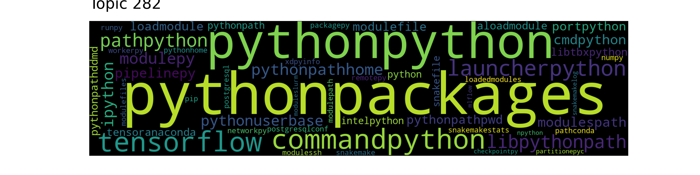

## Topic 283

```console
matlab deeplab matplotlib autolab deeplabv libpythonpath sbatchhtml filebasename libtbxpython dockerfile logfilename srlab modulefile modulespath execfilepath gnuplot bamfiles fileprefix jobfile filename mpmdconf filenames outputsbatch modulefiles scriptspath dockerexec commandpython makefile outputfile outputtxt nodelisttxt pythonpathddmd bamfile multirunlog tensorflow libexec bamspath tmux filesnum postgresqlconf datafile libstdc pythonpackages gpufile nodefilepbs pythonpython nodefile partitionbatch jlogfile fnamebatch
```
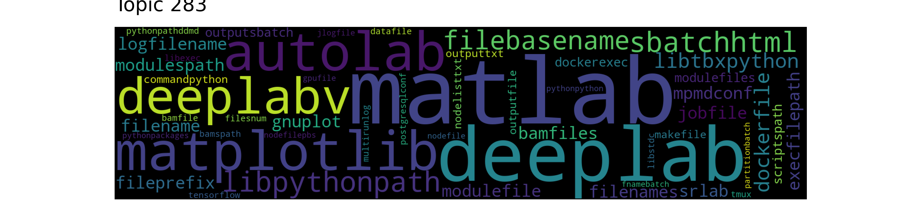

## Topic 284

```console
sbatchhtml batchbatch sbatch outputsbatch batchsize matlab batchq jobsbatch stepbatch jobsproc batchjob multiprocessing idsbatch batch execfilepath partitionbatch trainingbatch fnamebatch clusteroutput batchpy sizebatch batchsh modulespath dirproject waitsbatch autolab dataproces filehomeobsproc cudapath runprocess projectdirs dirtmpdir jidsbatch deeplab framebatch projectdir clustererror kbatch cmdlauncher mkdir processdir bamspath customcmd scriptspath workpath sbatchsh dockerexec dirsample bamfiles pathcudapath
```


## Topic 285

```console
datafile datapy datasetpy datafiles dataframe filedata outputtxt zshrc gnuplot rdatadir datash datasetcifar datasetn stdouttxt sorttxt dataprecaggr pgsql commandstxt datasettemplama dataset eachfile pythonpathpwd datalad fopenmp dirtmpdir databasepy datadir makefile dirtmp libtbxpython cdatadir rawdev tmpdirbase scriptsh dockerfile cmakecachetxt tmpfile datasetgta outputjtxt filetesttxt indexfile datapath commandpython dayfile outputfile matplotlib scriptsdir gmp intmpdir asciidatainput
```
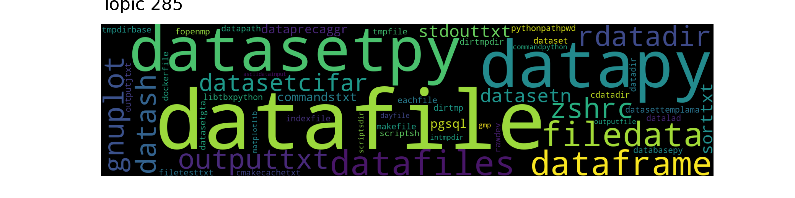

## Topic 286

```console
sbatchhtml batchbatch batchsize partitionbatch sbatch outputsbatch ulimit initlimit batchjob batchq synclimit jobsbatch multiprocessing sizebatch batch waitsbatch timelimit limit matlab fnamebatch dockerexec stepbatch directivesbatch execfilepath batchsh getopt unlimited partitioncpu minibatch limits getopts framebatch cmdsrun runprocess multithreading scriptsdir batchpy execdir limited cputime sbatchsh cmds scriptdir scriptspath scriptmanager batchnorm tasksslurm deeplab kbatch taskcpus
```


## Topic 287

```console
fluxionattack fluxionpath fluxion fluxionlibpath fluxionlanguage fluxionvline fluxionhashpath fluxiondebug fluxionairmonng fluxionversion fluxionundoable fluxionauto fluxionrevision stdouttxt stdoutj stdout targetpid scriptspath pathcudapath directivesbatch indexndx xorgconfd idxstats pathpathhome pathpath stdoutpbs directive interfaces idxfx outputgmx flagsdevicegpu attackconf xdef privoxy flups outputx ftrace runoff directivepbs nginxconfpacnew interfacetcl hxarrayshxarr termxterm flume hashpath pathoutput interface nextflowtrace ftracedir tzyx
```
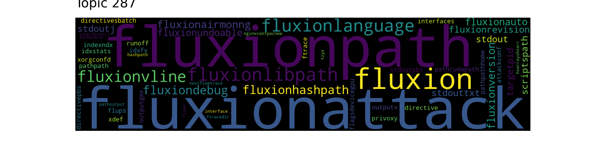

## Topic 288

```console
nodesn nodefile nodesnnodes threadsnprocs nprocs nodesh kernelexe tensorflow nodeslurm nodesslurm kneaddata datanode rdatadir nodes nprocscat nodejs nodempi nodescat datapy kernel nodesecho rdata nodesnodes node clusterthreads corecount datatraindata multithreading nodelistgpu datasetn rawdata nodelistslurm nproc dataproces datatrainann nnodes cdatadir nodesnum nodefilepbs nodeecho nprocmin nodata datascience rootdataset fluxdata nnode tensoranaconda nthreads kernelsasc datain
```
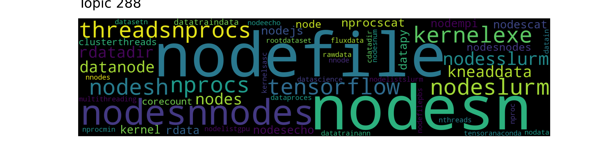

## Topic 289

```console
zshrc dockerexec libexec bashrc libxc commandpython pythonpackages libpythonpath xinitrc srcdir bashrcn makefile cmdpython cmakecachetxt libstdc libxml cmdfile dockerfile libtbxpython pathpython modulessh partitionepyc execfilepath cmakeliststxt githubcom srcpath modulespath pythonpathhome rmtxgz aparc installsh modulefile rm archlinux cdirs getopt filesmsccl curlrc remotepy pythonpathpwd mpiexec github commandsh compilervarssh src packagepy slurmfile swbuild petsc commandstxt
```
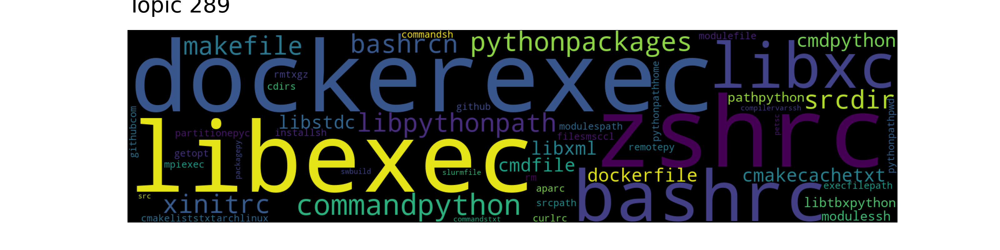

## Topic 290

```console
libpythonpath pythonpathpwd pathpython pythonpathhome pythonpython commandpython pythonpackages libtbxpython tensorflow modulespath pythonpathddmd datasetpy remotepy runpy modulepy modulefile cmdpython jobpy networkpy datapy performancepy postgresqlconf pythonpath ipython databasepy fopenmp portpython matplotlib pipelinepy postgresql intelpython execpy pythonuserbase workerpy modulefiles packagepy testpy numpy pgsql psf scriptpy partitionepyc dockerfile xdpyinfo launcherpython execfilepath psdef modulepath jobtmp stdout
```


## Topic 291

```console
gpuqueue gpufile sbatchhtml dockerexec excludegpu cmdpython batchbatch partitiongpu pythonpathhome commandpython gpulog gresgpu pythonpathpwd dockerfile pythonpathddmd multigpu pythonpython sbatch pythonuserbase nodelistgpu intelpython ipython libpythonpath gpuv gpuq cpuinfo partitioncpu lscpu outputsbatch cputime gpuer remotepy xinitrc batchsize gpu batchpy networkpy pathpython pythonpackages waitsbatch batchq launcherpython runprocess partitionbatch numpy cpu sizebatch amdgpu cpuq bashrcn
```


## Topic 292

```console
pythonpackages libpythonpath getopts getopt scriptsdir sbatchhtml dockerexec pythonpathpwd libexec scriptdir libtbxpython codedir executables execfilepath rundirs commandpython psdef ftracedir rundir partitionbatch partitionepyc scriptspath namecompiler libstdc makefile packagepy modulespath execdir scriptpath software performancepy execpy intmpdir dockerfile ncarcompilers pythonpathhome archlinux distributionspy outputsbatch runpy softwares batchq gnuplot scriptsh pythonpython runfile scriptpy executable dmpiexec nodefilepbs
```
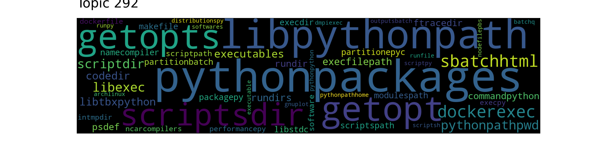

## Topic 293

```console
jobfile jobpy jobsproc jobscriptsh batchjob jobend jobnamejob jobrnderr jobscript jobnameojob jobtmp jobnamepbs summaryfilejob pipelinepy pythonpackages jobidtxt jobsbatch subjob jobksh jobindex modulespath jobdir joblog jobfs jobidpbs jobarray commandpython runjob workdirpbs jobrndadvm jobrndidl arrayjob envirovariables subjobs joberr jobstart pbsqueue workerpy dockerexec jobsize workflows scriptspath execfilepath tasksslurm outputjob nodelisttxt jobname workflow pythonpathhome pgsql
```
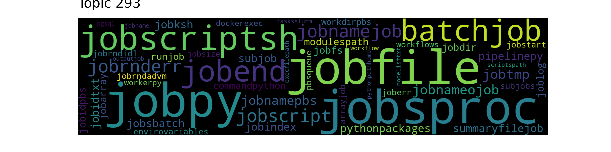

## Topic 294

```console
libexec xargs nprocs mpiexec execdir runprocess argsargs nprocscat executables execfilepath nproc nprocswc fopenmp nargs getopts execpy makefile nodenproc dmpiexec getopt nprocnproc archlinux executable dockerexec exec malloc runfile mpiprocs ftrace procs args seqproc commandtrace bashrcn mpmdconf nliqopt jobsproc nodefilepbs threadsnprocs ftracedir rundirs gdbint procname bashrc libstdc nodefile kernelexe openmp runconfigsh obsproc
```
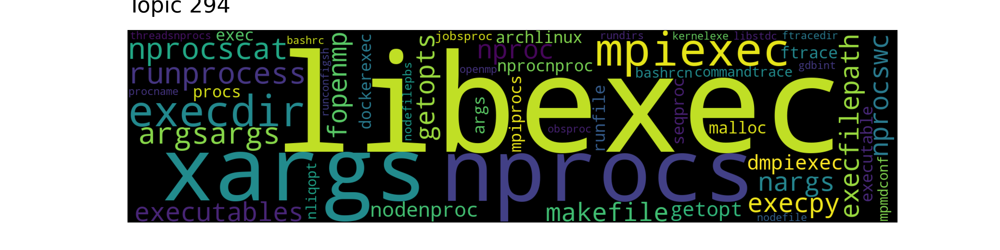

## Topic 295

```console
dockerexec echoinfo testpy execfilepath fopenmp bashrcn libexec bashrc scripttest psdef execdir dockerfile outputsbatch sbatchhtml memtest outputtxt libpythonpath nodeecho testfile grep outputjob filetesttxt qstat deeplab stdout execpy nodefilepbs pythonpathpwd cmdfile jobtmp ftrace sysctlconf cmds dirtmp postgresqlconf echo outputecho gnuplot echodebug gmp benchmarkpy stdouttxt outputfile libstdc filetests ftracedir scriptspath pkgstats outputgmx echocat
```
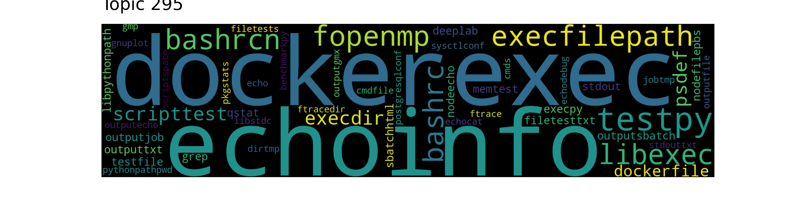

## Topic 296

```console
outputmsub qsub bsub runsub oarsub sub gsub subfile subs subdir losubg msub submode lsubg subj subsolver deeplab subfolder subjdir subdirname subdirectory subset logbasesprefix subsample subsysinitenv subdomain subsyscoll subjdirbedpostx substep cycqsub outputbase xpbs subjob deeplabv topoutputlogs subtask subcwd bbox subjname outputlog subdirectories stdoutpbs subjobs libvdpau outputsbatch pmembb nccllog basepy subtree logbase
```
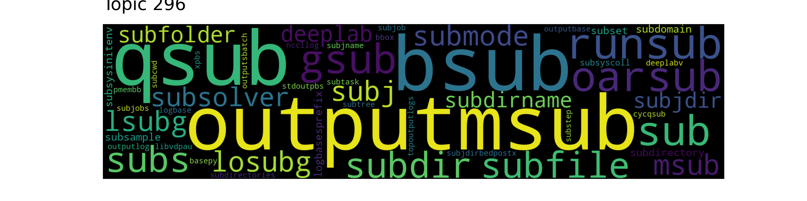

## Topic 297

```console
nvprof ftrace kernelexe performancepy runprocess cprofiler nprocs nprocscat filerun profiler stdout debugtrace ftracedir nprocswc nvidiaconf commandtrace gpufile sysctlconf cpuinfo nccllog workerpy nodelistgpu outputsrun nproc tensorflow multirunlog jobsproc runlog runconfigsh runpy fopenmp nprocmin stdoutj mpiprocs sysctl profiles namnprof gnuplot multiprocessing archlinux fxdlog stdouttxt endcsv nodefilepbs profiled drhookprof profiling lgprof cmdsrun profilemodules
```
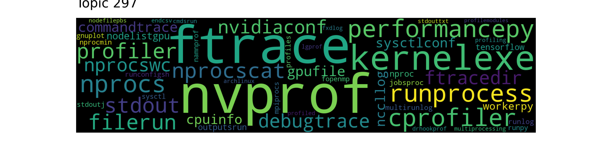

## Topic 298

```console
outputmsub nodefilepbs nodemanager clusteroutput github subdirectory gcccore nodeecho nprocswc subjob libstdc subjobs nodesecho runsub outputsbatch libxc nodefile githubcom outputgmx jobsproc nprocscat subfolder nmap libdmapsharing execpy sbatchhtml gdb execfilepath subdirectories opencl stdout interfacetcl sysctl multithreading execdir nprocs outputdirectory dockerexec fopenmp clusterthreads nodesbls jstdout directivesbatch malloc packagevalgrind deeplab nodesn nodeslurm subfile libncclso
```
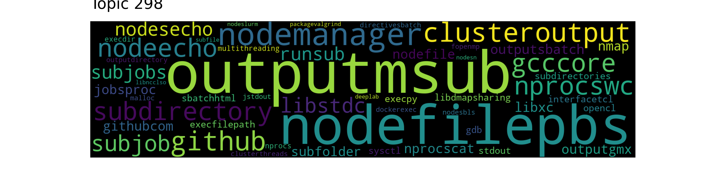

## Topic 299

```console
sbatchhtml batchbatch outputsbatch sbatch batchsize partitionbatch kbatch matrixmatrix idsbatch directivesbatch matrixcount matricesamd batchq batch matrixcountf waitsbatch matrixbody batchpy outputgmx stepbatch dockerexec matrices matrixout matrix xinitrc batchsh outputmsub batchnorm matlab bamspath multiprocessing execfilepath matrixhead sizebatch sbatchsh framebatch outputbase outputtxt pythonpathddmd cmsset getopts datasetpy jobsbatch getopt nodesecho execpy packagevalgrind malloc runprocess cmdpython
```
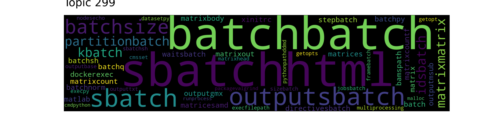

## Topic 300

```console
dockerexec dockerfile imagedocker bashrcn libstdc docker libpythonpath bashrc nodemanager libexec gccsv nvidiaconf pythonpathpwd zshrc github jobfile gnuplot nodefilepbs cmdpython fopenmp workerpy gpufile pythonpackages execfilepath gmp execdir gcccore postgresqlconf gdb commandpython jobpy githubcom nodeecho stdoutj libpng cmdlauncher ifnamedocker psdef customcmd libjpeg stdout pkgconf pbsqueue pythonpathhome nodefile scriptmanager printshellcmds udocker tensorflow execpy
```
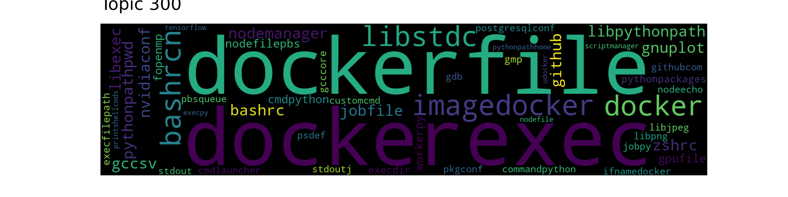

## Topic 301

```console
archlinux pythonpackages craylinux packagepy xinitrc libpythonpath libxc libxml linux github kernelexe libedit matplotlib libtbxpython packerc cmakecachetxt libstdc ubuntu zshrc selectcraylinux libxsmm scalapack sourcehomepack kernel cmakeliststxt githubcom kernelsasc skypeforlinux xinit libexec configtxt execpy packageroot configpy arpack commandpython gmkpack dockerexec spack dependenciespy libgl portpython pidx packagevalgrind pathpython modulespath libncclso runpy bashrc swbuild
```
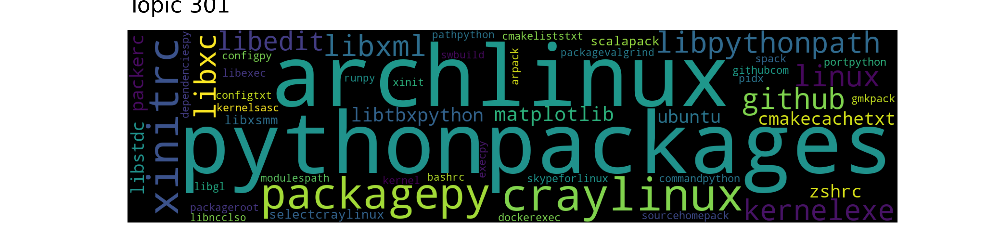

## Topic 302

```console
nextflowconfig tensorflow nextflowtrace nextflow mlflow templateflow pipelinepy flow workflow fluxos particleflow modulespath workflows flows aloadmodule outputmsub loadmodule pipelineyaml modulefile upstreams modulepy upstream deeplab pipeline fluxbox bamfile pbsqueue bamspath cosmoflow loadedmodules pipelines runsub moduleslurm pluginstart modulefiles modulepath deeplabv bamfiles pipeliner downstream subfile bitstream envmodules github startfluxbox libpythonpath fluxdata outputsbatch pluginpy loadmodel
```
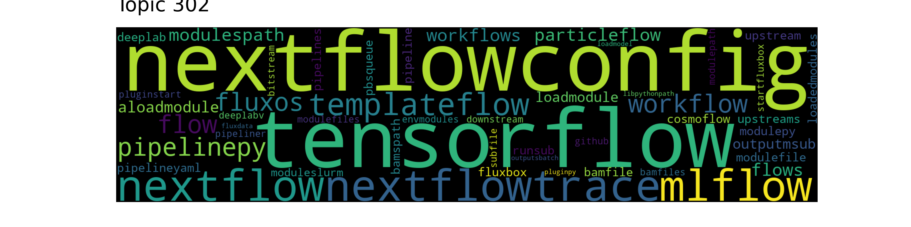

## Topic 303

```console
sbatchhtml batchbatch sbatch outputsbatch partitionbatch batchsize batchq batch stepbatch waitsbatch batchpy jobsbatch batchjob batchsh sizebatch kbatch sbatchsh runprocess directivesbatch trainingbatch multiprocessing execfilepath partitionepyc jidsbatch partitioncpu bamspath partitiongpu idsbatch batchnorm scriptspath nodeecho fnamebatch clusteroutput getopt framebatch outputecho dockerexec deeplab optimbatch execpy pathoutput packagevalgrind nodesecho cudapath scheduler scriptsdir jobsproc getopts datasettemplama scriptdir
```
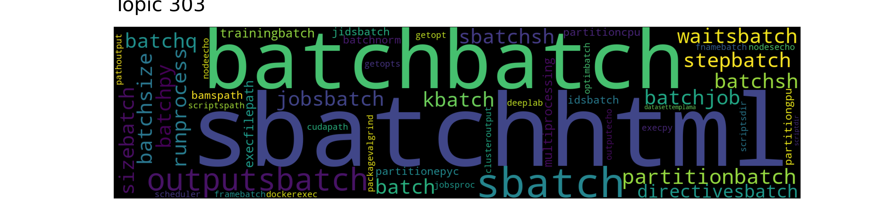

## Topic 304

```console
modulefile modulepy modulespath modulessh modulefiles loadmodule modulepath aloadmodule cmdpython cmakecachetxt gccsv moduleslurm commandpython libpythonpath envmodules xinitrc cmdgmake libxc module gcccore makefile launcherpython libtbxpython gmapcsv libstdc configpy gcc portpython partitionepyc cmake chmod configfile loadedmodules compilervarssh libxml moduletable modules runpy formatcsv compilercc pathpython qtcreator pythonpackages customcmd pythonpython agcmrc outputgmx gmake configjs moduleshome
```
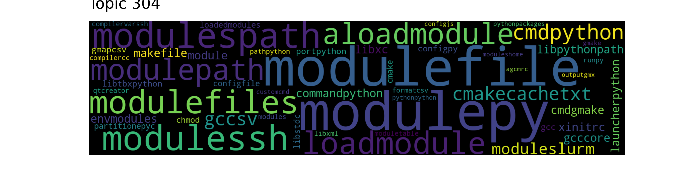

## Topic 305

```console
dirtmpdir tmpdirlocal cmdpython execpy modulepy modulefile dirtmp commandpython pkgconfigpkg pkgconfig modulessh pkgconf libtbxpython exportall mpmdconf pythonpackages export partitionepyc xinitrc aloadmodule modulefiles remotepy psdef portpython exports intmpdir pdebug modulespath pathpython launcherpython cmdlauncher exportnone libexec cmdgmake loadmodule pythonpathpwd exported cmakecachetxt packagepy tmpdir execdir xdpyinfo makefile pythonpython powercmddir execfilepath dockerexec runprocess namecompiler libpythonpath
```
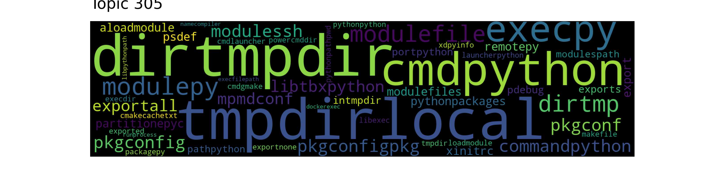

## Topic 306

```console
subsample outputmsub subjob deeplab nprocscat npesexpr stdouttxt idsample nprtrwnproc subjobs spdx runsub autolab matplotlib stdout nprocswc nsamples pipelinepy stdoutj synapsespbs postgresql ffmpeg deeplabv submode simoutput bsub modulessh fastsample fxdlog pthread pluginstart oarsub mergestxt synb stdoutpbs modulepy nccllog qsub wordidstxtbz nprocs ompthreads debugnxf nproc tensorflow summaryfilejob splittxt gnuplot matlab nvidiaconf srlab
```
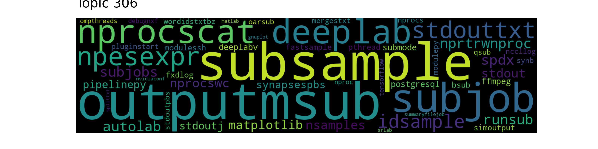

## Topic 307

```console
pythonpackages pythonpython libpythonpath launcherpython commandpython pythonpathhome pipelinepy pythonpathpwd pathpython cmdpython pytorchpy libtbxpython ipython pip pythonpathddmd pythonuserbase portpython pythonpath pytorchext checkpointpy python intelpython xdpyinfo testpy pyyaml pytorch pythonwhich pyspark matplotlib numpy pythonhome remotepy modulespath snakefile packagepy dockerexec npython stdout postgresqlconf pipedbam pgsql modulepy tensorflow ffmpeg pathconda runpy stdouttxt workerpy execfilepath pipenv
```
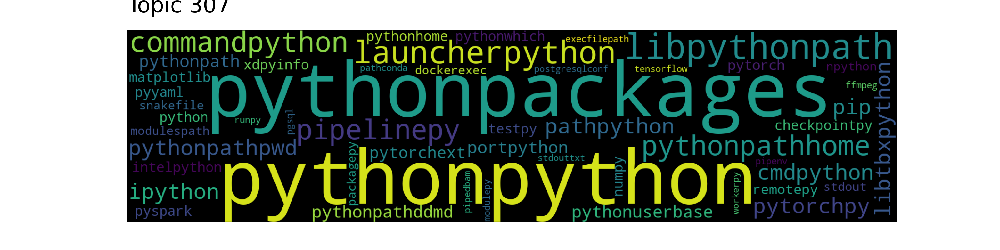

## Topic 308

```console
sbatchhtml outputsbatch batchbatch sbatch batchsize echoinfo batchpy sizebatch commandpython partitionbatch outputecho pythonpython batchq waitsbatch jobsbatch batch ipython trainingbatch multiprocessing framebatch tensorflow outputtrain cmdpython deeplabv performancepy batchjob dayecho batchsh libtbxpython datasetpy yecho optimbatch deeplab dockerfile outputgmx kbatch nodeecho remotepy clusteroutput datapy workerpy networkpy dataproces simulationpy simoutput hhecho getopts getopt outputbase sbatchsh
```
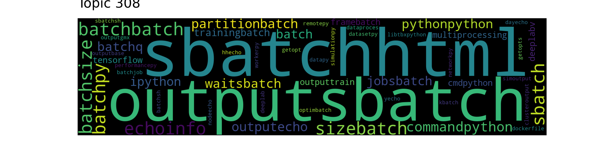

## Topic 309

```console
outputsbatch sbatchhtml printf printfile fopenmp outputfile outputtxt ftrace benchmarkpy runprocess outputgmx outputsrun ftracedir outputrfm partitionbatch batchq outputlog fileoutput cronlogfile sbatch outputjtxt nprocscat outputx outputoutj mpmdconf gdbint performancepy xargs multiprocessing benchmarkspy batchbatch getopts getopt gnuplot gpufile outputdirectory fxdlog batchsize outputj outputecho nprocs joutput outputscript multithreading outputoutputs partitioncpu outputerr outputbase debugnxf nfpcli
```
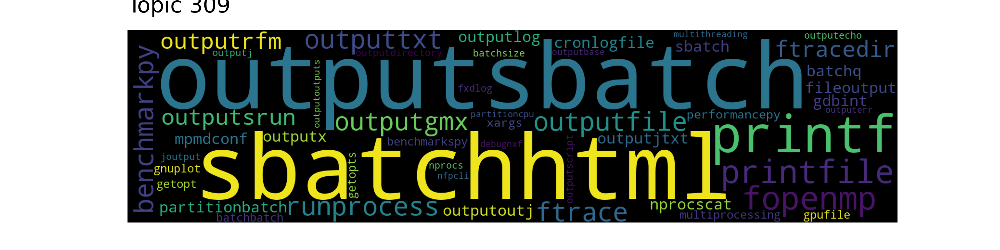

## Topic 310

```console
sbatchhtml batchsize sbatch batchbatch batchq outputsbatch jobsbatch pbsqueue postgresql queuepbs maxq batchjob waitsbatch pkgstats sizebatch postgres maxpl partitionbatch qstat kbatch jobterasort jobtmp clustergres jobsproc multiprocessing tmpdirbase queueoptarg xyzsort nprocs batchnorm dockerfile stepbatch optimbatch terasort fnamebatch nodefilepbs psdef nprocscat xargs sorttxt getopts getopt kdebase clusteroutput dockerexec tmploctmpdir nproc datasetmnist multithreading eachfile
```
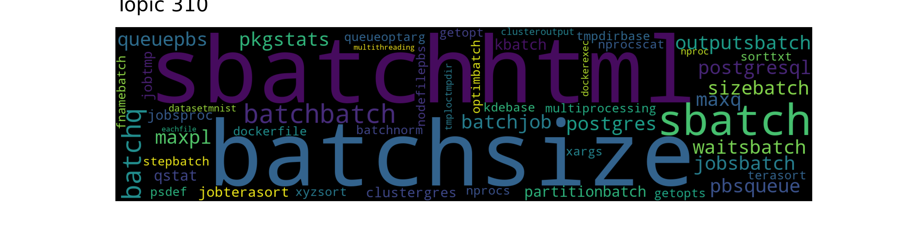

## Topic 311

```console
datasetpy sbatchhtml nodelistgpu workerpy batchsize nodesecho tensorflow nodesn outputsbatch gnuplot numpy multiprocessing pythonpython nodesnum nodesslurm nodeslurm pythonpathpwd batchbatch nodeecho runprocess sbatch commandpython datasetdataset pythonpackages runpy nodefile npnumnodesmpi nodesnnodes nodelistnode sizebatch datasettemplama datapy datasetn nodelistslurm nodelisttxt jobsbatch cmdpython libtbxpython nodesnodes dockerexec batchpy dockerfile networkpy performancepy jobpy batchjob libpythonpath nodedgxngpu ipython processorsnodes
```
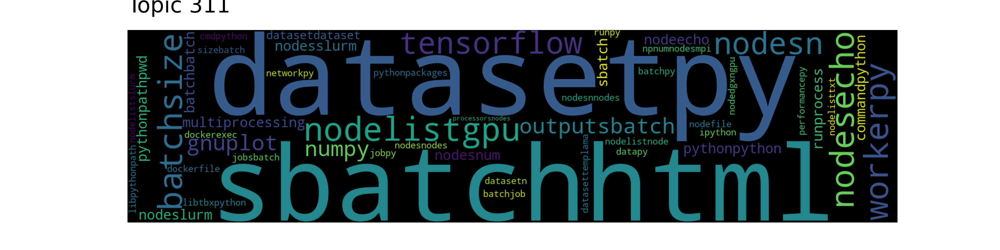

## Topic 312

```console
stdout nodefilepbs pdebug stdoutj bashrc bashrcn debugtrace outputfile nodefile outputsbatch libpythonpath fopenmp partitiondebug stdoutpbs datanode outputsrun nodeecho fileoutput gnuplot libstdc clusteroutput nodesecho openmp kernelexe outputoutj stdouttxt outputtxt nodelistnode pbsqueue nnode outputivecs erroroutput pythonpathhome outputrfm outputname nodelistgpu gdb partitionepyc pythonpathpwd diroutput outputbase outputx pbsout runpy diroutputs pbsidpbs ftrace pythonpython outputgmx outputoutputs
```
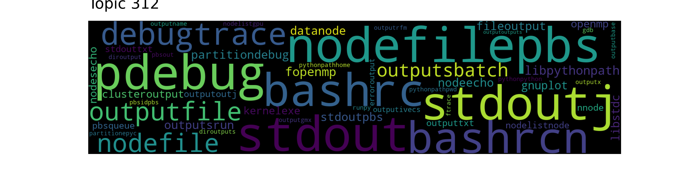

## Topic 313

```console
outputsbatch sbatchhtml exports export exportall exported batchsize batchbatch exportnone dockerexec clusteroutput outputgmx dockerfile jobsbatch sbatch outputecho batchjob runprocess partitionbatch deeplabv outputbase batchq outputjob outputslurm openmp paramsportport outputtrain execfilepath import outputsrun tmpdirlocal importing pathoutput jobsproc outputrfm tensorflow outputjobout portport outputerr cmdlauncher commandtrace outputoutput outputoutputs fopenmp execpy fileoutput ftrace customcmd outputtxt outputfile
```
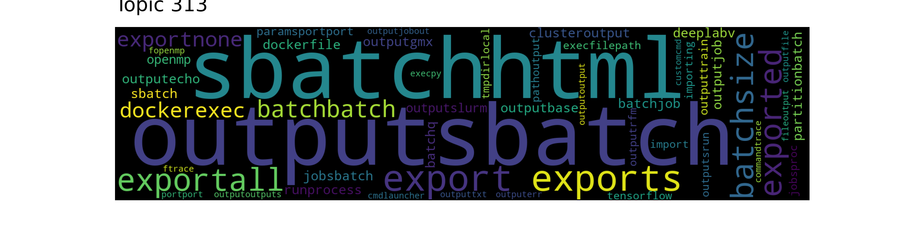

## Topic 314

```console
taskthreads taskset taskid seedswork seed ntasks ntask networkpy tasksslurm taskslurm ntasksslurm tasks seedrandom seeds numtasksslurm datasetdataset dataset task taskskip germination seedseed datasetpy mpitasks cloudmesh gnuplot datasetn datasettemplama networkfs ipython tasklist seedtrue datapy taskcpus commandpython nprocess nodesecho datatarget datasets processingpy libtbxpython nodeecho seedslurm datash rootdataset clusterthreads sheep dataproces vibits gdata taskpkl
```


## Topic 315

```console
fopenmp ntfs gvfs sqfs networkfs tmpfiles nodefilepbs outputtxt jobfs outputfile lfs nodefile chfsctl filesystem cronlogfile outputjtxt jobfile dockerfile chfsd tmpfile chfs psdef cvmfs dirtmp hdfile zfs nodelisttxt logfile cmdfile localdisk filesystemshome fileoutput jobtmp sysctlconf outputrfm stdouttxt dirdisk sddmconf nfile filetesttxt tmpdirlocal logfilename realsfs rawnetworkfs dfs cfs cmds squashfs outputdirectory vcfs
```
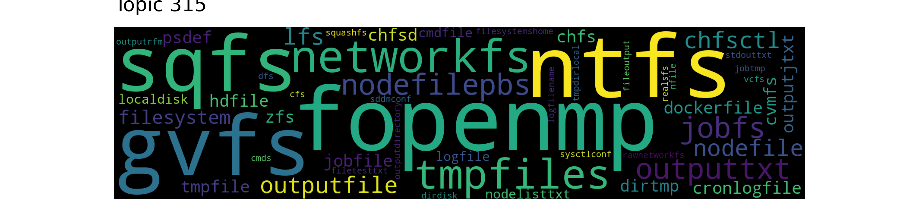

## Topic 316

```console
sbatchhtml commandpython sbatch batchbatch pythonpython cmdpython libtbxpython libpythonpath ipython batchq launcherpython batchsize pathpython pythonpathpwd gnuplot batchpy outputsbatch pythonuserbase pythonpackages remotepy pythonpathddmd portpython dockerexec intelpython dockerfile numpy matplotlib waitsbatch partitionbatch python sizebatch scriptpy batch jobsbatch commandstxt fnamebatch pythonpathhome xdpyinfo npython pythonpath multiprocessing kbatch networkpy xinitrc lcrflimittrue eachfile minibatch slurmscript datasetpy workerpy
```
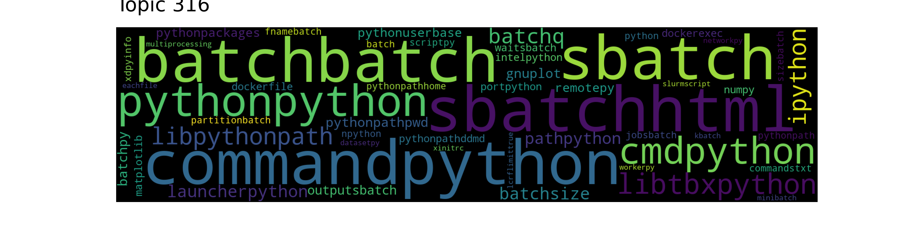

## Topic 317

```console
modulepy modulefile modulespath modulessh modulefiles cmdpython commandpython pythonpackages aloadmodule modulepath cmdgmake libpythonpath moduleslurm pathpython loadmodule xinitrc libtbxpython dockerexec makefile swbuild namecompiler libexec pythonpathddmd pythonpython cmdhostname packagepy pythonpathpwd launcherpython module portpython moduleshome pythonpathhome cmsrun dirtmpdir mpmdconf cmakecachetxt loadedmodules libstdc cmdlauncher cmake partitionepyc remotepy libxc execpy xdpyinfo moduletable customcmd zshrc intelpython runpy
```


## Topic 318

```console
export exportall outputrfm exports zshrc outputecho outputsrun libexec outputsbatch exported modulessh exportnone bashrc outputfile testpy cmdpython simoutput cmsrun dockerexec outputgmx modulefile runlocal makefile execpy libstdc outputslurm bashrcn outputerr outputbase modulespath commandpython outputx remotepy modulepy skypeforlinux ftrace cmdfile outputr noutput outputdir execdir outputmpi libxc paramsportport reporthtml cmd outputoutj diroutput outputlap testreport
```
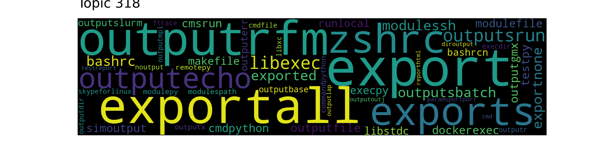

## Topic 319

```console
jobfile subfile outputmsub subdirectory jobrnderr pythonpathddmd arrayjob pythonpathpwd jobpy outputfile pbsqueue execpy workerpy nprocscat execfilepath outputdirectory subjobs datapy subdirectories pathpython commandpython subjob outputjtxt datafile queuequeue libpythonpath jobsproc partitionepyc datasetpy tmpfiles subfolder jobtmp filetesttxt splittxt queuepbs pythonpathhome seqfile fileoutput fileprefix filenames bamfiles nodelisttxt summaryfilejob autolab runsub directivesbatch sorttxt cpgdfile outputjob matplotlib
```
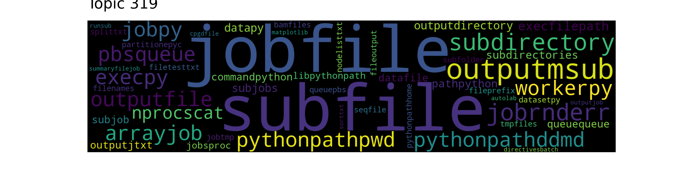

## Topic 320

```console
sbatchhtml outputsbatch batchbatch sbatch partitionbatch batchpy batchq batchsize batch jobsbatch waitsbatch batchjob batchsh stepbatch sizebatch outputecho outputbase fnamebatch commandpython idsbatch scriptpy cmdpython partitionepyc kbatch deeplab outputjtxt outputsrun outputscript outputrfm outputmpi minibatch erroroutput execpy pythonpython scripttest sbatchsh outputoutput outputgmx partitiondebug bashrc runprocess pbatch outputfile outputtxt outputoutj outputjob outputoutputs runpy batchnorm partitiongpu
```
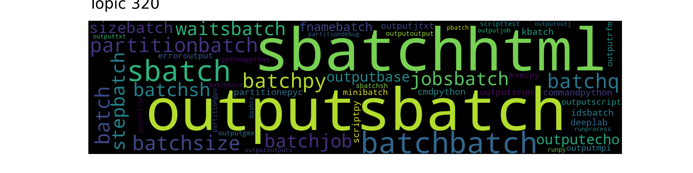

## Topic 321

```console
maxmem dmpiexec gpufile benchmarkpy mpiexec nodefile dockerexec nodemanager gmp dockerfile indexfile kdebase maxbuild nodefilepbs makefile datafile gdb bamfiles libexec datafiles cmdfile clustermem modulefiles maxq mfileidgrid eachfile fastqfile matplotlib cpuinfo matlab gdbint benchmarks benchmark memmax mfileid modulefile meminfo gcccore fopenmp clustergres nodesn mpmdconf sqfs gmcmc clusteroutput tmpfiles benchmarkspy sysctlconf mdrun mmps
```
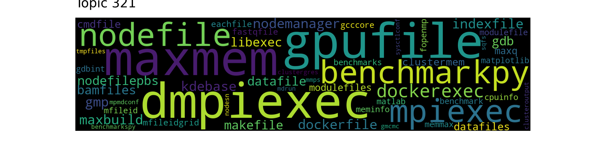

## Topic 322

```console
sbatchhtml dockerexec dockerfile outputsbatch commandpython batchbatch cmdpython remotepy libtbxpython batchsize libpythonpath networkpy sbatch launcherpython pythonpython pythonpackages multiprocessing partitionbatch partitionepyc workerpy performancepy jobsbatch batchjob modulefile batchpy eachfile ipython sizebatch pythonpathpwd clusteroutput getopts outputtxt jobpy xdpyinfo configpy pathpython pythonpathhome execfilepath numpy modulespath outputgmx pyspark cpuinfo getopt modulepy runprocess modulefiles modulessh framebatch pythonuserbase
```
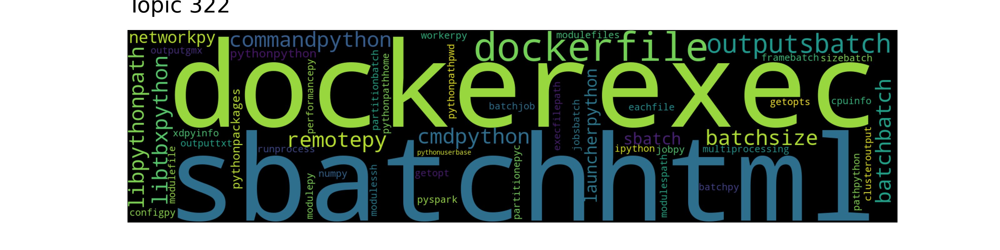

## Topic 323

```console
pythonpython ipython commandpython pathpython pythonpathpwd libpythonpath cmdpython libtbxpython sbatchhtml pythonpath python numpy launcherpython batchpy intelpython pythonpathddmd pythonpathhome pythonpackages runpy pythonuserbase workerpy datasetpy pythonwhich datapy sbatch randompy batchbatch deeplab remotepy outputsbatch scipy simulationpy databasepy networkpy batchsize execpy portpython testpy checkpointpy sizebatch benchmarkpy partitionbatch decodepy pythonhome partitionepyc npython matplotlib scriptpy looppy gresgpu
```


## Topic 324

```console
valgrind packagevalgrind slurmscript sbatchhtml eachfile scriptsdir batchbatch bamfiles fileprefix scriptdir partitionbatch fopenmp namevalgrind cmakecachetxt dirtmp bamfile malloc cputime fastqfile tmpscript dockerfile batchsize scripts sbatch partitionepyc scriptnow filesnum ncarcompilers ffmpeg kbatch tempfile slurmfiles outputsbatch script codec partitiondebug scriptsh mdlog scriptpy cpuinfo makefile jlogfile huffman logfile scripthome fastqfiles slurmfile cronlogfile mfileid batchnorm
```
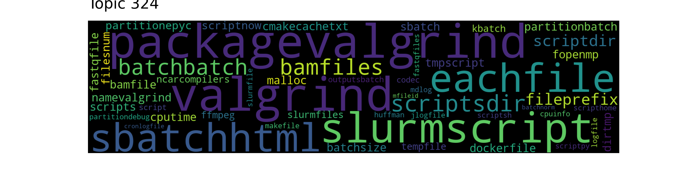

## Topic 325

```console
gromacs prefixrun prefixmdp prefixprefix bashrcn prefixstep packagevalgrind bashrc mpmdconf outputgmx mpiprefix xargs listemacs mdrun nprocmin nprocswc nprocscat gmp sprefix mingro stepbatch optimbatch nprocs gnuplot sbatchhtml gcccore batchsize prefixirap namevalgrind cmsrun postgresqlconf basesprefix cmdsrun nproc getopt gmrun prefix sizebatch zshrc runpplsh gpufile xquickruns fileprefix nodelistgpu xinitrc genomefasta batchbatch grompp outputsbatch partitionepyc
```
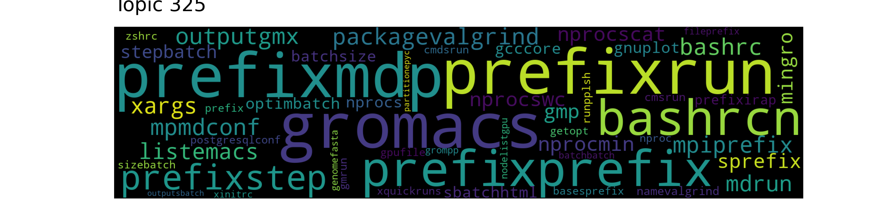

## Topic 326

```console
pythonpathhome libpythonpath libtbxpython commandpython pathpython pythonpackages cmdpython pythonpython launcherpython pythonpathpwd scriptspath pythonhome execfilepath ipython remotepy pythonuserbase modulespath pythonpath pyspark pythonpathddmd scriptpy scriptpath bashrc xinitrc zshrc portpython libexec snakefile runprocess stdout python intelpython makefile stdouttxt scriptsdir cudapath scriptnow scripthome roothome libxc runpy restartfilefind matplotlib networkpy datapy pyyaml virtualenv testpy gnuplot scriptdir
```
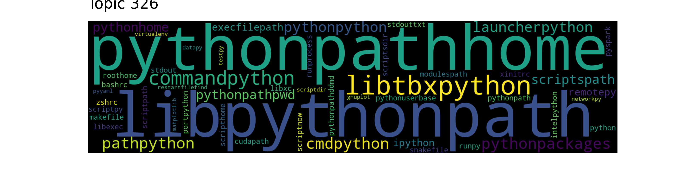

## Topic 327

```console
nprocscat fopenmp nprocs openmp nproc nodefilepbs nodenproc bashrcn nprocnproc outputrfm nprocswc stdout pathoutput runprocess outputgmx outputsrun outputsbatch mpiprocs makefile outputfile swbuild opencl nodesecho getopt seqproc malloc nodeecho libstdc runlocal mpmdconf bashrc qtcreator outputecho outputmsub nodemanager outputoutj simoutput noisemapbuilder getopts outputbase clusteroutput modulespath tmpdirlocal threadsnprocs nprocmin outputerr nprtrwnproc zshrc outputx diroutputs
```
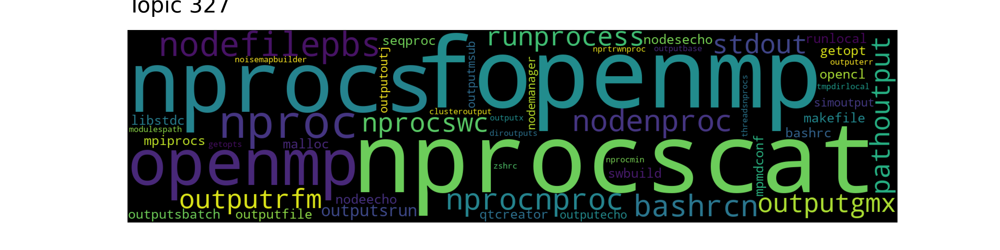

## Topic 328

```console
dockerexec dockerfile sysctlconf configyml defaultsconf configfile configslurm syslogauth configconfig configpy configyaml logfilename nginxconf freshclamconf configsh adminerconf pkgconf cmsset configdir catalystconf logbasesprefix clamdconf configjs configtxt cronlogfile configurelog xinitrc pkgconfig modprobeconf configs defaultsh logfile zshrc xorgconf sysctl configjson nvidiaconf httpdconf sddmconf config gconftool nginxconfpacnew lognamelog syslogfacility scriptmanager loglevelinfo postgresqlconf radeonconf cmakecachetxt gvfs
```
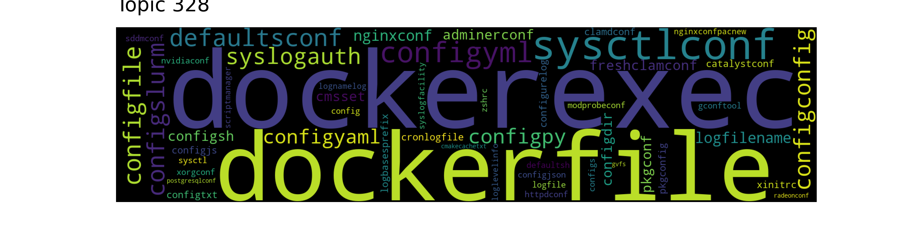

## Topic 329

```console
pythonpython launcherpython pythonpackages commandpython portpython pathpython libtbxpython libpythonpath pythonpathpwd pythonpathhome cmdpython python remotepy ipython pythonpathddmd pythonhome pythonpath packagepy pythonwhich pythonuserbase filespy runpy restartpy npython partitionepyc libvdpau intelpython inpfile dirtmpdir modulefile pdebug modulepy restartfilefind numpy snakefile xdpyinfo dirtmp modulessh pyspark epyc testpy restartfile pluginpy dependenciespy checkpointpy networkpy workerpy launchpy execpy outputfile
```
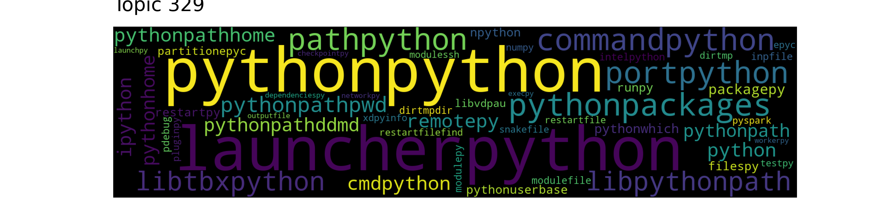

## Topic 330

```console
dockerexec exportall github outputgmx pluginstart export stdout exportnone outputjobout libstdc pluginpy exports outputerr outputsrun libvdpau stdoutj outputxojn execpy outputfile nodemanager outputsbatch outputx githubcom outputbase outputjob libexec libxc nodefilepbs xinitrc dockerfile outputoutj libpythonpath clusteroutput startfluxbox runprocess zshrc exported fluxnode launchpy outputecho outputivecs outputxjout envlocal launcherpython tensorflow runlocal jobpy libgl plugin nodeecho
```
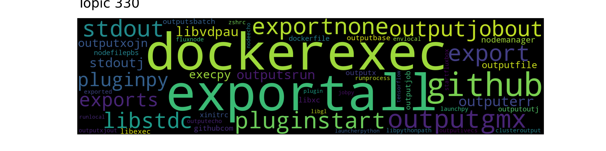

## Topic 331

```console
sbatchhtml batchbatch sbatch outputsbatch jobsbatch batchq batchjob batchsize partitionbatch fnamebatch batch batchsh waitsbatch jidsbatch batchpy bashrc sbatchsh stepbatch kbatch matlab bashrcn outputsrun deeplab multirunlog sizebatch runprocess execpy dockerexec minibatch execfilepath idsbatch mdrun jobscriptsh deeplabv cmdsrun autolab jobsproc srlab outputecho trainingbatch jobtmp commandtrace jobfile commandsh optimbatch slurmscript batchnorm jobscript execdir outputjob
```
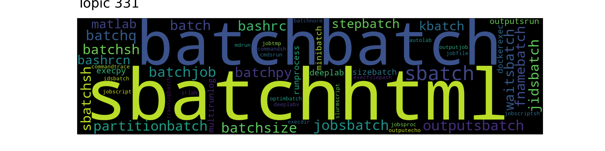

## Topic 332

```console
launcherpython commandpython pythonpython libpythonpath pythonpathhome pathpython cmdpython pythonpathpwd libtbxpython ipython intelpython pythonpath pythonuserbase portpython python npython pythonhome pythonpathddmd runpy remotepy jobpy pythonpackages pythonwhich runprocess workerpy numpy dockerfile testpy nodemanager pyenv execpy pyyaml stdout dockerexec deeplabv epyc kernelexe networkpy launchpy datasetpy nodefile checkpointpy pytorchpy databasepy jobstart datapy pathconda nodeecho snakemake virtualenv
```
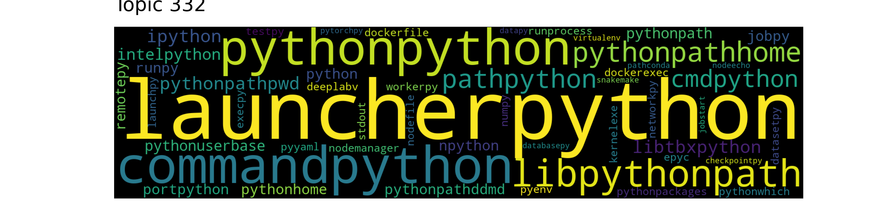

## Topic 333

```console
dockerexec libtbxpython tmux xdpyinfo libpythonpath dockerfile cmdpython matplotlib commandpython networkpy zshrc ipython xinitrc bashrc pythonpathhome bashrcn xtccibits pythonpython pythonpathddmd pythonpathpwd echoinfo remotepy ftrace pythonuserbase pathpython launcherpython centos ftracedir pythonpackages mcomix libxc outputtxt xargs xscheduler idxstats xterm stdouttxt mpmdconf gnuplot pidx xorgconfd sysctlconf portpython xorgconf sbatchhtml matlab gmxrc deeplab execpy xlsf
```
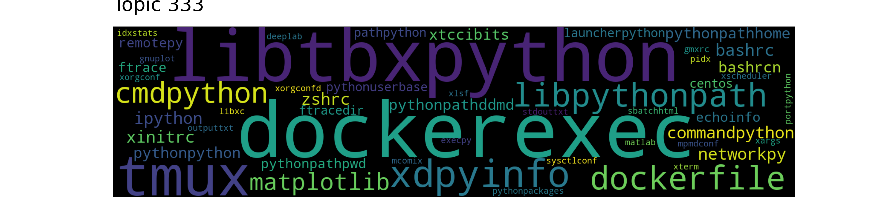

## Topic 334

```console
libpythonpath modulepy libstdc modulefile loadmodule aloadmodule loadedmodules modulefiles pythonpackages gpfs modulespath pbsqueue lpnetlib libgl modulessh moduleslurm matplotlib libpciaccess libdmapsharing libmtp libxc inpfile pkgconfig packagepy mlpf libld libpng libtbxpython pkgconfigpkg gpfswork modules libxml libncclso libxsmm moduleshome networkpy modulepath libjpeg pythonpython pythonpathhome gnuplot fopenmp namfpf basepy libexec libmkl nodefilepbs depmap module libyaml
```
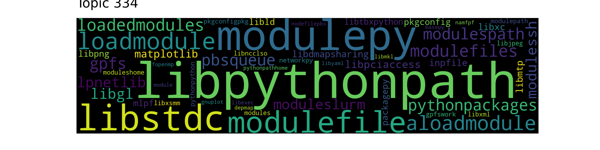

## Topic 335

```console
nextflowconfig tensorflow qstat configurelog multirunlog workflow fastqfiles pkgconfig seqproc workflows startfluxbox matplotlib fxdlog postgresqlconf snrnaseq simulationlog nccllog fastqfile nprocswc libxc rnaseq runlog snakemakelog syslogauth kernelsasc cmakecachetxt libstdc nprocscat sysctlconf symlinkstermlib nprocs configyml xinitrc fluxbox simoutput qtcreator xorgconfd nextflowtrace configfile nginxconfpacnew loggingmllog fxdtbuild mlflow configslurm freshclamconf nproc psdef pkgconfigpkg runprocess nginxconf
```
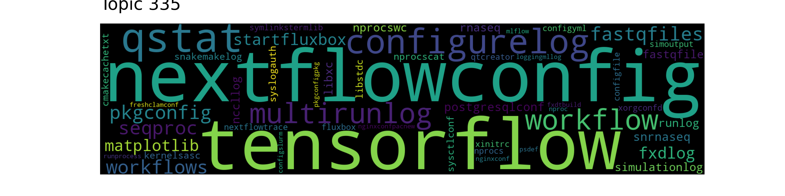

## Topic 336

```console
matlab dirproject deeplab projectdirs modulefiles pdebug modulepy projectdir projects projectorg debugtrace bamfiles pbsidpbs modulespath modulepath moduleslurm nameproject debuginfo modules mapperdebug debug libphp dirpbs debugdir project projectnw autolab profilemodules modulessh loadmodule deeplabv projectbias modulefile debugtrue pb loadedmodules pbs aloadmodule moduleshome projectname blib psdef bioinformatics accountproject debugnxf partitiondebug malloc programs libc debugger
```
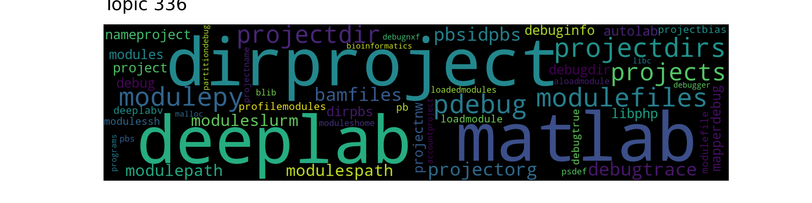

## Topic 337

```console
loglammps flagsdevicegpu tsv nvprof lmp vcomp gpuv lognamelog nvidiaconf ctmp envvar stmp printenv være vtk ncarenv namelammps myenv gpulog vnode pmapcsv nvtx nvsv whitespace pstmp envvars hcpmmp debugnxf xvf vram envs radeonconf ldsvfalse vmem endcsv loglevelinfo xzvf sysctlconf fxdlog dirtmp vx vmdrop namelog restartlmp vmemnxf envmodules nitmp vgg logtrue itmp
```
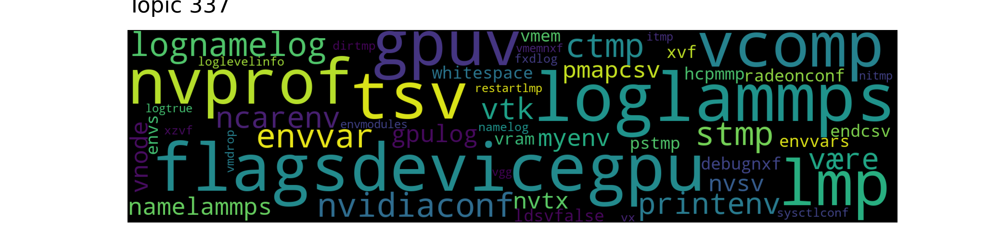

## Topic 338

```console
export exports exportall exported exportnone outputfile outputgmx fileoutput portport outputdirectory paramsportport outputoutput outputoutputs outputx outputdir outputerr outputjobout outputsrun outputoutj outputbase outputr diroutput pathoutput outputecho outputslurm diroutputs import outputsbatch outputxjout xport outputj outputout outputxojn outputjob importing execfilepath ftp inpfile outputmpi outputnc output printfile outputroot outputn noutput execdir outputlap outputjout outputname imported
```
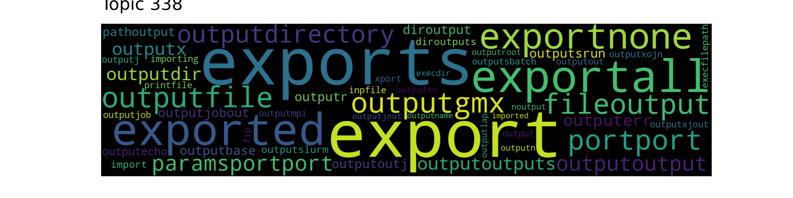

## Topic 339

```console
fopenmp ftrace stdout debugnxf xdef stdouttxt stopnxf tmux ftracedir printf outputtxt memnxf xdamp tmpdirlocal xlsf fdnxf nxf xorgconf xfce fsx fxdlog mpmdconf nconf sysctlconf psdef outputx stdoutj nginxconf nfpcli stdbuf stf commandstxt xorgconfd outputjtxt suffixprintf fntop bashrc startxfce fmap commandtrace fsldir stdoutpbs restartlmp execdir nexpr libxc bashrcn execpy execfilepath tmpfile
```


## Topic 340

```console
scriptdir scriptsdir scriptsh scriptpy scriptpath scriptmanager scriptnow workdir script workdirpwd srcdir workdirpbs workingdir workdirworkdir scripthome cdirs scriptspath jobscriptsh scripts cmdpython rundir indir mydircomdir scriptpwd wdir commandpython scripting networkpy powercmddir rundirs zshrc jobdir codedir workdirorigdir pythonpathddmd pythonpython pythonpathpwd portpython sdir jobscript mkdir ipython psdef bamdir launcherpython tmpscript scriptadd tmpdir xinitrc libpythonpath
```
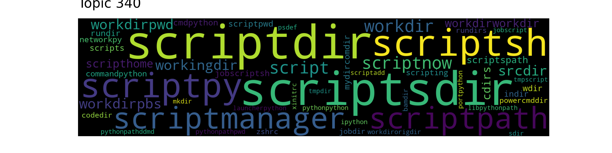

## Topic 341

```console
exportall loadmodule exports export modulespath modulefile modulefiles aloadmodule exported exportnone modulepath toolkit outputgmx import modulepy importing outputsbatch outputfile loadedmodules pluginstart moduleslurm pathoutput sourcetarget makefile toolsdir projectdirs moduleshome imported paramsportport swbuild github fileprefix outputbase dirproject outputsrun modulessh projectdir compilerintel module projdir githubcom plugins plugin projectorg envmodules modules outputerr pathpython toolbox outputrfm
```
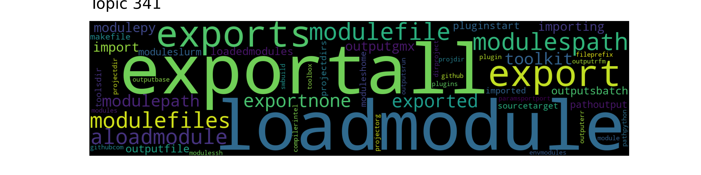

## Topic 342

```console
packagepy pythonpackages packagevalgrind packerc cppdefs compilercc compile compiling compilerintel libstdc sbatchhtml pkgconfig compilervarssh modulefiles gmkpack dependenciespy compilergcc cpp compiled modulepy libpythonpath configpy execpy spack specspack compiler packages dockerexec getopt arpack batchbatch package batchpy cmakecachetxt modulespath gcccore xinitrc compilers scalapack libxc swbuild libexec lapack runpy sysctlconf kernelexe getopts pppp configconfig depmap
```
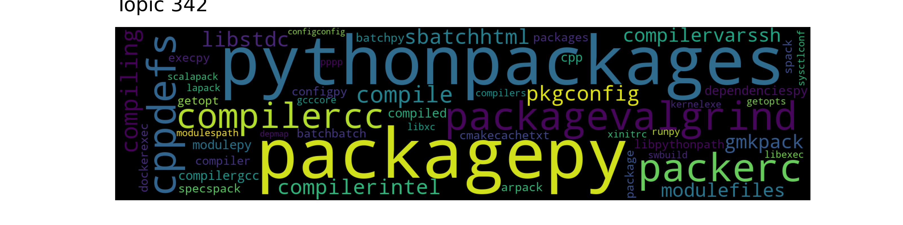

## Topic 343

```console
pythonpathhome configpy pythonpython trainingpy numpy trainpy pathpython libpythonpath commandpython ipython packagepy runpy pythonpathpwd pythonhome simulationpy pythonpath launcherpython pythonpackages networkpy pythonpathddmd pythonuserbase trainingbatch batchpy remotepy workerpy databasepy checkpointpy libtbxpython randompy scipy pyspark python partitionepyc testpy intelpython evalpy baselinepy cmdpython xdpyinfo portpython setuppy configslurm basesprefix stdoutpbs pipelinepy distributedpy pdebug sbatchhtml pythonwhich learningpy
```
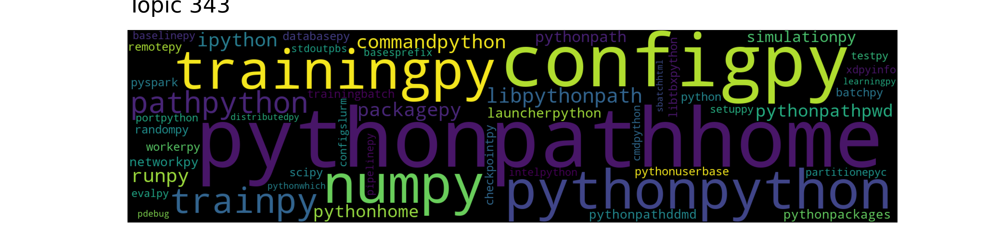

## Topic 344

```console
sbatchhtml batchbatch sbatch outputsbatch waitsbatch batchq batchsize nextflowconfig batchsh echoinfo sbatchsh echoecho stepbatch yecho batch hhecho sizebatch partitionbatch tensorflow iecho jidsbatch framebatch getopt jobsbatch echo outputecho asecho batchpy mlflow getopts batchjob mmecho hsecho deeplab ctxtecho mxecho kbatch optimbatch dayecho fnamebatch nextflowtrace nodeecho echoerror echocat echodebug dockerexec queueoptarg xecho loecho dateecho
```
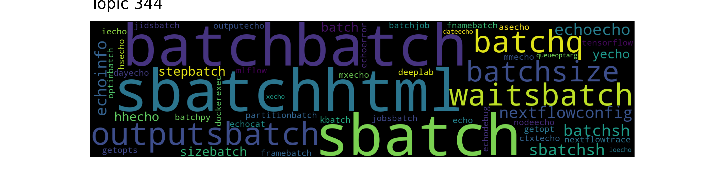

## Topic 345

```console
sbatchhtml outputsbatch outputgmx dockerexec batchbatch sbatch getopt xinitrc gnuplot nodeecho getopts github partitionbatch githubcom outputtxt execpy execdir zshrc deeplab nodesecho nodemanager nodefilepbs xargs bashrcn execfilepath dockerfile outputsrun batchq clusteroutput waitsbatch outputx outputlog libtbxpython pkgconfig nodefile outputscript outputrfm nodelistgpu runpplsh runprocess scriptmanager bashrc gpulog excludegpu outputerr batchsize cudapath gmxrc outputdirectory libpythonpath
```
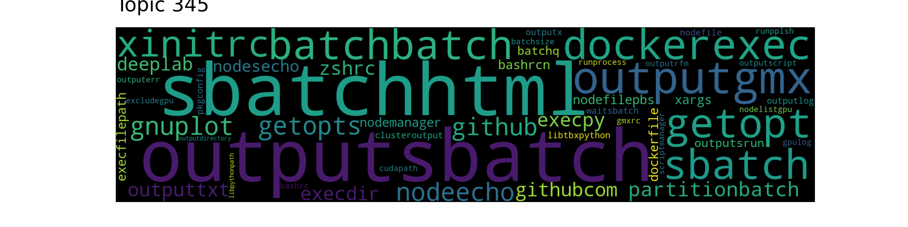

## Topic 346

```console
datafile eachfile nfpcli portshuf fdfd tmpdirlocal fileoptarg datasetpy fopenmp tmpfile fpath outputfile lsuppdatefalse ldsvfalse basefbase linpcdf datafiles tensorflow fsldir bamfile subfile floatxfloat inputfile rptdir xlsf deeplabv nfile lmpofffalse mapfile dvf filetrue lsettlsfalse echfp xvf datasetn cmeshtfrecord defaultsh libtbxpython endcsv seqfile bamfiles bamspath dataframe tmpdirbase libstdc outputrfm filerun dirtmp netcdf filebasename
```
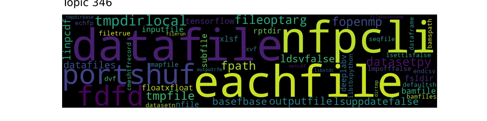

## Topic 347

```console
smilei procs sbatchhtml smiles makefile procname mpiprocs nprocs xps smi threadsnprocs nprocnproc nodenproc deps jobsproc sbatch nprocswc wps proc batchbatch mpiexec numprocs nproc nprocmin runtrix packagevalgrind mcomix psdef eachfile nprocscat benchmarkpy asdeps execpy seedrandom runprocess numpy outputsbatch batchpy nodesecho apmrandom xpbs partitionbatch batchjob mpipmix mixtures xdef fnamebatch matlab fps msec
```
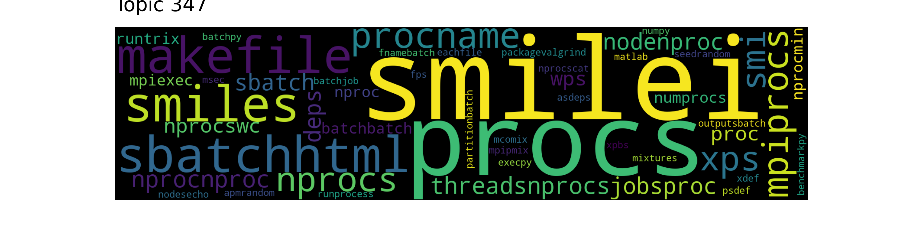

## Topic 348

```console
nodemanager nodeecho outputgmx dockerexec outputsbatch idlog nodesecho xinitrc fxdlog runprocess nodename sbatchhtml outputx outputsrun nodefile idxstats nodesn nodeslurm nodefilepbs outputrfm outputname outputlog lognamelog xscheduler outputecho dockerfile outputbase logfilename fnamebatch nodesslurm nodescontrol loglevelinfo runlocal nodelistgpu jobsproc gmx outputjob multirunlog outputtxt scriptmanager gfx cmdlauncher xorgconfd nprocscat nodesscontrol outputjobout outputerr ftrace gnuplot xargs
```
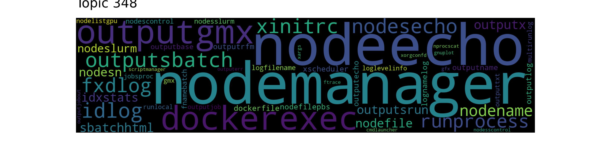

## Topic 349

```console
outputsbatch sbatchhtml outputecho batchbatch batchsize outputrfm batchpy echoinfo echodebug fastsample outputslurm echoecho batchq pipelinepy sampling samplingfm partitionbatch sbatch mpmdconf performancepy deeplab multiprocessing dirsample runprocess idsample fnamebatch outputfalse outputname outputgmx torchaudio echoerr execpy processingpy noisemapbuilder outputoutputs batchsh pathoutput outputsrun libpythonpath outputerr outputmpi nsamples nodeecho outputoutput outputtxt outputoutj fopenmp waitsbatch getopt outputtrue
```
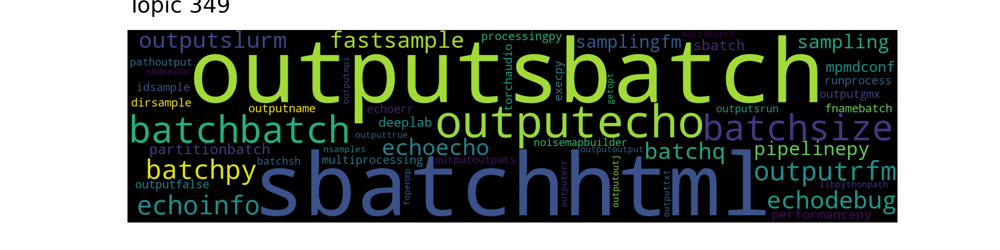

## Topic 350

```console
gpufile sbatchhtml idsbatch runprocess datapy mdrun datasetpy outputsbatch pythonpathddmd datafile gnuplot idcsv commandpython cmdsrun xinitrc cmdhostname pythonpathpwd gmp cmdfile pathpython gpuname gdb cmdpython cmds datasettwitch sbatch datasetn datasettemplama dataset runj stepbatch outputgmx pythonpathhome datafiles agcmrc tmux datalad filenames datasetcifar dstpath datapath filebasename optimbatch srcpath imagemagick githubcom runpy nodemanager filerun dirdataset
```
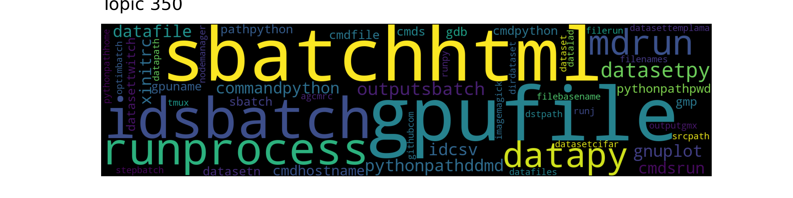

## Topic 351

```console
scriptspath scriptpath scriptsdir cudapath scriptdir execfilepath pathcudapath dockerexec dockerfile gmxdir scripthome remotepy scriptmanager libpythonpath dirtmpdir script sbatchhtml scriptsh jobscriptsh bamspath dirdataset remotehostname jobfile zshrc dirtmp pythonpathhome slurmscript gmx srcpath scriptname commandstxt scriptnow scripts dirpath stdouttxt execdir pythonpathpwd jobksh scripting rootpolbook gmxrc stdout rootdataset modulespath scriptpy tmpdirlocal libtbxpython filepath cmakecachetxt runpath
```
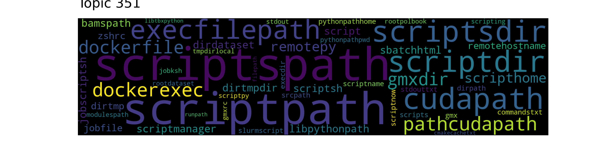

## Topic 352

```console
sbatchhtml batchbatch sbatch batchsize partitionbatch outputsbatch nodefilepbs sizebatch cronlogfile fnamebatch jobsbatch dockerexec runprocess execfilepath batchpy nodefile remotehostname bashrcn idsbatch getopt partitionepyc crontab gnuplot getopts waitsbatch nodeecho commandtrace dockerfile packagevalgrind hostfile datehostnamepwd xargs commandpython batchjob batchsh batchq sbatchsh fileoptarg cmdhostname asciidatainput bashrc queueoptarg commandstxt nodesecho filesnum remotepy localhost stdout hostnamectl nodesnum
```
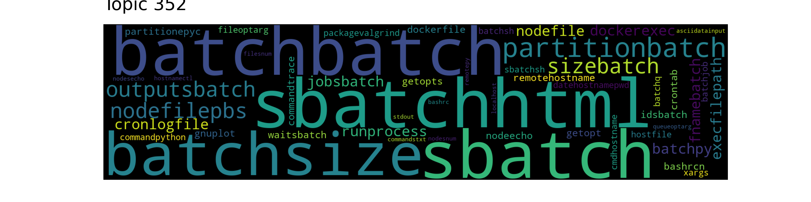

## Topic 353

```console
sbatchhtml batchsize dockerexec outputsbatch batchbatch sbatch batchq modulefile cronlogfile batchjob scriptmanager partitionbatch sizebatch multirunlog jobsbatch cmdlauncher bashrcn waitsbatch libexec pluginstart jobfile modulessh batchsh jobtmp jobscriptsh modulefiles commandpython nodelisttxt stdout bashrc fileprefix nodeecho dockerfile dmpiexec jobpy zshrc nodemanager cmakecachetxt modulepy pbsqueue printshellcmds stdouttxt modulespath scriptdir outputtxt scriptsdir mpiexec nodesecho batchpy slurmscript
```
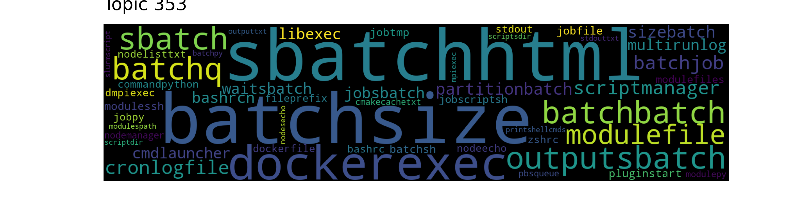

## Topic 354

```console
pythonpython ipython networkpy libtbxpython commandpython cmdpython sbatchhtml projectdirs datasetpy libpythonpath datatarget launcherpython pathpython intelpython accountproject simulationpy pythonpathhome gnuplot batchsize echoinfo taskthreads python datapy projectdir pythonpackages runprocess sizebatch githubcom github outputsbatch jobsproc dataproces matplotlib scriptpy dirproject multiprocessing pythonuserbase simoutput portpython scripttest taskset taskid npython dockerfile processingpy pythonpathpwd pythonpath remotepy scriptsdir nprocess
```
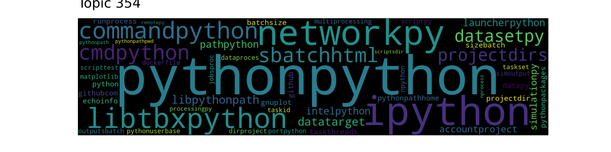

## Topic 355

```console
nodefilepbs nodefile modulefile modulefiles nodelistnode modulespath nodesn nodesecho nnode makefile nodeecho nodelistgpu nodesnodes nodelisttxt nnodes github modulessh modulepy nnodesslurm githubcom libpythonpath fluxnode bashrcn nodejs pythonpackages nodeslurm npernode nodempi stringnode datanode npm nnodeswc libstdc aloadmodule arraynodes nfile nodemanager nodesh npnumnodesmpi pgsql nodelistslurm pernode loadmodule bamfiles nodesnnodes modulepath fastqfile dockerfile nodesslurm nodescat
```
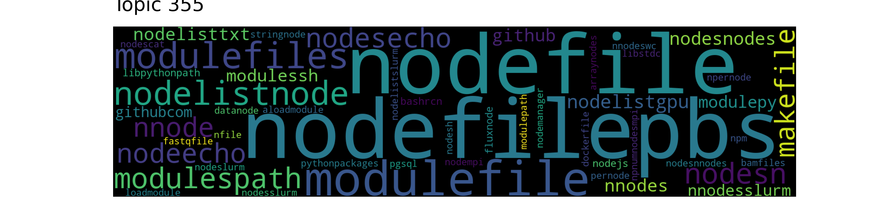

## Topic 356

```console
sbatchhtml tmpfiles outputsbatch datafile dataproces cmeshtfrecord datafiles datasetpy dataset fileoutput asciidatainput datasetdataset datapy sbatch partitionbatch datatraindata filedata batchbatch batchsize outputtxt multiprocessing outputfile dotfiles formatcsv datasettemplama datasetn tmpfile traintfrecord dirdataset datasets datasetcifar tfrecord endcsv datasetmnist tmux stdouttxt deeplab processingpy datapbs datatrainann outputtrain clusteroutput filetesttxt pathdatasets datalad bamfiles partitionepyc fileprefix outputjtxt tmpdirlocal
```
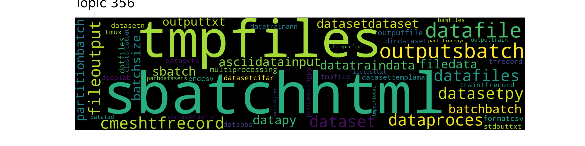

## Topic 357

```console
nodelistgpu multiprocessing nodefilepbs nodesnum nodefile nodesn nodesecho nodelisttxt nodeecho multithreading computational sbatchhtml outputsbatch partitioncpu computation nprocs nodeslurm nprocscat nodescat partitionbatch deeplab nodejs batchsize processorsnodes getopt eachfile nodesh nodesslurm networkpy computed nproc endcsv outputtxt nodemanager deeplabv memtotal cputime nodelistslurm nodesnnodes nodedgxngpu cpuinfo nprocswc dockerexec clusteroutput nvprof nnode getopts gnuplot multithreaded hyperthreading
```
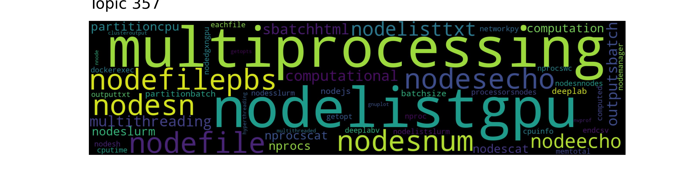

## Topic 358

```console
dockerexec dockerfile outputsbatch sbatchhtml outputgmx getopt stdout partitionepyc commandpython nodefile nodefilepbs nodemanager outputfile clusteroutput getopts partitionbatch bashrc multiprocessing execfilepath eachfile pythonpackages nodeecho stdouttxt libpythonpath bashrcn outputtxt modulefile runprocess modulefiles execpy zshrc libexec fopenmp fileoutput nodesecho modulespath nodelisttxt xinitrc outputdirectory libtbxpython modulessh powercmddir commandstxt batchsize stdoutj cmdlauncher cmdpython packagepy exportall makefile
```
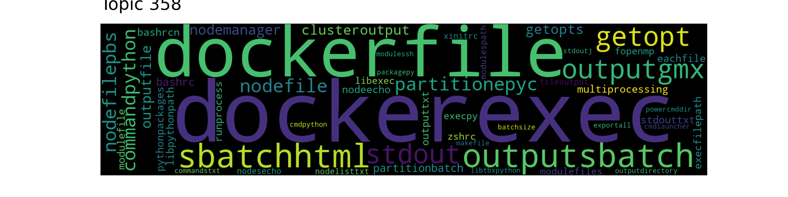

## Topic 359

```console
outputsbatch sbatchhtml runprocess executables outputsrun batchbatch sbatch rundirs batchsize executable execpy outputgmx partitionbatch getopts getopt execdir rundir optfile filerun runconfigsh libexec execfilepath runfile runj executing multirunlog runpath excludegpu libvdpau outputfile mdrun loadmodule dirrun pathoutput exiting multiprocessing outputivecs srcpath xinitrc batch nprocs srun processes libxml performancepy waitsbatch gpufile pathrun runmagpie exit
```
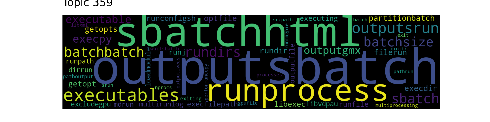

## Topic 360

```console
nodelistgpu gpufile cpuinfo excludegpu gpuqueue multigpu partitioncpu partitiongpu gpulog sbatchhtml cpu multiprocessing amdgpu gpu nodedgxngpu nvidiaconf lscpu gpuname outputsbatch runprocess nodesn partitionbatch nodemanager gpuv namegpu nprocs gpuq dockerexec cpuq nodeecho gpus selectgpu cputime nodesecho nodescontrol nodefilepbs nnode nprocswc gpgpu multithreading batchbatch processorsnodes gresgpu gpuspernode multinode nodejs nproc nodesh skypeforlinux processingpy
```
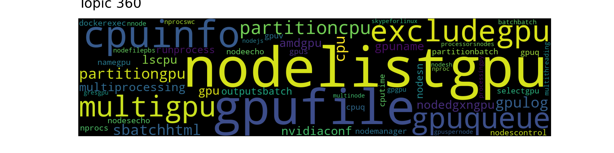

## Topic 361

```console
sbatchhtml cmdpython commandpython pathpython modulespath outputsbatch libpythonpath pythonpackages scriptspath pythonpython pythonpathhome execfilepath libtbxpython pythonpathpwd batchsize batchbatch pythonpathddmd scriptpath cmdsrun modulefile runprocess outputscript getopt cmdfile sbatch bashrc outputgmx gnuplot xinitrc portpython ipython mdrun modulepath matplotlib partitionbatch cmds batchq powercmddir modulepy getopts modulefiles github aloadmodule cmd cudapath zshrc loadmodule gpufile githubcom scriptsdir
```
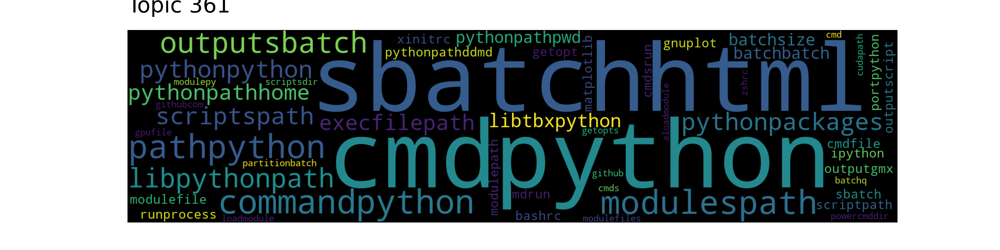
